# SpringCloud

# 一、零基础微服务架构理论入门

## 01、微服务架构概述

微服务架构是一种架构模式，它提倡将单一应用程序划分成一组小的服务，服务之间互相协调、互相配合，为用户提供最终价值。
每个服务运行在其独立的进程中，服务与服务间采用轻量级的通信机制互相协作(通常是基于HTTP协议的RESTful API) 。每个服务都围绕着具体业务进行构建，并且能够被独立的部署到生产环境、类生产环境等。另外，应当尽量避免统一的、集中式的服务管理机制，对具体的一个服务而言，应根据业务上下文，选择合适的语言、工具对其进行构建

> 分布式微服务架构

1. 服务注册与发现
2. 服务调用
3. 服务熔断
4. 负载均衡
5. 服务降级
6. 服务消息队列
7. 配置中心管理
8. 服务网关
9. 服务监控
10. 全链路追踪
11. 自动化构建部署
12. 服务定时任务调度操作

## 02、Spring Cloud简介

分布式微服务的一站式解决方案，是多种微服务架构落地技术的集合体，俗称微服务全家桶


## 03、Spring Cloud技术栈


## 04、总结


# 二、Springboot和Cloud版本选择

> Springboot2.x、SpringCloud H版选择
>
> Springboot采用数字版本迭代，SpringCloud采用字母版本迭代，目前SpringCloud最新版为H版

## 01、Springboot和cloud的版本依赖关系

官网查看：https://spring.io/projects/spring-cloud#overview


## 02、更具体地选择Springboot版本

1. 第一种

   在网页中格式化json数据：https://start.spring.io/actuator/info

   

   获取相应的版本选择信息

   

2. 第二种方法 （进入官网https://spring.io/projects/spring-cloud#learn）

   

   

## 03、本项目所有版本选择


# 三、Cloud各种组件的停更说明

## 01、Cloud升级

服务注册中心：~~Eureka~~、Zookeeper、Consul、**Nacos**

服务调用：Ribbon、LoadBalancer

服务调用2：~~Feign~~、OpenFeign

服务降级：~~Hystrix~~、Resilience4j（国外）、Sentienl(国内)

服务网关：~~Zuul~~、~~Zuul2~~（未开发完成）、gateway

服务配置：~~Config~~、**Nacos**

服务总线：~~Bus~~、**Nacos**

## 02、官方文档

> SpringCloud版本：Hoxton.SR1
>
> SpringBoot版本：2.2.2.RELEASE

SpringCloud官方文档：https://cloud.spring.io/spring-cloud-static/Hoxton.SR1/reference/htmlsingle/

SpringCloud中文文档：https://www.bookstack.cn/read/spring-cloud-docs/docs-index.md

SpringBoot官方文档：https://docs.spring.io/spring-boot/docs/2.2.2.RELEASE/reference/htmlsingle/

# 四、微服务架构编码构建

## 01~04：IDEA新建project工作空间

### 01、SpringCloud整体聚合父工程配置

#### 01-1、新建工程步骤


设置包名、项目名，选择Maven仓库

#### 01-2、字符编码


#### 01-3、注解生效激活


#### 01-4、Java编译版本选8


#### 01-5、File Type过滤


### 02、父工程POM

1. pom.xml改为父工程

   ```xml
   <packaging>pom</packaging>
   ```

   

2. 删除父工程的src文件夹

3. 添加统一管理jar包依赖版本

   ```xml
     <properties>
       <project.build.sourceEncoding>UTF-8</project.build.sourceEncoding>
       <maven.compiler.source>1.8</maven.compiler.source>
       <maven.compiler.target>1.8</maven.compiler.target>
       <junit.version>4.12</junit.version>
       <log4j.version>1.2.17</log4j.version>
       <lombok.version>1.16.18</lombok.version>
       <mysql.version>5.1.47</mysql.version>
       <druid.version>1.1.16</druid.version>
       <mybatis.spring.boot.version>1.3.0</mybatis.spring.boot.version>
     </properties>
   ```

4. 整个pom.xml的配置

   ```xml
   <?xml version="1.0" encoding="UTF-8"?>
   
   <project xmlns="http://maven.apache.org/POM/4.0.0" xmlns:xsi="http://www.w3.org/2001/XMLSchema-instance"
     xsi:schemaLocation="http://maven.apache.org/POM/4.0.0 http://maven.apache.org/xsd/maven-4.0.0.xsd">
     <modelVersion>4.0.0</modelVersion>
   
     <groupId>com.atguigu.springcloud</groupId>
     <artifactId>cloud2020</artifactId>
     <version>1.0-SNAPSHOT</version>
     <packaging>pom</packaging>
   
     <name>Maven</name>
     <!-- FIXME change it to the project's website -->
     <url>http://maven.apache.org/</url>
     <inceptionYear>2001</inceptionYear>
   
     <!-- 统一管理jar包版本 -->
     <properties>
       <project.build.sourceEncoding>UTF-8</project.build.sourceEncoding>
       <maven.compiler.source>1.8</maven.compiler.source>
       <maven.compiler.target>1.8</maven.compiler.target>
       <junit.version>4.12</junit.version>
       <log4j.version>1.2.17</log4j.version>
       <lombok.version>1.16.18</lombok.version>
       <mysql.version>5.1.47</mysql.version>
       <druid.version>1.1.16</druid.version>
       <mybatis.spring.boot.version>1.3.0</mybatis.spring.boot.version>
     </properties>
   
     <!-- 子模块继承之后，提供作用：锁定版本+子modlue不用写groupId和version  -->
     <dependencyManagement>
       <dependencies>
         <!--spring boot 2.2.2-->
         <dependency>
           <groupId>org.springframework.boot</groupId>
           <artifactId>spring-boot-dependencies</artifactId>
           <version>2.2.2.RELEASE</version>
           <type>pom</type>
           <scope>import</scope>
         </dependency>
         <!--spring cloud Hoxton.SR1-->
         <dependency>
           <groupId>org.springframework.cloud</groupId>
           <artifactId>spring-cloud-dependencies</artifactId>
           <version>Hoxton.SR1</version>
           <type>pom</type>
           <scope>import</scope>
         </dependency>
         <!--spring cloud alibaba 2.1.0.RELEASE-->
         <dependency>
           <groupId>com.alibaba.cloud</groupId>
           <artifactId>spring-cloud-alibaba-dependencies</artifactId>
           <version>2.1.0.RELEASE</version>
           <type>pom</type>
           <scope>import</scope>
         </dependency>
         <dependency>
           <groupId>mysql</groupId>
           <artifactId>mysql-connector-java</artifactId>
           <version>${mysql.version}</version>
         </dependency>
         <dependency>
           <groupId>com.alibaba</groupId>
           <artifactId>druid</artifactId>
           <version>${druid.version}</version>
         </dependency>
         <dependency>
           <groupId>org.mybatis.spring.boot</groupId>
           <artifactId>mybatis-spring-boot-starter</artifactId>
           <version>${mybatis.spring.boot.version}</version>
         </dependency>
         <dependency>
           <groupId>junit</groupId>
           <artifactId>junit</artifactId>
           <version>${junit.version}</version>
         </dependency>
         <dependency>
           <groupId>log4j</groupId>
           <artifactId>log4j</artifactId>
           <version>${log4j.version}</version>
         </dependency>
         <dependency>
           <groupId>org.projectlombok</groupId>
           <artifactId>lombok</artifactId>
           <version>${lombok.version}</version>
           <optional>true</optional>
         </dependency>
       </dependencies>
     </dependencyManagement>
   
   
     <build>
       <plugins>
         <plugin>
           <groupId>org.springframework.boot</groupId>
           <artifactId>spring-boot-maven-plugin</artifactId>
           <configuration>
             <fork>true</fork>
             <addResources>true</addResources>
           </configuration>
         </plugin>
       </plugins>
     </build>
   
   </project>
   ```

### 03、Maven细节

#### 03-1、Maven中的DependencyManagement和Dependencies的区别

Maven使用dependencyManagement元素来提供了一种管理依赖版本号的方式。

通常会在一个组织或者项目的最顶层的父POM中看到dependencyManagement元素。

使用pom.xml中的dependencyManagement元素能让所有在子项目中引用一个依赖而不用显式的列出版本号。Maven会沿着父子层次向上走，直到找到一个拥有dependencyManagement元素的项目，然后它就会使用这个dependencyManagement元素中指定的版本号。


好处：

- 如果有多个子项目都引用同一样依赖，则可以避免在每个使用的子项目里都声明一个版本号,这样当想升级或切换到另一个版本时，只需要在顶层父容器里更新，而不需要一个一个子项目的修改;
- 另外如果某个子项目需要另外的一个版本，只需要声明version就可。
- dependencyManagement里只是声明依赖，并不实现引入，因此子项目需要显示的声明需要用的依赖。
- 如果不在子项目中声明依赖，是不会从父项目中继承下来的;只有在子项目中写了该依赖项,并且没有指定具体版本,
  才会从父项目中继承该项，并且version和scope都读取自父pom;

#### 03-2、maven中跳过单元测试


### 04、创建完成操作

父工程创建完成执行mvn:install或Lifecycle中的install将父工程发布到仓库方便子工程继承

## 05、Rest微服务工程构建

> cloud-provider-payment8001微服务提供者支付Module模块构建

### 05-1、cloud-provider-payment8001 微服务提供者支付Module模块

#### 1、微服务模块构建

1. 建module

   

2. 改pom（添加依赖）

   ```xml
       <dependencies>
           <dependency>
               <groupId>org.springframework.boot</groupId>
               <artifactId>spring-boot-starter-web</artifactId>
           </dependency>
           <!--图形化显示和坐标监控-->
           <dependency>
               <groupId>org.springframework.boot</groupId>
               <artifactId>spring-boot-starter-actuator</artifactId>
           </dependency>
           <dependency>
               <groupId>org.mybatis.spring.boot</groupId>
               <artifactId>mybatis-spring-boot-starter</artifactId>
           </dependency>
           <dependency>
               <groupId>com.alibaba</groupId>
               <artifactId>druid-spring-boot-starter</artifactId>
               <version>1.1.10</version>
           </dependency>
           <!--mysql-connector-java-->
           <dependency>
               <groupId>mysql</groupId>
               <artifactId>mysql-connector-java</artifactId>
           </dependency>
           <!--jdbc-->
           <dependency>
               <groupId>org.springframework.boot</groupId>
               <artifactId>spring-boot-starter-jdbc</artifactId>
           </dependency>
           <dependency>
               <groupId>org.springframework.boot</groupId>
               <artifactId>spring-boot-devtools</artifactId>
               <scope>runtime</scope>
               <optional>true</optional>
           </dependency>
           <dependency>
               <groupId>org.projectlombok</groupId>
               <artifactId>lombok</artifactId>
               <optional>true</optional>
           </dependency>
           <dependency>
               <groupId>org.springframework.boot</groupId>
               <artifactId>spring-boot-starter-test</artifactId>
               <scope>test</scope>
           </dependency>
       </dependencies>
   ```

3. 写YML

   ```yaml
   server:
     port: 8001
   
   spring:
     application:
       name: cloud-payment-service
     datasource:
       type: com.alibaba.druid.pool.DruidDataSource            # 当前数据源操作类型
       driver-class-name: org.gjt.mm.mysql.Driver              # mysql驱动包
       url: jdbc:mysql://localhost:3306/db2019?useUnicode=true&characterEncoding=utf-8&useSSL=false
       username: root
       password: 123456
   
   mybatis:
     mapperLocations: classpath:mapper/*.xml
     type-aliases-package: com.atguigu.springcloud.entities    # 所有Entity别名类所在包
   ```

4. 主启动

   ```java
   package com.atguigu.springcloud;
   
   import org.springframework.boot.SpringApplication;
   import org.springframework.boot.autoconfigure.SpringBootApplication;
   
   /**
    * @ClassName PaymentMain8001
    * @Description TODO
    * @Author Lambert
    * @Date 2021/10/30 20:46
    * @Version 1.0
    **/
   @SpringBootApplication
   public class PaymentMain8001 {
       public static void main(String[] args) {
           SpringApplication.run(PaymentMain8001.class,args);
       }
   }
   ```

####  2、业务类

##### 2.1、建表SQL和Entities

```sql
CREATE TABLE `payment` (  `id` bigint(20) NOT NULL AUTO_INCREMENT COMMENT 'ID',  `serial` varchar(200) DEFAULT '',  PRIMARY KEY (`id`)) ENGINE=InnoDB AUTO_INCREMENT=1 DEFAULT CHARSET=utf8
```

entities

支付实体`Payment`

```java
package com.atguigu.springcloud.entities;

import lombok.AllArgsConstructor;
import lombok.Data;
import lombok.NoArgsConstructor;

import java.io.Serializable;


/**
 * @ClassName Payment
 * @Description 支付实体
 * @Author Lambert
 * @Date 2021/10/30 21:10
 * @Version 1.0
 **/
@Data
@AllArgsConstructor
@NoArgsConstructor
public class Payment implements Serializable {
    private Long id;
    private String serial;
}
```

通用返回结果集`CommonResult`

```java
package com.atguigu.springcloud.entities;

import lombok.AllArgsConstructor;
import lombok.Data;
import lombok.NoArgsConstructor;

/**
 * @ClassName CommonResult
 * @Description 通用返回结果集
 * @Author Lambert
 * @Date 2021/10/30 21:14
 * @Version 1.0
 **/
@Data
@AllArgsConstructor
@NoArgsConstructor
public class CommonResult<T> {
    //404 not_fountd
    private Integer code;

    private String message;

    private T data;

    public CommonResult(Integer code,String message){
        this(code,message,null);
    }
}
```

##### 2.2、dao

- `PaymentDao`

  ```java
  package com.atguigu.springcloud.dao;
  
  import com.atguigu.springcloud.entities.Payment;
  import org.apache.ibatis.annotations.Mapper;
  import org.apache.ibatis.annotations.Param;
  
  /**
   * @ClassName PaymentDao
   * @Description TODO
   * @Author Lambert
   * @Date 2021/10/30 21:21
   * @Version 1.0
   **/
  @Mapper
  public interface PaymentDao {
      //添加
      int create(Payment payment);
      //查询
      Payment getPaymentById(@Param("id") Long id);
  }
  ```

- `PaymentMapper.xml`

  > 路径：resource/mapper/PaymentMapper.xml

  ```xml
  <?xml version="1.0" encoding="UTF-8" ?>
  <!DOCTYPE mapper PUBLIC "-//mybatis.org//DTD Mapper 3.0//EN" "http://mybatis.org/dtd/mybatis-3-mapper.dtd" >
  
  <mapper namespace="com.atguigu.springcloud.dao.PaymentDao">
      <insert id="create" parameterType="Payment" useGeneratedKeys="true" keyProperty="id">
          insert into payment(serial) values(#{serial})
      </insert>
      <!--BaseResultMap:返回结果映射    -->
      <select id="getPaymentById" parameterType="Long" resultMap="BaseResultMap">
          select * from payment where id = #{id}
      </select>
      <resultMap id="BaseResultMap" type="com.atguigu.springcloud.entities.Payment">
          <id column="id" property="id" jdbcType="BIGINT"></id>
          <id column="serial" property="serial" jdbcType="VARCHAR"></id>
      </resultMap>
  </mapper>
  ```

##### 2.3、service

- `paymentService`

  ```java
  package com.atguigu.springcloud.service;
  
  import com.atguigu.springcloud.entities.Payment;
  import org.apache.ibatis.annotations.Param;
  
  /**
   * @ClassName PaymentService
   * @Description TODO
   * @Author Lambert
   * @Date 2021/10/30 21:55
   * @Version 1.0
   **/
  public interface PaymentService {
      //添加
      int create(Payment payment);
      //查询
      Payment getPaymentById(@Param("id") Long id);
  }
  ```

- `paymentServiceImpl`

  ```java
  package com.atguigu.springcloud.service.impl;
  
  import com.atguigu.springcloud.dao.PaymentDao;
  import com.atguigu.springcloud.entities.Payment;
  import com.atguigu.springcloud.service.PaymentService;
  import org.springframework.stereotype.Service;
  
  import javax.annotation.Resource;
  
  /**
   * @ClassName PaymentServiceImpl
   * @Description TODO
   * @Author Lambert
   * @Date 2021/10/30 21:56
   * @Version 1.0
   **/
  @Service
  public class PaymentServiceImpl implements PaymentService {
      @Resource
      private PaymentDao paymentDao;
  
      @Override
      public int create(Payment payment) {
          return paymentDao.create(payment);
      }
  
      @Override
      public Payment getPaymentById(Long id) {
          return paymentDao.getPaymentById(id);
      }
  }
  ```

##### 2.4、controller

```java
package com.atguigu.springcloud.controller;

import com.atguigu.springcloud.entities.CommonResult;
import com.atguigu.springcloud.entities.Payment;
import com.atguigu.springcloud.service.PaymentService;
import lombok.extern.slf4j.Slf4j;
import org.springframework.web.bind.annotation.GetMapping;
import org.springframework.web.bind.annotation.PathVariable;
import org.springframework.web.bind.annotation.PostMapping;
import org.springframework.web.bind.annotation.RestController;

import javax.annotation.Resource;

/**
 * @ClassName PaymentController
 * @Description 支付模块Controller
 * @Author Lambert
 * @Date 2021/10/30 22:03
 * @Version 1.0
 **/
@RestController
@Slf4j
public class PaymentController {

    @Resource
    private PaymentService paymentService;

    @PostMapping("/payment/create")
    public CommonResult create(Payment payment){
        int result = paymentService.create(payment);
        log.info("*********插入结果:"+result);
        if (result > 0){
            return new CommonResult(200,"插入数据库成功",result);
        }else {
            return new CommonResult(500,"插入数据库失败");
        }
    }

    @GetMapping("/payment/get/{id}")
    public CommonResult<Payment> getPaymentById(@PathVariable("id") Long id){
        Payment payment = paymentService.getPaymentById(id);
        if (payment != null){
            return new CommonResult<>(200,"查询数据库成功",payment);
        }else {
            return new CommonResult<>(500,"没有对应记录，查询ID："+id);
        }
    }
}
```

#### 3、测试

查询

1. 首先在数据库插入一条数据

2. 浏览器调用查询接口

   

3. Postman调用创建接口

   

### 05-2、热部署Devtools

#### 1、添加Devtools依赖

`cloud-provider-payment8001`

```xml
<!--devtools-->
<dependency>
    <groupId>org.springframework.boot</groupId>
    <artifactId>spring-boot-devtools</artifactId>
    <scope>runtime</scope>
    <optional>true</optional>
</dependency>
```

#### 2、父工程中添加插件

```xml
<build>
    <finalName>cloud2020</finalName>
    <plugins>
        <plugin>
            <groupId>org.springframework.boot</groupId>
            <artifactId>spring-boot-maven-plugin</artifactId>
            <configuration>
                <fork>true</fork>
                <addResources>true</addResources>
            </configuration>
        </plugin>
    </plugins>
</build>
```

#### 3、开启自动编译


#### 4、设置

1. 在页面使用快捷键`Ctrl+Shift+Alt+/`打开

   选择`Registry`

   

2. 再选中两个选项

   

#### 5、测试

1. 修改代码后
2. 服务器自动重启部署

### 05-3、cloud-consumer-order80 微服务消费者订单Module模块

> 模块构建同支付模块

`application.yml`

```yaml
server:
  port: 80
```

#### 1、业务类

##### 1.1、entities

`通用返回结果集`

```java
package com.atguigu.springcloud.entities;

import lombok.AllArgsConstructor;
import lombok.Data;
import lombok.NoArgsConstructor;

/**
 * @ClassName CommonResult
 * @Description 通用返回结果集
 * @Author Lambert
 * @Date 2021/10/30 21:14
 * @Version 1.0
 **/
@Data
@AllArgsConstructor
@NoArgsConstructor
public class CommonResult<T> {
    //404 not_fountd
    private Integer code;

    private String message;

    private T data;

    public CommonResult(Integer code,String message){
        this(code,message,null);
    }
}

```

`支付实体`

```java
package com.atguigu.springcloud.entities;

import lombok.AllArgsConstructor;
import lombok.Data;
import lombok.NoArgsConstructor;

import java.io.Serializable;


/**
 * @ClassName Payment
 * @Description 支付实体
 * @Author Lambert
 * @Date 2021/10/30 21:10
 * @Version 1.0
 **/
@Data
@AllArgsConstructor
@NoArgsConstructor
public class Payment implements Serializable {
    private Long id;
    private String serial;
}

```

##### 1.2、RestTemplate

> RestTemplate提供了多种便捷访问远程Http服务的方法
> 是一种简单便捷的访问restful服务模板类，是Spring提供的用于访问Rest服务的客户端模板工具集

官网：https://docs.spring.io/spring-framework/docs/5.2.2.RELEASE/javadoc-api/org/springframework/web/client/RestTemplate.html

使用：使用restTemplate访问restful接口非常的简单粗暴无脑。(url, requestMap, ResponseBean.class)这三个参数分别代表 REST请求地址、请求参数、HTTP响应转换被转换成的对象类型。

##### 1.3、配置RestTamplate

`config.ApplicationContextConfig`

```java
@Configuration
public class ApplicationContextConfig {

    /**
     * 配置RestTemplate远程调用
     */
    @Bean
    public RestTemplate getRestTemplate(){
        return new RestTemplate();
    }
}
```

在controller中注入即可使用

##### 1.4、controller

```java
@RestController
@Slf4j
public class OrderController {

    public static final String PAYMENT_URL = "http://localhost:8001";

    @Resource
    private RestTemplate restTemplate;

    @GetMapping("/consumer/payment/create")
    public CommonResult<Payment> create(Payment payment){
         return restTemplate.postForObject(PAYMENT_URL + "/payment/create", payment, CommonResult.class);
    }

    @GetMapping("/consumer/payment/get/{id}")
    public CommonResult<Payment> getPayment(@PathVariable("id") Long id){
        return restTemplate.getForObject(PAYMENT_URL + "/payment/get/" + id, CommonResult.class);
    }
}
```

#### 2、运行Services配置

2021版的IDEA时Services


启动后方便多模块服务的操作


#### 3、测试

调用后插入成功，但数据库没有serial字段的数据


需要在支付模块的参数Payment中添加注解`@RequestBody`

```java
@PostMapping("/payment/create")
public CommonResult create(@RequestBody Payment payment)
```


### 05-4、工程重构

> 由于两个模块中的entities有重复部分，重构

#### 1、构建`cloud-api-commons`模块

#### 2、添加依赖

```xml
<dependencies>
    <dependency>
        <groupId>org.springframework.boot</groupId>
        <artifactId>spring-boot-starter</artifactId>
    </dependency>
    <dependency>
        <groupId>org.springframework.boot</groupId>
        <artifactId>spring-boot-devtools</artifactId>
        <scope>runtime</scope>
        <optional>true</optional>
    </dependency>
    <dependency>
        <groupId>org.projectlombok</groupId>
        <artifactId>lombok</artifactId>
        <optional>true</optional>
    </dependency>
    <dependency>
        <groupId>cn.hutool</groupId>
        <artifactId>hutool-all</artifactId>
        <version>5.1.0</version>
    </dependency>
</dependencies>
```

#### 3、entities

> 复制支付模块或订单模块的entities

#### 4、maven命令clean、install

> 目的：将commons模块install称jar包，供其他模块引入使用


#### 5、修改订单和支付模块

1. 删除订单和支付模块的entites

2. 两个模块引入install后的commons模块

   `pom.xml`

   ```xml
   <!-- 引入自己定义的api通用包，可以使用Payment支付Entity -->
   ```


# 五、Eureka服务注册与发现

## 01、Eureka基础知识

### 01-1、服务治理

Spring Cloud 封装了 Netflix 公司开发的 Eureka 模块来实现服务治理

在传统的rpc远程调用框架中，管理每个服务与服务之间依赖关系比较复杂，管理比较复杂，所以需要使用服务治理，管理服务于服务之间依赖关系，可以实现服务调用、负载均衡、容错等，实现服务发现与注册。

### 01-2、服务注册与发现

Eureka采用了CS的设计架构，Eureka Server 作为服务注册功能的服务器，它是服务注册中心。而系统中的其他微服务，使用 Eureka的客户端连接到 Eureka Server并维持心跳连接。这样系统的维护人员就可以通过 Eureka Server 来监控系统中各个微服务是否正常运行。
在服务注册与发现中，有一个注册中心。当服务器启动的时候，会把当前自己服务器的信息 比如 服务地址通讯地址等以别名方式注册到注册中心上。另一方（消费者|服务提供者），以该别名的方式去注册中心上获取到实际的服务通讯地址，然后再实现本地RPC调用RPC远程调用框架核心设计思想：在于注册中心，因为使用注册中心管理每个服务与服务之间的一个依赖关系(服务治理概念)。在任何rpc远程框架中，都会有一个注册中心(存放服务地址相关信息(接口地址))

左：Eureka系统架构 右：Dubbo系统架构


### 01-3、Eureka的两个组件

包含`Eureka Server`和`Eureka Client`

- Eureka Server提供服务注册服务
  各个微服务节点通过配置启动后，会在EurekaServer中进行注册，这样EurekaServer中的服务注册表中将会存储所有可用服务节点的信息，服务节点的信息可以在界面中直观看到。

- EurekaClient通过注册中心进行访问
  是一个Java客户端，用于简化Eureka Server的交互，客户端同时也具备一个内置的、使用轮询(round-robin)负载算法的负载均衡器。在应用启动后，将会向Eureka Server发送心跳(默认周期为30秒)。如果Eureka Server在多个心跳周期内没有接收到某个节点的心跳，EurekaServer将会从服务注册表中把这个服务节点移除（默认90秒）

> Eureka相当于一个中介，商家需要上架到某个APP需要向这个APP进行服务注册，服务注册中心（EurekaServer）需要实时监听商家（EurekaClient）的心跳。

## 02、单机Eureka构建步骤

### 02-1、构建EurekaServer服务注册中心

#### 02-1-1、构建cloud-eureka-server7001模块


#### 02-1-2、改pom

springcloud1.X和2.X的Eureka对比说明

- 老版本（2018）

  ```xml
  <dependency>
          <groupId>org.springframework.cloud</groupId>
          <artifactId>spring-cloud-starter-eureka</artifactId>
  </dependency>
  ```

- 新版本（2020.2)

  ```xml
  <dependency>
      <groupId>org.springframework.cloud</groupId>
      <artifactId>spring-cloud-starter-netflix-eureka-server</artifactId>
  </dependency>
  ```

#### 02-1-3、改yml

```yaml
server:
  port: 7001
eureka:
  instance:
    hostname: localhost #eureka服务端的实例名称
  client:
    #false表示不向注册中心注册自己。
    register-with-eureka: false
    #false表示自己端就是注册中心，我的职责就是维护服务实例，并不需要去检索服务
    fetch-registry: false
    service-url:
      #设置与Eureka Server交互的地址查询服务和注册服务都需要依赖这个地址。
      defaultZone: http://${eureka.instance.hostname}:${server.port}/eureka/
```

#### 02-1-4、修改主启动

> 添加`@EableEurekaServer`注解

```java
@SpringBootApplication
@EnableEurekaServer
public class CloudEurekaServer7001Application {

	public static void main(String[] args) {
		SpringApplication.run(CloudEurekaServer7001Application.class, args);
	}

}
```

#### 02-1-5、测试

- 启动Eureka Server

- 进入http://localhost:7001/

  

### 02-2、支付模块注册进EurekaServer成为服务生产者provider

`cloud-provider-payment8001`

#### 02-2-1、添加Eureka客户端依赖

`老版本`

```xml
<dependency>
        <groupId>org.springframework.cloud</groupId>
        <artifactId>spring-cloud-starter-eureka</artifactId>
</dependency>
```

`新版本`

```xml
<dependency>
    <groupId>org.springframework.cloud</groupId>
    <artifactId>spring-cloud-starter-netflix-eureka-client</artifactId>
</dependency>
```

#### 02-2-2、修改yml配置

```yaml
eureka:
  client:
    #表示是否将自己注册进EurekaServer默认为true。
    register-with-eureka: true
    #是否从EurekaServer抓取已有的注册信息，默认为true。单节点无所谓，集群必须设置为true才能配合ribbon使用负载均衡
    fetchRegistry: true
    service-url:
      defaultZone: http://localhost:7001/eureka
```

#### 02-2-3、主启动类

添加注解`@EnableEurekaClient`

#### 02-2-4、测试

1. 启动EureakaServer

2. 访问http://localhost:7001

   

### 02-3、订单模块注册进EurekaServer成为服务消费者consumer

#### 02-3-1、添加Eureka客户端依赖

```xml
<!--  引入Eureka Client      -->
<dependency>
    <groupId>org.springframework.cloud</groupId>
    <artifactId>spring-cloud-starter-netflix-eureka-client</artifactId>
</dependency>
```

#### 02-3-2、修改yml配置

```yaml
spring:
  application:
    name: cloud-order-service

eureka:
  client:
    #表示是否将自己注册进EurekaServer默认为true。
    register-with-eureka: true
    #是否从EurekaServer抓取已有的注册信息，默认为true。单节点无所谓，集群必须设置为true才能配合ribbon使用负载均衡
    fetchRegistry: true
    service-url:
      defaultZone: http://localhost:7001/eureka
```

#### 02-3-3、主启动类

添加注解`@EnableEurekaClient`

#### 02-3-4、测试

1. 先启动EurekaServer 7001服务

2. 再启动服务提供者provider 8001服务

3. 访问http://localhost:7001/

   

## 03、Eureka集群

### 03-1、Eureka集群原理说明

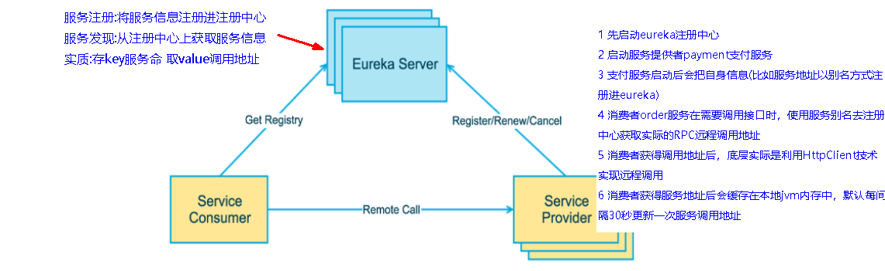

服务注册：将服务信息注册进注册中心

服务发现：从注册中心上获取服务信息

实质:存key服务 取value调用地址

Eureka使用步骤：

1. 先启动eureka注册中心
2. 启动服务提供者paymen支付服务
3. 支付服务启动后会把自身信息(比如服务地址以别名方式注册进eureka)
4. 消费者order服务在需要调用接口时，使用服务别名去注册中心获取实际的RPC远程调用地址
5. 消费者获得调用地址后，底层实际是利用HttpClien技术实现远程调用
6. 消费者获得服务地址后会缓存在本地jvm内存中，默认每间隔30秒更新一次服务调用地址


微服务RPC远程服务调用最核心的是**高可用**，试想你的注册中心只有一个only one，它出故障了那就呵呵(￣▽￣)"了，会导致整个为服务环境不可用

解决办法：搭建Eureka注册中心集群 ，实现负载均衡+故障容错

### 03-2、Eureka集群环境构建

集群思想：互相监控

> 参考cloud-eureka-server7001

#### 03-2-1、新建模块cloud-eureka-server7002


#### 03-2-2、修改Pom(同cloud-eureka-server7001)

#### 03-2-3、修改映射配置

1. 进入 C:\Windows\System32\drivers\etc路径下的hosts文件(启动管理员权限使用Notepad++打开host文件修改保存)

2. 修改映射配置添加进hosts文件

   ```tex
   127.0.0.1 eureka7001.com
   127.0.0.1 eureka7002.com
   ```

#### 03-2-4、修改yml配置文件

`cloud-eureka-server7001`

```yaml
server:
  port: 7001

eureka:
  instance:
    hostname: eureka7001.com #eureka服务端的实例名称
  client:
    #false表示不向注册中心注册自己。
    register-with-eureka: false
    #false表示自己端就是注册中心，我的职责就是维护服务实例，并不需要去检索服务
    fetch-registry: false
    service-url:
      #设置与Eureka Server交互的地址查询服务和注册服务都需要依赖这个地址。
      defaultZone: http://eureka7002.com:7002/eureka/
```

`cloud-eureka-server7002`

```yaml
server:
    port: 7002
eureka:
    instance:
        hostname: eureka7002.com #eureka服务端的实例名称
    client:
        #false表示不向注册中心注册自己。
        register-with-eureka: false
        #false表示自己端就是注册中心，我的职责就是维护服务实例，并不需要去检索服务
        fetch-registry: false
        service-url:
            #设置与Eureka Server交互的地址查询服务和注册服务都需要依赖这个地址。
            defaultZone: http://eureka7001.com:7001/eureka/
```

#### 03-2-5、主启动类

添加注解`@EnableEurekaServer`

#### 03-2-6、测试


### 03-3、支付模块和订单模块注册进Eureka集群

`cloud-provider-payment8001`,`cloud-consumer-order80`

```yaml
#defaultZone: http://localhost:7001/eureka #单机版
defaultZone: http://eureka.com:7001/eureka,http://eureka7002.com:7002/eureka #集群版
```

### 03-4、测试

1. 先要启动EurekaServer，7001/7002服务
2. 再要启动服务提供者provider，8001
3. 再要启动消费者，80

### 03-5、支付服务提供者集群环境构建

> 参考cloud-provider-payment8001

#### 03-5-1、新建cloud-provider-payment8002

#### 03-5-2、修改pom

同cloud-provider-payment8001模块

#### 03-5-3、修改yml配置文件

```yaml
server:
  port: 8002

spring:
  application:
    name: cloud-payment-service
  datasource:
    type: com.alibaba.druid.pool.DruidDataSource            # 当前数据源操作类型
    driver-class-name: org.gjt.mm.mysql.Driver              # mysql驱动包
    url: jdbc:mysql://localhost:3306/db2019?useUnicode=true&characterEncoding=utf-8&useSSL=false
    username: root
    password: 123456
eureka:
  client:
    #表示是否将自己注册进EurekaServer默认为true。
    register-with-eureka: true
    #是否从EurekaServer抓取已有的注册信息，默认为true。单节点无所谓，集群必须设置为true才能配合ribbon使用负载均衡
    fetchRegistry: true
    service-url:
      #defaultZone: http://localhost:7001/eureka
      defaultZone: http://eureka.com:7001/eureka,http://eureka7002.com:7002/eureka #集群版

mybatis:
  mapperLocations: classpath:mapper/*.xml
  type-aliases-package: com.atguigu.springcloud.entities    # 所有Entity别名类所在包
```

#### 03-5-4、主启动

添加@EnableEurekaClient注解

#### 03-5-5、业务类

> 同cloud-provider-payment8001

#### 03-5-6、修改8001/8002的Controller

8001,8002:

```java
public class PaymentController {

    @Resource
    private PaymentService paymentService;

    @Value("${server.port}")
    private String serverPort;

    @PostMapping("/payment/create")
    public CommonResult create(@RequestBody Payment payment){
        int result = paymentService.create(payment);
        log.info("*********插入结果:"+result);
        if (result > 0){
            return new CommonResult(200,"插入数据库成功,serverPort:"+serverPort,result);
        }else {
            return new CommonResult(500,"插入数据库失败");
        }
    }

    @GetMapping("/payment/get/{id}")
    public CommonResult<Payment> getPaymentById(@PathVariable("id") Long id){
        Payment payment = paymentService.getPaymentById(id);
//        System.out.println(payment.toString());
        if (payment != null){
            return new CommonResult<>(200,"查询数据库成功,serverPort:"+serverPort,payment);
        }else {
            return new CommonResult<>(500,"没有对应记录，查询ID："+id);
        }
    }
}
```

#### 03-5-7、测试

调用：http://localhost/consumer/payment/get/31接口发现一直都是8001接口调用


### 03-6、负载均衡

#### 03-6-1、订单模块Controller访问地址修改

```java
//    public static final String PAYMENT_URL = "http://localhost:8001";
public static final String PAYMENT_URL = "http://CLOUD-PAYMENT-SERVICE";
```

#### 03-6-2、订单模块RestTemplate负载均衡配置

`ApplicationContextConfig`添加@LoadBalanced注解

```java
/**
 * 配置RestTemplate远程调用
 */
@Bean 
@LoadBalanced //使用@LoadBalanced注解赋予RestTemplate负载均衡的能力
public RestTemplate getRestTemplate(){
    return new RestTemplate();
}
```

#### 03-6-3、测试

实现远程调用负载均衡（轮询机制）


## 04、Actuator微服务信息完善


含有主机名称：192.168.176.1

规范中要求**只暴露服务名**

### 04-1、主机名称和服务名称的修改

#### 04-1-1、修改cloud-provider-payment8001/8002

添加内容：

```yaml
instance:
	instance-id: payment8002
```

完整:

```yaml
eureka:
  client:
    #表示是否将自己注册进EurekaServer默认为true。
    register-with-eureka: true
    #是否从EurekaServer抓取已有的注册信息，默认为true。单节点无所谓，集群必须设置为true才能配合ribbon使用负载均衡
    fetchRegistry: true
    service-url:
      #defaultZone: http://localhost:7001/eureka
      defaultZone: http://eureka7001.com:7001/eureka,http://eureka7002.com:7002/eureka #集群版
  instance:
    instance-id: payment8001
```

#### 04-1-2、修改后


### 04-2、访问信息有IP信息提示

当前访问信息没有IP信息提示

#### 04-2-1、修改cloud-provider-payment8001/8002

添加内容

```yaml
instance:
	prefer-ip-address: true     #访问路径可以显示IP地址
```

完整：

```yaml
eureka:
  client:
    #表示是否将自己注册进EurekaServer默认为true。
    register-with-eureka: true
    #是否从EurekaServer抓取已有的注册信息，默认为true。单节点无所谓，集群必须设置为true才能配合ribbon使用负载均衡
    fetchRegistry: true
    service-url:
      #defaultZone: http://localhost:7001/eureka
      defaultZone: http://eureka7001.com:7001/eureka,http://eureka7002.com:7002/eureka #集群版
  instance:
    instance-id: payment8001
    prefer-ip-address: true     #访问路径可以显示IP地址
```

#### 04-2-2、修改后

显示ip

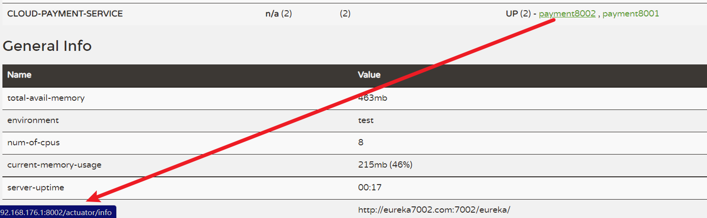

## 05、服务发现Discovery

> 对于注册进Eureka里面的微服务，可以通过服务发现来获取该服务的信息

cloud-provider-payment8001/8002

### 05-1、controller

1. 注入服务信息类 DiscoveryClinet

   ```java
   @Resource
   private DiscoveryClient discoveryClient;
   ```

2. 获取服务信息接口

   ```java
   @GetMapping("/payment/discovery")
   public Object discovery(){
       //获取服务列表清单
       List<String> services = discoveryClient.getServices();
       for (String element:services) {
           log.info("****element:"+element);
           //****element:cloud-payment-service
           //****element:cloud-order-service
       }
       //获取服务
       List<ServiceInstance> instances = discoveryClient.getInstances("CLOUD-PAYMENT-SERVICE");
       for (ServiceInstance instance : instances) {
           log.info(instance.getServiceId()+"\t"+instance.getHost()+"\t"+instance.getPort()+"\t"+instance.getUri());
           //CLOUD-PAYMENT-SERVICE	192.168.176.1	8002	http://192.168.176.1:8002
           //CLOUD-PAYMENT-SERVICE	192.168.176.1	8001	http://192.168.176.1:8001
       }
       return this.discoveryClient;
   }
   ```

### 05-2、主启动类

添加注解`@EnableDiscoveryClient`

```java
@SpringBootApplication
@EnableEurekaClient
@EnableDiscoveryClient
public class PaymentMain8001 {
    public static void main(String[] args) {
        SpringApplication.run(PaymentMain8001.class,args);
    }
}
```

### 05-3、测试

启动服务，调用接口：http://localhost:8001/payment/discovery


## 06、Eureka自我保护

### 06-1、自我保护现象

保护模式主要用于一组客户端和Eureka Server之间存在网络分区场景下的保护。一旦进入保护模式，
**Eureka Server将会尝试保护其服务注册表中的信息，不再删除服务注册表中的数据，也就是不会注销任何微服务。**

如果在Eureka Server的首页看到以下这段提示，则说明Eureka进入了保护模式：


### 06-2、导致原因

> 某时刻某一个微服务不可用了，Eureka不会立刻清理，依旧会对该微服务的信息进行保存

属于CAP分支的AP分支


- 为什么会产生Eureka自我保护机制？

  为了防止EurekaClient可以正常运行，但是 与 EurekaServer网络不通情况下，EurekaServer不会立刻将EurekaClient服务剔除

- 什么是自我保护模式？

  默认情况下，如果EurekaServer在一定时间内没有接收到某个微服务实例的心跳，EurekaServer将会注销该实例（默认90秒）。但是当网络分区故障发生(延时、卡顿、拥挤)时，微服务与EurekaServer之间无法正常通信，以上行为可能变得非常危险了——因为微服务本身其实是健康的，此时本不应该注销这个微服务。Eureka通过“自我保护模式”来解决这个问题———**当EurekaServer节点在短时间内丢失过多客户端时（可能发生了网络分区故障），那么这个节点就会进入自我保护模式。**


在自我保护模式中，Eureka Server会保护服务注册表中的信息，不再注销任何服务实例。
它的设计哲学就是宁可保留错误的服务注册信息，也不盲目注销任何可能健康的服务实例。一句话讲解：好死不如赖活着

综上，自我保护模式是一种应对网络异常的安全保护措施。它的架构哲学是宁可同时保留所有微服务（健康的微服务和不健康的微服务都会保留）也不盲目注销任何健康的微服务。使用自我保护模式，可以让Eureka集群更加的健壮、稳定。

### 06-3、禁止自我保护

#### 06-3-1、注册中心EurekaServer端7001

1. 出厂默认，自我保护机制是开启的

   ```properties
   eureka.server.enable-self-preservation=true
   ```

   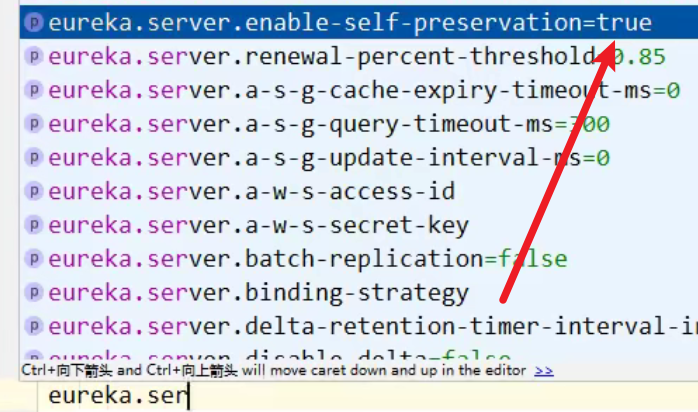

2. 将配置关闭即可禁用自我保护模式

   ```properties
   eureka.server.enable-self-preservation=false
   # 2s未监听到服务信息删除该微服务(默认为90s)
   eviction-interval-timer-in-ms: 2000  
   ```

效果：


#### 06-3-2、生产者客户端EurekaClient端8001

1. 默认配置

   ```properties
   #单位为秒(默认是30秒)
   eureka.instance.lease-renewal-interval-in-seconds=30
   #单位为秒(默认是90秒)
   eureka.instance.lease-expiration-duration-in-seconds=90
   ```

2. 需要修改的配置

   ```yaml
   instance:
   	#Eureka客户端向服务端发送心跳的时间间隔，单位为秒(默认是30秒)
   	lease-renewal-interval-in-seconds: 1
   	#Eureka服务端在收到最后一次心跳后等待时间上限，单位为秒(默认是90秒)，超时将剔除服务
   	lease-expiration-duration-in-seconds: 2
   ```

#### 06-3-3、测试

1. 配置7001和8001的yml配置文件
2. 先启动7001再启动8001
3. EurekaServer中存在7001
4. 关闭8001后，EurekaServer立刻删除8001服务

# 六、Zookeeper服务注册与发现


## 01、SpringCloud整合Zookeeper代替Eureka

### 01-1、注册中心ZooKeeper

zookeeper是一个分布式协调工具，可以实现注册中心功能

### 01-2、使用前提

1. 关闭Linux服务器防火墙

   ```shell
   [root@localhost zookeeper-3.5.7]# systemctl stop firewalld
   ```

2. 启动zookeeper服务器

   ```shell
   [root@localhost zookeeper-3.5.7]#  bin/zkServer.sh start
   #查看ZooKeeper启动状态
   [root@localhost zookeeper-3.5.7]# bin/zkServer.sh status
   /usr/bin/java
   ZooKeeper JMX enabled by default
   Using config: /opt/module/zookeeper-3.5.7/bin/../conf/zoo.cfg
   Client port found: 2181. Client address: localhost.
   Mode: standalone
   ```
   
3. 启动zooKeeper客户端

   ```shell
   [root@localhost zookeeper-3.5.7]# bin/zkCli.sh
   ```

## 02、服务提供者

### 02-1、新建cloud-provider-payment8004

### 02-2、pom配置

```xml
<?xml version="1.0" encoding="UTF-8"?>
<project xmlns="http://maven.apache.org/POM/4.0.0" xmlns:xsi="http://www.w3.org/2001/XMLSchema-instance"
	xsi:schemaLocation="http://maven.apache.org/POM/4.0.0 https://maven.apache.org/xsd/maven-4.0.0.xsd">
	<modelVersion>4.0.0</modelVersion>
	<parent>
		<artifactId>cloud2020</artifactId>
		<groupId>com.atguigu.springcloud</groupId>
		<version>1.0-SNAPSHOT</version>
	</parent>

	<artifactId>cloud-provider-payment8004</artifactId>

	<dependencies>
		<dependency>
			<groupId>org.springframework.boot</groupId>
			<artifactId>spring-boot-starter-test</artifactId>
			<scope>test</scope>
		</dependency>
		<!-- SpringBoot整合Web组件 -->
		<dependency>
			<groupId>org.springframework.boot</groupId>
			<artifactId>spring-boot-starter-web</artifactId>
		</dependency>
		<!-- 引入自己定义的api通用包，可以使用Payment支付Entity -->
		<dependency>
			<groupId>com.atguigu.springcloud</groupId>
			<artifactId>cloud-api-commons</artifactId>
			<version>${project.version}</version>
		</dependency>
		<!-- SpringBoot整合zookeeper客户端 -->
		<dependency>
			<groupId>org.springframework.cloud</groupId>
			<artifactId>spring-cloud-starter-zookeeper-discovery</artifactId>
		</dependency>
		<dependency>
			<groupId>org.springframework.boot</groupId>
			<artifactId>spring-boot-devtools</artifactId>
			<scope>runtime</scope>
			<optional>true</optional>
		</dependency>
		<dependency>
			<groupId>org.projectlombok</groupId>
			<artifactId>lombok</artifactId>
			<optional>true</optional>
		</dependency>
	</dependencies>
</project>
```

### 02-3、yml配置

```yaml
#8004表示注册到zookeeper服务器的支付服务提供者端口号
server:
  port: 8004
#服务别名----注册zookeeper到注册中心名称
spring:
  application:
    name: cloud-provider-payment
  cloud:
    zookeeper:
      connect-string: 10.1.53.169:2181 #zookeeper端口默认2181
```

### 02-4、主启动类

添加`@EnableDiscoveryClient`注解

```java

@SpringBootApplication
@EnableDiscoveryClient //该注解用于向使用consul或者zookeeper作为注册中心时注册服务
public class CloudProviderPayment8004Application {

	public static void main(String[] args) {
		SpringApplication.run(CloudProviderPayment8004Application.class, args);
	}

}

```

### 02-5、controller

```java
@RestController
@Slf4j
public class PaymentController {

    @Value("${server.port}")
    private String serverPort;

    @RequestMapping(value = "/payment/zk")
    public String paymentzk()
    {
        return "springcloud with zookeeper: "+serverPort+"\t"+ UUID.randomUUID().toString();
    }
}
```

### 02-6、启动8004注册进zookeeper

若启动后报错：


原因：服务器的zookeeper版本低于3.5.3，版本冲突


解决：修改pom

```xml
<!-- SpringBoot整合zookeeper客户端 -->
<dependency>
    <groupId>org.springframework.cloud</groupId>
    <artifactId>spring-cloud-starter-zookeeper-discovery</artifactId>
    <!--先排除自带的zookeeper3.5.3-->
    <exclusions>
        <exclusion>
            <groupId>org.apache.zookeeper</groupId>
            <artifactId>zookeeper</artifactId>
        </exclusion>
    </exclusions>
</dependency>
<!--添加zookeeper3.4.9版本-->
<dependency>
    <groupId>org.apache.zookeeper</groupId>
    <artifactId>zookeeper</artifactId>
    <version>3.4.9</version>
</dependency>
```

zookeeper上查看是否有服务注册

```SHELL
# 未注册时
[zk: localhost:2181(CONNECTED) 0] ls /
[zookeeper]
# 注册后 多了个services
[zk: localhost:2181(CONNECTED) 1] ls /
[services, zookeeper]
[zk: localhost:2181(CONNECTED) 2] ls /services
[cloud-provider-payment]
```


### 02-7、调用接口验证测试


```shell
[zk: localhost:2181(CONNECTED) 6] ls /services/cloud-provider-payment
[939cd5a3-6206-4e16-acd3-9956fd7dc973]
[zk: localhost:2181(CONNECTED) 7] ls /services/cloud-provider-payment/939cd5a3-6206-4e16-acd3-9956fd7dc973
[]
[zk: localhost:2181(CONNECTED) 8] get /services/cloud-provider-payment/939cd5a3-6206-4e16-acd3-9956fd7dc973
{"name":"cloud-provider-payment","id":"939cd5a3-6206-4e16-acd3-9956fd7dc973","address":"localhost","port":8004,"sslPort":null,"payload":{"@class":"org.springframework.cloud.zookeeper.discovery.ZookeeperInstance","id":"application-1","name":"cloud-provider-payment","metadata":{}},"registrationTimeUTC":1637111849651,"serviceType":"DYNAMIC","uriSpec":{"parts":[{"value":"scheme","variable":true},{"value":"://","variable":false},{"value":"address","variable":true},{"value":":","variable":false},{"value":"port","variable":true}]}}
```


### 02-8、zookeeper服务节点是持久/临时的

1. 关闭服务节点后，等待几分钟

2. 在zookeeper查看当前注册的服务节点

   ```shell
   [zk: localhost:2181(CONNECTED) 10] ls /services/cloud-provider-payment
   [939cd5a3-6206-4e16-acd3-9956fd7dc973]
   [zk: localhost:2181(CONNECTED) 11] ls /services/cloud-provider-payment
   Node does not exist: /services/cloud-provider-payment
   # 重新启动8004端口服务器
   [zk: localhost:2181(CONNECTED) 12] ls /services/cloud-provider-payment
   [9382e481-6387-4269-a1aa-73cbd9030e68] #重新注册新服务节点
   ```

ZooKeeper服务节点是临时的

## 03、服务消费者

### 03-1、新建cloud-consumerzk-order80

### 03-2、pom配置

```xml
<?xml version="1.0" encoding="UTF-8"?>
<project xmlns="http://maven.apache.org/POM/4.0.0" xmlns:xsi="http://www.w3.org/2001/XMLSchema-instance"
	xsi:schemaLocation="http://maven.apache.org/POM/4.0.0 https://maven.apache.org/xsd/maven-4.0.0.xsd">
	<modelVersion>4.0.0</modelVersion>
	<parent>
		<artifactId>cloud2020</artifactId>
		<groupId>com.atguigu.springcloud</groupId>
		<version>1.0-SNAPSHOT</version>
	</parent>

	<artifactId>cloud-consumerzk-order80</artifactId>

	<dependencies>
		<dependency>
			<groupId>org.springframework.boot</groupId>
			<artifactId>spring-boot-starter-test</artifactId>
			<scope>test</scope>
		</dependency>
		<!-- SpringBoot整合Web组件 -->
		<dependency>
			<groupId>org.springframework.boot</groupId>
			<artifactId>spring-boot-starter-web</artifactId>
		</dependency>
		<!-- 引入自己定义的api通用包，可以使用Payment支付Entity -->
		<dependency>
			<groupId>com.atguigu.springcloud</groupId>
			<artifactId>cloud-api-commons</artifactId>
			<version>${project.version}</version>
		</dependency>
		<!-- SpringBoot整合zookeeper客户端 -->
		<dependency>
			<groupId>org.springframework.cloud</groupId>
			<artifactId>spring-cloud-starter-zookeeper-discovery</artifactId>
		</dependency>
		<dependency>
			<groupId>org.springframework.boot</groupId>
			<artifactId>spring-boot-devtools</artifactId>
			<scope>runtime</scope>
			<optional>true</optional>
		</dependency>
		<dependency>
			<groupId>org.projectlombok</groupId>
			<artifactId>lombok</artifactId>
			<optional>true</optional>
		</dependency>
	</dependencies>

</project>
```

### 03-3、yml配置

```yaml
server:
  port: 80

spring:
  application:
    name: cloud-consumer-order
  cloud:
    #注册到zookeeper地址
    zookeeper:
      connect-string: 10.1.53.169:2181
```

### 03-4、主启动类

添加`@EnableDiscoveryClient`注解

### 03-5、业务类

1. config配置RestTemplate

   ```java
   @Configuration
   public class ApplicationContextConfig {
   
       @Bean
       public RestTemplate getRestTemplate(){
           return new RestTemplate();
       }
   }
   ```

2. controller

   ```java
   @RestController
   @Slf4j
   public class OrderZKController {
       public static final String INVOKE_URL = "http://cloud-provider-payment";
   
       @Resource
       private RestTemplate restTemplate;
   
       @GetMapping("/consumer/payment/zk")
       public String paymentInfo(){
           String result = restTemplate.getForObject(INVOKE_URL + "/payment/zk", String.class);
           return result;
       }
   }
   ```

   

### 03-6、测试


调用HTTP接口：


转发调用支付模块的接口

# 七、Consul服务注册与发现

## 01、Consul简介

官网/官方文档：https://www.consul.io/intro/index.html

中文文档：https://www.springcloud.cc/spring-cloud-consul.html

Consul 是一套开源的分布式服务发现和配置管理系统，由 HashiCorp 公司**用 Go 语言开发**。

提供了微服务系统中的服务治理、配置中心、控制总线等功能。这些功能中的每一个都可以根据需要单独使用，也可以一起使用以构建全方位的服务网格，总之Consul提供了一种完整的服务网格解决方案。

它具有很多优点。包括： 基于 raft 协议，比较简洁； 支持健康检查, 同时支持 HTTP 和 DNS 协议 支持跨数据中心的 WAN 集群 提供图形界面 跨平台，支持 Linux、Mac、Windows

### 01-1、Consul的功能

1. 服务发现：提供HTTP和DNS两种发现方式。
2. 健康监测：支持多种方式，HTTP、TCP、Docker、Shell脚本定制化监控
3. KV存储方式：Key、Value的存储方式
4. 多数据中心：Consul支持多数据中心
5. 可视化Web界面

### 01-2、Consul下载地址

https://www.consul.io/downloads.html

## 02、Consul的安装与运行

官网安装说明：https://learn.hashicorp.com/consul/getting-started/install.html

1. 进入下载地址安装Windows版本的Consul

2. 解压后只有一个consul.exe文件

3. 查看版本号

   

4. 启动Consul服务

   ```shell
   D:\OfficeFile\consul_1.10.3_windows_amd64>consul agent -dev
   ```

   通过以下地址可以访问Consul的首页：http://localhost:8500

   


## 03、服务提供者注册进Consul

### 03-1、新建cloud-providerconsul-payment8006

### 03-2、pom配置

```xml
<?xml version="1.0" encoding="UTF-8"?>
<project xmlns="http://maven.apache.org/POM/4.0.0" xmlns:xsi="http://www.w3.org/2001/XMLSchema-instance"
	xsi:schemaLocation="http://maven.apache.org/POM/4.0.0 https://maven.apache.org/xsd/maven-4.0.0.xsd">
	<modelVersion>4.0.0</modelVersion>
	<parent>
		<artifactId>cloud2020</artifactId>
		<groupId>com.atguigu.springcloud</groupId>
		<version>1.0-SNAPSHOT</version>
	</parent>

	<artifactId>cloud-providerconsul-payment8006</artifactId>

	<dependencies>
		<!--SpringCloud consul-server -->
		<dependency>
			<groupId>org.springframework.cloud</groupId>
			<artifactId>spring-cloud-starter-consul-discovery</artifactId>
		</dependency>
		<!-- SpringBoot整合Web组件 -->
		<dependency>
			<groupId>org.springframework.boot</groupId>
			<artifactId>spring-boot-starter-web</artifactId>
		</dependency>
		<dependency>
			<groupId>org.springframework.boot</groupId>
			<artifactId>spring-boot-starter-actuator</artifactId>
		</dependency>
		<!--日常通用jar包配置-->
		<dependency>
			<groupId>org.springframework.boot</groupId>
			<artifactId>spring-boot-devtools</artifactId>
			<scope>runtime</scope>
			<optional>true</optional>
		</dependency>
		<dependency>
			<groupId>org.projectlombok</groupId>
			<artifactId>lombok</artifactId>
			<optional>true</optional>
		</dependency>
		<dependency>
			<groupId>org.springframework.boot</groupId>
			<artifactId>spring-boot-starter-test</artifactId>
			<scope>test</scope>
		</dependency>
	</dependencies>
</project>
```

### 03-3、yml配置

```yaml
server:
  port: 8006

spring:
  application:
    name: consul-provider-payment
  cloud:
    consul:
      host: localhost
      port: 8500
      discovery:
        service-name: ${spring.application.name}
```

### 03-4、主启动类

添加`@EnableDiscoveryClient`注解

```java
@SpringBootApplication
@EnableDiscoveryClient
public class CloudProviderconsulPayment8006Application {

	public static void main(String[] args) {
		SpringApplication.run(CloudProviderconsulPayment8006Application.class, args);
	}

}
```

### 03-5、业务类Controller

```java
@RestController
@Slf4j
public class PaymentController
{
    @Value("${server.port}")
    private String serverPort;

    @GetMapping("/payment/consul")
    public String paymentInfo()
    {
        return "springcloud with consul: "+serverPort+"\t\t"+ UUID.randomUUID().toString();
    }

}
```

### 03-6、测试

- 访问http:localhost:8500查看Consul注册情况

  

- 调用接口

  

## 04、服务消费者注册进Consul

### 03-1、新建cloud-consumerconsul-order80

### 03-2、pom配置(同服务提供者模块)

### 03-3、yml配置

```yaml
###consul服务端口号
server:
  port: 80

spring:
  application:
    name: cloud-consumer-order
####consul注册中心地址
  cloud:
    consul:
      host: localhost
      port: 8500
      discovery:
        service-name: ${spring.application.name}
```

### 03-4、主启动类

添加`@EnableDiscoveryClient`注解

### 03-5、业务类

1. config

   ```java
   @Configuration
   public class ApplicationContextConfig {
   
       @Bean
       @LoadBalanced
       public RestTemplate getRestTemplate(){
           return new RestTemplate();
       }
   }
   ```

2. controller

   ```java
   @RestController
   @Slf4j
   public class OrderZKController {
       public static final String INVOKE_URL = "http://consul-provider-payment";
   
       @Resource
       private RestTemplate restTemplate;
   
       @GetMapping("/consumer/payment/consul")
       public String paymentInfo(){
           String result = restTemplate.getForObject(INVOKE_URL + "/payment/consul", String.class);
           return result;
       }
   }
   ```

### 03-6、测试

Consul平台：


调用消费者接口实现远程调用：


## 05、三个注册中心的异同点

|  组件名   | 语言 | CAP  | 服务健康检查 | 对外暴露接口 | Springcloud集成 |
| :-------: | :--: | :--: | :----------: | :----------: | :-------------: |
|  Eureka   | Java |  AP  |   可配支持   |     HTTP     |     已集成      |
| ZooKeeper |  GO  |  CP  |     支持     |    客户端    |     已集成      |
|  Consul   | Java |  CP  |     支持     |   HTTP/DNS   |     已集成      |


### 05-1、CAP

CAP理论关注粒度是数据，而不是整体系统设计的策略

- C:Consistency（强一致性）
- A:Availability（可用性）
- P:Partition tolerance（分区容错性）

最多只能同时较好的满足两个。
CAP理论的核心是：**一个分布式系统不可能同时很好的满足一致性，可用性和分区容错性这三个需求**，

因此，根据 CAP 原理将 NoSQL 数据库分成了满足 CA 原则、满足 CP 原则和满足 AP 原则三 大类：
CA - 单点集群，满足一致性，可用性的系统，通常在可扩展性上不太强大。
CP - 满足一致性，分区容忍必的系统，通常性能不是特别高。
AP - 满足可用性，分区容忍性的系统，通常可能对一致性要求低一些。

- AP(Eureka)：AP架构当网络分区出现后，为了保证可用性，系统B可以返回旧值，保证系统的可用性。

  结论：违背了一致性C的要求，只满足可用性和分区容错，即AP

  

- CP(Zookeeper/Consul)：当网络分区出现后，为了保证一致性，就必须拒接请求，否则无法保证一致性
  结论：违背了可用性A的要求，只满足一致性和分区容错，即CP

  

# 八、Ribbon负载均衡服务调用


## 01、Ribbon概述

Spring Cloud Ribbon是基于Netflix Ribbon实现的一套**客户端负载均衡的工具**。

简单的说，Ribbon是Netflix发布的开源项目，主要功能是**提供客户端的软件负载均衡算法和服务调用**。Ribbon客户端组件提供一系列完善的配置项如连接超时，重试等。简单的说，就是在配置文件中列出Load Balancer（简称LB）后面所有的机器，Ribbon会自动的帮助你基于某种规则（如简单轮询，随机连接等）去连接这些机器。我们很容易使用Ribbon实现自定义的负载均衡算法。

### 01-1、官网资料

官网：https://github.com/Netflix/ribbon/wiki/Getting-Started

**Ribbon目前也进入维护模式**，但Ribbon目前还是主流的，未来替换方案：


### 01-2、LB（负载均衡）

负载均衡：简单的说就是将用户的请求平摊的分配到多个服务上，从而达到系统的HA（高可用）。常见的负载均衡有软件Nginx，LVS，硬件 F5等。

Ribbon本地负载均衡客户端 VS Nginx服务端负载均衡区别：

- Nginx是服务器负载均衡，客户端所有请求都会交给nginx，然后由nginx实现转发请求。即负载均衡是由服务端实现的。
- Ribbon本地负载均衡，在调用微服务接口时候，会在注册中心上获取注册信息服务列表之后缓存到JVM本地，从而在本地实现RPC远程服务调用技术。

集中式LB：即在服务的消费方和提供方之间使用独立的LB设施(可以是硬件，如F5, 也可以是软件，如nginx), 由该设施负责把访

问请求通过某种策略转发至服务的提供方；

进程内LB：将LB逻辑集成到消费方，消费方从服务注册中心获知有哪些地址可用，然后自己再从这些地址中选择出一个合适的服务

器。Ribbon就属于进程内LB，它只是一个类库，集成于消费方进程，消费方通过它来获取到服务提供方的地址。

> 前面我们讲解过了80通过轮询负载访问8001/8002
> Ribbon就是负载均衡+RestTamplate调用

## 02、Ribbon负载均衡实现

### 02-1、架构说明

> 总结：Ribbon其实就是一个软负载均衡的客户端组件，他可以和其他所需请求的客户端结合使用，和eureka结合只是其中的一个实例。

架构图：


Ribbon在工作时分成两步

1. 第一步先选择 EurekaServer ,它优先选择在同一个区域内负载较少的server.
2. 第二步再根据用户指定的策略，在从server取到的服务注册列表中选择一个地址。
   其中Ribbon提供了多种策略：比如轮询、随机和根据响应时间加权。

### 02-2、POM

```xml
<dependency>
    <groupId>org.springframework.cloud</groupId>
    <artifactId>spring-cloud-starter-netflix-ribbon</artifactId>
</dependency>
```

之前写样例时候已经完成了负载均衡,没有引入spring-cloud-starter-ribbon也可以使用ribbon,

因为spring-cloud-starter-netflix-eureka-client自带了spring-cloud-starter-ribbon引用：


### 02-3、RestTemplate的使用（二）

官方API文档：https://docs.spring.io/spring-framework/docs/5.2.2.RELEASE/javadoc-api/org/springframework/web/client/RestTemplate.html


#### 02-3-1、getForObject/getForEntity方法

1. getForObject：返回对象为响应体中数据转化成的对象，基本上可以理解为Json

   ```java
   @GetMapping("/consumer/payment/get/{id}")
   public CommonResult<Payment> getPayment(@PathVariable("id") Long id) {
       return restTemplate.getForObject(PAYMENT_URL + "/payment/get/" + id, CommonResult.class);
   }
   ```

2. getForEntity：返回对象为ResponseEntity对象，包含了响应中的一些重要信息，比如响应头、响应状态码、响应体等

   ```java
   @GetMapping("/consumer/payment/get/{id}")
   public CommonResult<Payment> getPayment2(@PathVariable("id") Long id) {
       ResponseEntity<CommonResult> entity = restTemplate.getForEntity(PAYMENT_URL + "/payment/get/" + id, CommonResult.class);
       if (entity.getStatusCode().is2xxSuccessful()){
           return entity.getBody();
       }else {
           return new CommonResult(444,"操作失败");
       }
   }
   ```

#### 02-3-2、postForObject/postForEntity

1. postForObject

   ```java
   @GetMapping("/consumer/payment/create")
   public CommonResult<Payment> create(Payment payment) {
       return restTemplate.postForObject(PAYMENT_URL + "/payment/create", payment, CommonResult.class);
   }
   ```

2. postForEntity

   ```java
   @GetMapping("/consumer/payment/getForEntity/create")
   public CommonResult<Payment> create1(Payment payment){
       return restTemplate.postForEntity(PAYMENT_URL + "/payment/create", payment, CommonResult.class).getBody();
   }
   ```

#### 02-3-3、GET请求方法

```java
<T> T getForObject(String url, Class<T> responseType, Object... uriVariables);
 
<T> T getForObject(String url, Class<T> responseType, Map<String, ?> uriVariables);
 
<T> T getForObject(URI url, Class<T> responseType);
 
<T> ResponseEntity<T> getForEntity(String url, Class<T> responseType, Object... uriVariables);
 
<T> ResponseEntity<T> getForEntity(String url, Class<T> responseType, Map<String, ?> uriVariables);
 
<T> ResponseEntity<T> getForEntity(URI var1, Class<T> responseType);
```

#### 02-3-4、POST请求方法

```java
 <T> T postForObject(String url, @Nullable Object request, Class<T> responseType, Object... uriVariables);
 
<T> T postForObject(String url, @Nullable Object request, Class<T> responseType, Map<String, ?> uriVariables);
 
<T> T postForObject(URI url, @Nullable Object request, Class<T> responseType);
 
<T> ResponseEntity<T> postForEntity(String url, @Nullable Object request, Class<T> responseType, Object... uriVariables);
 
<T> ResponseEntity<T> postForEntity(String url, @Nullable Object request, Class<T> responseType, Map<String, ?> uriVariables);
 
<T> ResponseEntity<T> postForEntity(URI url, @Nullable Object request, Class<T> responseType);
```

## 03、Ribbon核心组件IRule

> **IRule：根据特定算法中从服务列表中选取一个要访问的服务**


1. com.netflix.loadbalancer.RoundRobinRule：轮询
2. com.netflix.loadbalancer.RandomRule：随机
3. com.netflix.loadbalancer.RetryRule：先按照RoundRobinRule的策略获取服务，如果获取服务失败则在指定时间内会进行重试，获取可用的服务
4. WeightedResponseTimeRule：对RoundRobinRule的扩展，响应速度越快的实例选择权重越大，越容易被选择
5. BestAvailableRule：会先过滤掉由于多次访问故障而处于断路器跳闸状态的服务，然后选择一个并发量最小的服务
6. AvailabilityFilteringRule：先过滤掉故障实例，再选择并发较小的实例
7. ZoneAvoidanceRule：默认规则,复合判断server所在区域的性能和server的可用性选择服务器

### 03-1、修改Ribbon的负载规则IRule

1. 修改`cloud-consumer-order80`

2. 配置细节

   官方文档明确给出了警告：Ribbon配置的这个自定义配置类不能放在@ComponentScan所扫描的当前包下以及子包下，
   否则我们自定义的这个配置类就会被所有的Ribbon客户端所共享，达不到特殊化定制的目的了。

   配置不能放在主启动所属的上一级包内（com.atguigu.springcloud)

3. 新建package：com.atguigu.myrule

   

4. 包内新建MySelfRule规则类

   ```java
   @Configuration
   public class MySelfRule {
   
       @Bean
       public IRule myRule(){
           return new RandomRule();//定义为随机
       }
   }
   ```

5. 主启动类添加`@RibbonClient`

   ```java
   @SpringBootApplication
   @EnableEurekaClient
   @RibbonClient(name = "CLOUD-PAYMENT-SERVICE",configuration = MySelfRule.class)
   public class OrderMain80 {
       public static void main(String[] args) {
           SpringApplication.run(OrderMain80.class, args);
       }
   }
   ```

6. 测试：http://localhost/consumer/payment/get/31

   随机负载：

   

   

## 04、Ribbon负载均衡算法

### 04-1、原理

负载均衡算法：rest接口第几次请求数 % 服务器集群总数量 = 实际调用服务器位置下标  ，每次服务重启动后rest接口计数从1开始。

```java
List<ServiceInstance> instances = discoveryClient.getInstances("CLOUD-PAYMENT-SERVICE");
 
如：   
    List [0] instances = 127.0.0.1:8002
    List [1] instances = 127.0.0.1:8001
```

8001 + 8002 组合成为集群，它们共计2台机器，集群总数为2， 按照轮询算法原理：

当总请求数为1时： 1 % 2 =1 对应下标位置为1 ，则获得服务地址为127.0.0.1:8001
当总请求数位2时： 2 % 2 =0 对应下标位置为0 ，则获得服务地址为127.0.0.1:8002
当总请求数位3时： 3 % 2 =1 对应下标位置为1 ，则获得服务地址为127.0.0.1:8001
当总请求数位4时： 4 % 2 =0 对应下标位置为0 ，则获得服务地址为127.0.0.1:8002
如此类推......

### 04-2、RoundRobinRule源码

```java
public class RoundRobinRule extends AbstractLoadBalancerRule {
    private AtomicInteger nextServerCyclicCounter;
    private static final boolean AVAILABLE_ONLY_SERVERS = true;
    private static final boolean ALL_SERVERS = false;
    private static Logger log = LoggerFactory.getLogger(RoundRobinRule.class);

    public RoundRobinRule() {
        this.nextServerCyclicCounter = new AtomicInteger(0);
    }

    public RoundRobinRule(ILoadBalancer lb) {
        this();
        this.setLoadBalancer(lb);
    }

    public Server choose(ILoadBalancer lb, Object key) {//轮询算法
        if (lb == null) {
            log.warn("no load balancer");
            return null;
        } else {
            Server server = null;
            int count = 0;

            while(true) {
                if (server == null && count++ < 10) {
                    List<Server> reachableServers = lb.getReachableServers();//获取存活的服务器集合
                    List<Server> allServers = lb.getAllServers();//获取所有服务器集合
                    int upCount = reachableServers.size();//获取存活的服务器数量
                    int serverCount = allServers.size();//获取所有服务器数量
                    if (upCount != 0 && serverCount != 0) {
                        int nextServerIndex = this.incrementAndGetModulo(serverCount);//获取本次选择的服务器下标
                        server = (Server)allServers.get(nextServerIndex);//找到本次轮询的服务器
                        if (server == null) {
                            Thread.yield();
                        } else {
                            if (server.isAlive() && server.isReadyToServe()) {
                                return server;
                            }

                            server = null;
                        }
                        continue;
                    }

                    log.warn("No up servers available from load balancer: " + lb);
                    return null;
                }

                if (count >= 10) {
                    log.warn("No available alive servers after 10 tries from load balancer: " + lb);
                }

                return server;
            }
        }
    }

    private int incrementAndGetModulo(int modulo) {
        int current;//上一次选择的服务器下标
        int next;//下一个选择的服务器下标
        do {
            current = this.nextServerCyclicCounter.get();//获取上次选择的服务器下标 首次为0
            next = (current + 1) % modulo;//选择下一个服务器下标 首次为1 
        } while(!this.nextServerCyclicCounter.compareAndSet(current, next));//对比current和next并将next设值到nextServerCyclicCounter

        return next;
    }
}
```


### 04-3、手写轮询算法

1. 启动7001/7002集群

2. 8001/8002微服务改造

   `controller`

   ```java
   @GetMapping("/payment/lb")
   public String getPaymentLB(){
       return serverPort;
   }
   ```

3. 80订单服务改造

   1. 配置类ApplicationContextConfig去掉注解@LoadBalanced

   2. 添加LoadBalancer接口

      `com.atguigu.springcloud.lb.LoadBalancer`

      ```java
      public interface LoadBalancer {
          ServiceInstance instances(List<ServiceInstance> serviceInstance);
      }
      ```

   3. MyLB轮询算法

      ```java
      @Component
      public class MyLB implements LoadBalancer {
      
          private AtomicInteger atomicInteger = new AtomicInteger(0);
      
          public final int getAndIncrement(){
             int current;
             int next;
             do{
                 current = this.atomicInteger.get();
                 next = current >= 2147483647 ? 0 : current + 1;
             }while (!this.atomicInteger.compareAndSet(current, next));
              System.out.println("next::"+next);
              return next;
          }
      
          @Override
          public ServiceInstance instances(List<ServiceInstance> serviceInstance) {
              int index = getAndIncrement() % serviceInstance.size();
              ServiceInstance instance = serviceInstance.get(index);
              return instance;
          }
      }
      ```

   4. controller

      ```java
      @Resource
      private LoadBalancer loadBalancer;
      
      @Resource
      private DiscoveryClient discoveryClient;
      
      @GetMapping("consumer/payment/lb")
      public String getPaymentLB(){
          List<ServiceInstance> instances = discoveryClient.getInstances("CLOUD-PAYMENT-SERVICE");
          if (instances == null || instances.size() <=0){
              return null;
          }
          ServiceInstance serviceInstance = loadBalancer.instances(instances);
          URI uri = serviceInstance.getUri();
          return restTemplate.getForObject(uri + "/payment/lb", String.class);
      }
      ```

   5. 测试:http://localhost/consumer/payment/lb

      

      

# 九、OpenFeign服务接口调用

## 01、OpenFeign概述

Feign是一个**声明式WebService客户端。使用Feign能让编写Web Service客户端更加简单。**

它的使用方法是**定义一个服务接口然后在上面添加注解**。Feign也支持可拔插式的编码器和解码器。Spring Cloud对Feign进行了封装，使其支持了Spring MVC标准注解和HttpMessageConverters。Feign可以与Eureka和Ribbon组合使用以支持负载均衡

官方文档：https://cloud.spring.io/spring-cloud-static/Hoxton.SR1/reference/htmlsingle/#spring-cloud-openfeign

Github：https://github.com/spring-cloud/spring-cloud-openfeign


### 01-1、OpenFeign的用途

Feign旨在使编写Java Http客户端变得更容易。
前面在使用Ribbon+RestTemplate时，利用RestTemplate对http请求的封装处理，形成了一套模版化的调用方法。但是在实际开发中，由于对服务依赖的调用可能不止一处，**往往一个接口会被多处调用，所以通常都会针对每个微服务自行封装一些客户端类来包装这些依赖服务的调用**。所以，Feign在此基础上做了进一步封装，由他来帮助我们定义和实现依赖服务接口的定义。在Feign的实现下，**我们只需创建一个接口并使用注解的方式来配置它(以前是Dao接口上面标注Mapper注解,现在是一个微服务接口上面标注一个Feign注解即可**)，即可完成对服务提供方的接口绑定，简化了使用Spring cloud Ribbon时，自动封装服务调用客户端的开发量。

### 01-2、Feign集成了Ribbon

利用Ribbon维护了Payment的服务列表信息，并且通过轮询实现了客户端的负载均衡。而与Ribbon不同的是，**通过feign只需要定义服务绑定接口且以声明式的方法**，优雅而简单的实现了服务调用

### 01-3、Feign和OpenFeign的区别

|                            Feign                             |                          OpenFeign                           |
| :----------------------------------------------------------: | :----------------------------------------------------------: |
| Feign是Spring Cloud组件中的一个轻量级RESTful的HTTP服务客户端。Feign内置了Ribbon，用来做客户端负载均衡，去调用服务注册中心的服务。Feign的使用方式是：使用Feign的注解定义接口，调用这个接口，就可以调用服务注册中心的服务 | OpenFeign是Spring Cloud 在Feign的基础上支持了SpringMVC的注解，如@RequesMapping等等。OpenFeign的@FeignClient可以解析SpringMVC的@RequestMapping注解下的接口，并通过动态代理的方式产生实现类，实现类中做负载均衡并调用其他服务。 |
| <dependency>  <groupId>org.springframework.cloud</groupId><br/>    <artifactId>spring-cloud-starter-feign</artifactId><br/></dependency> | <dependency><br/>    <groupId>org.springframework.cloud</groupId><br/>    <artifactId>spring-cloud-starter-openfeign</artifactId><br /></dependency> |

## 02、OpenFeign实现

> 实现方式：接口+注解（微服务调用接口+@FeignClient）

### 02-1、新建cloud-consumer-feign-order80

### 02-2、pom配置

```xml
<?xml version="1.0" encoding="UTF-8"?>
<project xmlns="http://maven.apache.org/POM/4.0.0"
         xmlns:xsi="http://www.w3.org/2001/XMLSchema-instance"
         xsi:schemaLocation="http://maven.apache.org/POM/4.0.0 http://maven.apache.org/xsd/maven-4.0.0.xsd">
    <parent>
        <artifactId>cloud2020</artifactId>
        <groupId>com.atguigu.springcloud</groupId>
        <version>1.0-SNAPSHOT</version>
    </parent>
    <modelVersion>4.0.0</modelVersion>

    <artifactId>cloud-consumer-feign-order80</artifactId>

    <dependencies>
        <!--openfeign-->
        <dependency>
            <groupId>org.springframework.cloud</groupId>
            <artifactId>spring-cloud-starter-openfeign</artifactId>
        </dependency>
        <!--eureka client-->
        <dependency>
            <groupId>org.springframework.cloud</groupId>
            <artifactId>spring-cloud-starter-netflix-eureka-client</artifactId>
        </dependency>
        <!-- 引入自己定义的api通用包，可以使用Payment支付Entity -->
        <dependency>
            <groupId>com.atguigu.springcloud</groupId>
            <artifactId>cloud-api-commons</artifactId>
            <version>${project.version}</version>
        </dependency>
        <!--web-->
        <dependency>
            <groupId>org.springframework.boot</groupId>
            <artifactId>spring-boot-starter-web</artifactId>
        </dependency>
        <dependency>
            <groupId>org.springframework.boot</groupId>
            <artifactId>spring-boot-starter-actuator</artifactId>
        </dependency>
        <!--一般基础通用配置-->
        <dependency>
            <groupId>org.springframework.boot</groupId>
            <artifactId>spring-boot-devtools</artifactId>
            <scope>runtime</scope>
            <optional>true</optional>
        </dependency>
        <dependency>
            <groupId>org.projectlombok</groupId>
            <artifactId>lombok</artifactId>
            <optional>true</optional>
        </dependency>
        <dependency>
            <groupId>org.springframework.boot</groupId>
            <artifactId>spring-boot-starter-test</artifactId>
            <scope>test</scope>
        </dependency>
    </dependencies>

</project>
```

### 02-3、yml配置

```yaml
server:
  port: 80

eureka:
  client:
    register-with-eureka: false
    service-url:
      defaultZone: http://eureka7001.com:7001/eureka/,http://eureka7002.com:7002/eureka/
```

### 02-4、主启动类

添加`@EnableFeignClients`

```java
@SpringBootApplication
@EnableFeignClients
public class CloudConsumerFeignOrder80 {
    public static void main(String[] args) {
        SpringApplication.run(CloudConsumerFeignOrder80.class, args);
    }
}
```

### 03-5、业务类

#### 03-5-1、配置业务逻辑接口和配置@FeignClinet调用provider服务

`service.PaymentFeignService`

```java
@FeignClient(value = "CLOUD-PAYMENT-SERVICE")
public interface PaymentFeignService {
    @GetMapping("/payment/get/{id}")
    CommonResult<Payment> getPaymentById(@PathVariable("id") Long id);
}
```

#### 03-5-2、控制层Controller

```java
@RestController
@Slf4j
public class OrderFeignController {
    @Resource
    private PaymentFeignService paymentFeignService;

    @GetMapping("/consumer/payment/get/{id}")
    public CommonResult<Payment> getPaymentById(@PathVariable("id") Long id){
        return paymentFeignService.getPaymentById(id);
    }
}
```

### 03-6、测试

1. 启动7001、7002

2. 启动8001、8002

3. 启动OpenFeign80服务

4. 调用接口：http://localhost/consumer/payment/get/31

   

5. 自带**轮询**负载均衡机制

总结：

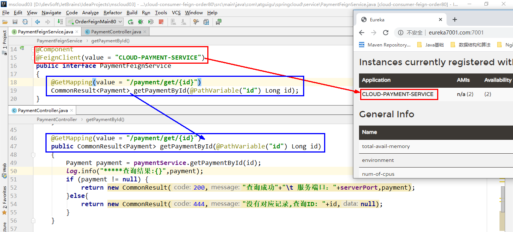

## 03、OpenFeign的超时控制

> 消费者在调用服务提供者接口时，由于某些原因请求超时
>
> OpenFeigndiao'yong默认等待1s，超时后报错

### 03-1、模拟服务超时情况

`payment8001-PaymentController`

```java
@GetMapping("/payment/feign/timeout")
public String paymentFeignTimeout(){
    //暂停几秒线程
    System.out.println("*****paymentFeignTimeOut from port: "+serverPort);
    //暂停几秒钟线程
    try {
        TimeUnit.SECONDS.sleep(3);
    } catch (InterruptedException e) {
        e.printStackTrace();
    }
    return serverPort;
}
```

`FeignOrder80-PaymentFeignService`

```java
@GetMapping("/payment/feign/timeout")
String paymentFeignTimeout();
```

`FeignOrder80-OrderFeignController`

```java
@GetMapping("/consumer/payment/feign/timeout")
public String paymentFeignTimeout(){
    //openFeign-ribbon客户端一般默认等待1秒
    return paymentFeignService.paymentFeignTimeout();
}
```

### 03-2、测试

调用接口：http://localhost/consumer/payment/feign/timeout


### 03-3、超时控制

默认Feign客户端只等待一秒钟，但是服务端处理需要超过1秒钟，导致Feign客户端不想等待了，直接返回报错。
为了避免这样的情况，有时候我们需要设置Feign客户端的超时控制。

```yaml
server:
  port: 80

eureka:
  client:
    register-with-eureka: false
    service-url:
      defaultZone: http://eureka7001.com:7001/eureka/,http://eureka7002.com:7002/eureka/

#设置feign客户端超时时间(OpenFeign默认支持ribbon)
ribbon:
  #指的是建立连接所用的时间，适用于网络状况正常的情况下,两端连接所用的时间
  ReadTimeout: 5000
  #指的是建立连接后从服务器读取到可用资源所用的时间
  ConnectTimeout: 5000
```

### 03-4、测试

 

## 04、OpenFeign日志打印功能

Feign 提供了日志打印功能，我们可以通过配置来调整日志级别，从而了解 Feign中Http请求的细节。

说白了就是对Feign接口的调用情况进行监控和输出

### 04-1、日志级别

- **NONE**：默认的，不显示任何日志；
- **BASIC**：仅记录请求方法、URL、响应状态码及执行时间；
- **HEADERS**：除了 BASIC 中定义的信息之外，还有请求和响应的头信息；
- **FULL**：除了 HEADERS 中定义的信息之外，还有请求和响应的正文及元数据。

### 04-2、日志配置

`config-FeignConfig`

```java
@Configuration
public class FeignConfig {
    @Bean
    Logger.Level feignLoggerLevel()
    {
        return Logger.Level.FULL;
    }
}
```

### 04-3、yml配置中开启日志的Feign客户端

```yaml
logging:
  level:
    # feign日志以什么级别监控哪个接口
    com.atguigu.springcloud.service.PaymentFeignService: debug
```

### 04-4、测试

调用接口：http://CLOUD-PAYMENT-SERVICE/payment/get/31

控制台日志：


# 十、Hystrix断路器

## 01、Hystrix概述

### 01-1、分布式面临的问题

复杂分布式体系结构中的应用程序有数十个依赖关系，每个依赖关系在某些时候将不可避免地失败。


服务雪崩

- 多个微服务之间调用的时候，假设微服务A调用微服务B和微服务C，微服务B和微服务C又调用其它的微服务，这就是所谓的“扇出”。如果扇出的链路上某个微服务的调用响应时间过长或者不可用，对微服务A的调用就会占用越来越多的系统资源，进而引起系统崩溃，所谓的“雪崩效应”.
- 对于高流量的应用来说，单一的后端依赖可能会导致所有服务器上的所有资源都在几秒钟内饱和。比失败更糟糕的是，这些应用程序还可能导致服务之间的延迟增加，备份队列，线程和其他系统资源紧张，导致整个系统发生更多的级联故障。这些都表示需要对故障和延迟进行隔离和管理，以便单个依赖关系的失败，不能取消整个应用程序或系统。
  所以，通常当你发现一个模块下的某个实例失败后，这时候这个模块依然还会接收流量，然后这个有问题的模块还调用了其他的模块，这样就会发生级联故障，或者叫雪崩。

### 01-2、Hystrix

Hystrix是一个用于处理分布式系统的延迟和容错的开源库，在分布式系统里，许多依赖不可避免的会调用失败，比如超时、异常等，Hystrix能够保证在一个依赖出问题的情况下，**不会导致整体服务失败，避免级联故障，以提高分布式系统的弹性**。

“断路器”本身是一种开关装置，当某个服务单元发生故障之后，通过断路器的故障监控（类似熔断保险丝），**向调用方返回一个符合预期的、可处理的备选响应（FallBack），而不是长时间的等待或者抛出调用方无法处理的异常**，这样就保证了服务调用方的线程不会被长时间、不必要地占用，从而避免了故障在分布式系统中的蔓延，乃至雪崩。

官网资料：https://github.com/Netflix/Hystrix/wiki/How-To-Use

## 02、Hystrix重要概念

### 02-1、服务降级(fallback)

服务器忙，请稍后再试，**不让客户端等待并立刻返回一个友好提示**，fallback

触发降级的情况：

- 程序运行异常
- 超时
- 服务熔断触发服务降级
- 线程池/信号量打满也会导致服务降级

### 02-2、服务熔断(break)

类比保险丝达到最大服务访问后，直接拒绝访问，拉闸限电，然后调用服务降级的方法并返回友好提示

流程：服务的降级 -> 进而熔断 -> 恢复调用链路

### 02-3、服务限流(flowlimit)

秒杀高并发等操作，严禁一窝蜂的过来拥挤，大家排队，一秒钟N个，有序进行

## 03、Hystrix实现案例

### 03-1、Hystrix支付微服务构建

#### 03-1-1、新建cloud-provider-hystrix-payment8001

#### 03-1-2、pom配置

```xml
<?xml version="1.0" encoding="UTF-8"?>
<project xmlns="http://maven.apache.org/POM/4.0.0" xmlns:xsi="http://www.w3.org/2001/XMLSchema-instance"
	xsi:schemaLocation="http://maven.apache.org/POM/4.0.0 https://maven.apache.org/xsd/maven-4.0.0.xsd">
	<modelVersion>4.0.0</modelVersion>
	<parent>
		<artifactId>cloud2020</artifactId>
		<groupId>com.atguigu.springcloud</groupId>
		<version>1.0-SNAPSHOT</version>
	</parent>

	<artifactId>cloud-provider-hystrix-payment8001</artifactId>

	<dependencies>
		<!--hystrix-->
		<dependency>
			<groupId>org.springframework.cloud</groupId>
			<artifactId>spring-cloud-starter-netflix-hystrix</artifactId>
		</dependency>
		<!--eureka client-->
		<dependency>
			<groupId>org.springframework.cloud</groupId>
			<artifactId>spring-cloud-starter-netflix-eureka-client</artifactId>
		</dependency>
		<!--web-->
		<dependency>
			<groupId>org.springframework.boot</groupId>
			<artifactId>spring-boot-starter-web</artifactId>
		</dependency>
		<dependency>
			<groupId>org.springframework.boot</groupId>
			<artifactId>spring-boot-starter-actuator</artifactId>
		</dependency>
		<dependency><!-- 引入自己定义的api通用包，可以使用Payment支付Entity -->
			<groupId>com.atguigu.springcloud</groupId>
			<artifactId>cloud-api-commons</artifactId>
			<version>${project.version}</version>
		</dependency>
		<dependency>
			<groupId>org.springframework.boot</groupId>
			<artifactId>spring-boot-devtools</artifactId>
			<scope>runtime</scope>
			<optional>true</optional>
		</dependency>
		<dependency>
			<groupId>org.projectlombok</groupId>
			<artifactId>lombok</artifactId>
			<optional>true</optional>
		</dependency>
		<dependency>
			<groupId>org.springframework.boot</groupId>
			<artifactId>spring-boot-starter-test</artifactId>
			<scope>test</scope>
		</dependency>
	</dependencies>
</project>
```

#### 03-1-3、yml配置

```yaml
server:
  port: 8001

spring:
  application:
    name: cloud-provider-hystrix-payment

eureka:
  client:
    register-with-eureka: true
    fetch-registry: true
    service-url:
      #defaultZone: http://eureka7001.com:7001/eureka,http://eureka7002.com:7002/eureka
      defaultZone: http://eureka7001.com:7001/eureka
```

#### 03-1-4、主启动类

```java
@SpringBootApplication
@EnableEurekaClient
public class CloudProviderHystrixPayment8001Application {
	public static void main(String[] args) {
		SpringApplication.run(CloudProviderHystrixPayment8001Application.class, args);
	}
}
```

#### 03-1-5、业务类

1. service 

   ```java
   @Service
   public class PaymentService {
   
       public String paymentInfo_OK(Integer id){
           return "线程池:"+ Thread.currentThread().getName() + "paymentInfo_OK" + id;
       }
   
       public String paymentInfo_Timeout(Integer id){
           int timeNumber = 3;
           try {
               TimeUnit.SECONDS.sleep(3);
           } catch (InterruptedException e) {
               e.printStackTrace();
           }
           return "线程池:"+ Thread.currentThread().getName() + "paymentInfo_timeout" + id + "耗时:"+ timeNumber;
       }
   }
   ```

2. controller

   ```java
   @RestController
   @Slf4j
   public class PaymentController {
   
       @Resource
       private PaymentService paymentService;
   
       @Value("${server.port}")
       private String serverPort;
   
       @GetMapping("/payment/hystrix/ok/{id}")
       public String paymentInfo_OK(@PathVariable("id") Integer id){
           String result = paymentService.paymentInfo_OK(id);
           log.info("*****result:"+result);
           return result;
       }
   
       @GetMapping("/payment/hystrix/timeout/{id}")
       public String paymentInfo_timeout(@PathVariable("id") Integer id){
           String result = paymentService.paymentInfo_Timeout(id);
           log.info("*****result:"+result);
           return result;
       }
   }
   ```

#### 03-1-6、测试

1. 启动7001、7002

2. 启动cloud-provider-hystrix-payment8001

3. 访问成功的接口：http://localhost:8001/payment/hystrix/ok/31

   即可显示结果：

4. 访问超时的接口：http://localhost:8001/payment/hystrix/timeout/31

以上述为根基平台，从正确->错误->降级熔断->恢复

### 03-2、高并发测试

上述在非高并发情形下，还能勉强满足，但是在高并发下。

#### 03-2-1、Jmeter压力测试

开启Jmeter，来20000个并发压死8001，20000个请求都去访问paymentInfo_TimeOut服务


测试结果：再去浏览器调用接口：http://localhost:8001/payment/hystrix/ok/31会持续等待分配线程卡死

原因：tomcat的默认的工作线程数被打满了，没有多余的线程来分解压力和处理。

#### 03-2-2、Jmeter压测结论

上面还是服务提供者8001自己测试，假如此时外部的消费者80也来访问，那消费者只能干等，最终导致消费端80不满意，服务端8001直接被拖死

#### 03-2-3、新建订单模块消费者80来调用支付模块

1. 新建`cloud-consumer-feign-hystrix-order80`

2. pom配置

   ```xml
   <?xml version="1.0" encoding="UTF-8"?>
   <project xmlns="http://maven.apache.org/POM/4.0.0" xmlns:xsi="http://www.w3.org/2001/XMLSchema-instance"
   	xsi:schemaLocation="http://maven.apache.org/POM/4.0.0 https://maven.apache.org/xsd/maven-4.0.0.xsd">
   	<modelVersion>4.0.0</modelVersion>
   	<parent>
   		<artifactId>cloud2020</artifactId>
   		<groupId>com.atguigu.springcloud</groupId>
   		<version>1.0-SNAPSHOT</version>
   	</parent>
   	<artifactId>cloud-consumer-feign-hystrix-order80</artifactId>
   
   	<dependencies>
   		<!--openfeign-->
   		<dependency>
   			<groupId>org.springframework.cloud</groupId>
   			<artifactId>spring-cloud-starter-openfeign</artifactId>
   		</dependency>
   		<!--hystrix-->
   		<dependency>
   			<groupId>org.springframework.cloud</groupId>
   			<artifactId>spring-cloud-starter-netflix-hystrix</artifactId>
   		</dependency>
   		<!--eureka client-->
   		<dependency>
   			<groupId>org.springframework.cloud</groupId>
   			<artifactId>spring-cloud-starter-netflix-eureka-client</artifactId>
   		</dependency>
   		<!-- 引入自己定义的api通用包，可以使用Payment支付Entity -->
   		<dependency>
   			<groupId>com.atguigu.springcloud</groupId>
   			<artifactId>cloud-api-commons</artifactId>
   			<version>${project.version}</version>
   		</dependency>
   		<!--web-->
   		<dependency>
   			<groupId>org.springframework.boot</groupId>
   			<artifactId>spring-boot-starter-web</artifactId>
   		</dependency>
   		<dependency>
   			<groupId>org.springframework.boot</groupId>
   			<artifactId>spring-boot-starter-actuator</artifactId>
   		</dependency>
   		<!--一般基础通用配置-->
   		<dependency>
   			<groupId>org.springframework.boot</groupId>
   			<artifactId>spring-boot-devtools</artifactId>
   			<scope>runtime</scope>
   			<optional>true</optional>
   		</dependency>
   		<dependency>
   			<groupId>org.projectlombok</groupId>
   			<artifactId>lombok</artifactId>
   			<optional>true</optional>
   		</dependency>
   		<dependency>
   			<groupId>org.springframework.boot</groupId>
   			<artifactId>spring-boot-starter-test</artifactId>
   			<scope>test</scope>
   		</dependency>
   	</dependencies>
   </project>
   ```

3. yml配置

   ```yaml
   server:
     port: 80
   
   eureka:
     client:
       register-with-eureka: false
       service-url:
         defaultZone: http://eureka7001.com:7001/eureka/
   ```

4. 主启动类

   ```java
   @SpringBootApplication
   @EnableFeignClients
   public class CloudConsumerFeignHystrixOrder80Application {
   
   	public static void main(String[] args) {
   		SpringApplication.run(CloudConsumerFeignHystrixOrder80Application.class, args);
   	}
   }
   ```

5. 业务类

   - service

     ```java
     @Service
     @FeignClient(value = "cloud-provider-hystrix-payment")
     public interface PaymentHystrixService {
     
         @GetMapping("/payment/hystrix/ok/{id}")
         String paymentInfo_OK(@PathVariable("id") Integer id);
     
         @GetMapping("/payment/hystrix/timeout/{id}")
         String paymentInfo_timeout(@PathVariable("id") Integer id);
     }
     ```

   - controller

     ```java
     @RestController
     @Slf4j
     public class PaymentHystrixController {
     
         @Resource
         private PaymentHystrixService paymentHystrixService;
     
         @GetMapping("/consumer/payment/hystrix/ok/{id}")
         public String paymentInfo_OK(@PathVariable("id") Integer id){
             return paymentHystrixService.paymentInfo_OK(id);
         }
     
         @GetMapping("/consumer/payment/hystrix/timeout/{id}")
         public String paymentInfo_TimeOut(@PathVariable("id") Integer id){
             return paymentHystrixService.paymentInfo_timeout(id);
         }
     }
     ```

6. 正常测试

   ok接口直接返回结果无需等待

7. 高并发测试

   1. 2W个线程压8001
   2. 消费端80微服务再去访问正常的Ok微服务8001地址：http://localhost/consumer/payment/hystrix/ok/31

   结果：ok接口有时等待几秒后返回结果，有时消费端报错超时错误

### 03-3、故障现象和导致原因

- 8001同一层次的其它接口服务被困死，因为tomcat线程池里面的工作线程已经被挤占完毕
- 80此时调用8001，客户端访问响应缓慢，转圈圈

正因为有上述故障或不佳表现，才有服务降级/熔断/限流等技术诞生

### 03-4、解决的要求和解决方案

解决要求：

- 超时导致服务器变慢(转圈)的解决要求：超时不再等待
- 出错(宕机或程序运行出错)的解决要求：出错时有备选方案

解决方案：

1. 对方服务(8001)超时了，调用者(80)不能一直卡死等待，必须有服务降级
2. 对方服务(8001)down机了，调用者(80)不能一直卡死等待，必须有服务降级
3. 对方服务(8001)OK，调用者(80)自己出故障或有自我要求（自己的等待时间小于服务提供者），自己处理降级

### 03-5、服务降级

降级配置注解：`@HystrixCommand`

首先从8001自身找问题：设置自身调用超时时间的峰值，峰值内可以正常运行；超过了需要有兜底的方法处理，作服务降级fallback

#### 03-5-1、8001支付模块fallback服务降级

1. 业务类启动`@HystrixCommand`注解

   ```java
   //fallbackMethod:出错后会自动调用该属性标注好的方法
   //HystrixProperty:指定该方法执行的时间，若超过会报超时错误
   @HystrixCommand(fallbackMethod = "paymentInfo_TimeoutHandler", commandProperties = {@HystrixProperty(name = "execution.isolation.thread.timeoutInMilliseconds",value="3000")})
   public String paymentInfo_Timeout(Integer id){
       int timeNumber = 5;
       try {
           TimeUnit.SECONDS.sleep(3);
       } catch (InterruptedException e) {
           e.printStackTrace();
       }
       return "线程池:"+ Thread.currentThread().getName() + "paymentInfo_timeout" + id + "耗时:"+ timeNumber;
   }
   
   public String paymentInfo_TimeoutHandler(Integer id){
       return "线程池:"+ Thread.currentThread().getName() + "paymentInfo_TimeoutHandler" + id + "/(ㄒoㄒ)/~~";
   }
   ```

   一旦调用服务方法失败并抛出了错误信息后，会自动调用@HystrixCommand标注好的fallbackMethod调用类中的指定方法

2. 主启动类

   添加新注解`@EnableCircuitBreaker`

   ```java
   @SpringBootApplication
   @EnableEurekaClient
   @EnableCircuitBreaker
   public class CloudProviderHystrixPayment8001Application {
   
   	public static void main(String[] args) {
   		SpringApplication.run(CloudProviderHystrixPayment8001Application.class, args);
   	}
   }
   ```

3. 测试

   1. 调用接口：http://localhost:8001/payment/hystrix/timeout/31

   2. 等待3s后

   3. 返回显示

      

      调用了paymentInfo_TimeoutHandler方法

4. 总结

   

#### 03-5-2、80订单模块fallback服务降级

80订单微服务，也可以更好的保护自己，自己也需要进行客户端降级保护

ps：我们自己配置过的热部署方式对java代码的改动明显，但**对@HystrixCommand内属性的修改建议重启微服务**

1. yml配置

   ```yaml
   feign:
     hystrix:
       enabled: true
   ```

2. 主启动

   添加注解`@EnableHystrix`

   ```java
   @SpringBootApplication
   @EnableFeignClients
   @EnableHystrix
   public class CloudConsumerFeignHystrixOrder80Application {
   
   	public static void main(String[] args) {
   		SpringApplication.run(CloudConsumerFeignHystrixOrder80Application.class, args);
   	}
   
   }
   ```

3. 业务类-controller

   ```java
   @GetMapping("/consumer/payment/hystrix/timeout/{id}")
   @HystrixCommand(fallbackMethod = "paymentTimeOutFallbackMethod",commandProperties = {
       @HystrixProperty(name="execution.isolation.thread.timeoutInMilliseconds",value="1500")
   })
   public String paymentInfo_TimeOut(@PathVariable("id") Integer id)
   {
       String result = paymentHystrixService.paymentInfo_timeout(id);
       return result;
   }
   
   public String paymentTimeOutFallbackMethod(@PathVariable("id") Integer id)
   {
       return "我是消费者80,对方支付系统繁忙请10秒钟后再试或者自己运行出错请检查自己,o(╥﹏╥)o";
   }
   ```

4. 测试

   

   由于：订单模块调用paymentInfo_TimeOut()接口只能等待1.5s，支付模块处sleep了3s，过了订单模块的最长等待时间，调用备选方法paymentTimeOutFallbackMethod()

#### 03-5-3、目前的问题

项目中会有很多方法接口，若每个业务方法对应一个兜底的方法，代码膨胀

#### 03-5-4、解决问题

使用全局的服务降级，global fallback

1. 没有特别指明fallback方法的使用全局通用fallback方法

   

   1：N 除了个别重要核心业务有专属，其它普通的可以通过@DefaultProperties(defaultFallback = "")  统一跳转到统一处理结果页面

   ```java
   @RestController
   @Slf4j
   @DefaultProperties(defaultFallback = "payment_Global_Fallback")
   public class PaymentHystrixController {
   
       @Resource
       private PaymentHystrixService paymentHystrixService;
   
       @GetMapping("/consumer/payment/hystrix/ok/{id}")
       public String paymentInfo_OK(@PathVariable("id") Integer id){
           return paymentHystrixService.paymentInfo_OK(id);
       }
   
       @GetMapping("/consumer/payment/hystrix/timeout/{id}")
   //    @HystrixCommand(fallbackMethod = "paymentTimeOutFallbackMethod",commandProperties = {
   //            @HystrixProperty(name="execution.isolation.thread.timeoutInMilliseconds",value="4000")
   //    })
       @HystrixCommand //加了@DefaultProperties属性注解，并且没有写具体方法名字，就用统一全局的
       public String paymentInfo_TimeOut(@PathVariable("id") Integer id)
       {
           String result = paymentHystrixService.paymentInfo_timeout(id);
           return result;
       }
   
       public String paymentTimeOutFallbackMethod(@PathVariable("id") Integer id)
       {
           return "我是消费者80,对方支付系统繁忙请10秒钟后再试或者自己运行出错请检查自己,o(╥﹏╥)o";
       }
   
       //全局fallback方法
       public String paymentGlobalFallback(){
           return "Global异常处理信息，请稍后再试，/(ㄒoㄒ)/~~";
       }
   
   }
   ```

#### 03-5-5、特殊情况服务降级

客户端去调用服务端，碰上服务端宕机或关闭

本次案例服务降级处理是在客户端80实现完成的，与服务端8001没有关系，只需要为Feign客户端定义的接口添加一个服务降级处理的实现类即可实现解耦

1. 重新新建一个类(PaymentFallbackService)实现PaymentHystrixService接口，统一为接口里面的方法进行异常处理

   ```java
   @Component
   public class PaymentFallbackService implements PaymentHystrixService {
       @Override
       public String paymentInfo_OK(Integer id) {
           return "----PaymentFallbackService fall back-paymentInfo_OK, o(╥﹏╥)o";
       }
   
       @Override
       public String paymentInfo_timeout(Integer id) {
           return "----PaymentFallbackService fall back-paymentInfo_timeout, o(╥﹏╥)o";
       }
   }
   ```

2. PaymentHystrixService

   添加fallback属性指定异常后的服务降级方法

   ```java
   @Component
   @FeignClient(value = "cloud-provider-hystrix-payment",fallback = PaymentFallbackService.class)
   public interface PaymentHystrixService {
   
       @GetMapping("/payment/hystrix/ok/{id}")
       String paymentInfo_OK(@PathVariable("id") Integer id);
   
       @GetMapping("/payment/hystrix/timeout/{id}")
       String paymentInfo_timeout(@PathVariable("id") Integer id);
   }
   ```

3. 测试

   调用接口：http://localhost/consumer/payment/hystrix/ok/31

   

   关闭支付模块服务器后调用接口：

   

### 03-6、服务熔断

#### 03-6-1、熔断机制

熔断机制是应对雪崩效应的一种微服务链路保护机制。当扇出链路的某个微服务出错不可用或者响应时间太长时，
会进行服务的降级，进而熔断该节点微服务的调用，快速返回错误的响应信息。
**当检测到该节点微服务调用响应正常后，恢复调用链路。**

在Spring Cloud框架里，熔断机制通过Hystrix实现。Hystrix会监控微服务间调用的状况，
当失败的调用到一定阈值，缺省是5秒内20次调用失败，就会启动熔断机制。熔断机制的注解是@HystrixCommand。

#### 03-6-2、熔断案例

修改cloud-provider-hystrix-payment8001

1. PaymentService

   ```java
   //服务熔断
   @HystrixCommand(fallbackMethod = "paymentCircuitBreaker_fallback",commandProperties = {
       @HystrixProperty(name = "circuitBreaker.enabled",value = "true"), //是否开启断路器
       @HystrixProperty(name = "circuitBreaker.requestVolumeThreshold",value = "10"),//请求次数
       @HystrixProperty(name = "circuitBreaker.sleepWindowInMilliseconds",value = "10000"),//时间窗口期
       @HystrixProperty(name = "circuitBreaker.errorThresholdPercentage",value = "60"),//失败率打到多少后
   })//在10s内，十次请求出现60％的失败率时开启断路器
   public String paymentCircuitBreaker(@PathVariable("id") Integer id)
   {
       if(id < 0)
       {
           throw new RuntimeException("******id 不能负数");
       }
       String serialNumber = IdUtil.simpleUUID();
   
       return Thread.currentThread().getName()+"\t"+"调用成功，流水号: " + serialNumber;
   }
   public String paymentCircuitBreaker_fallback(@PathVariable("id") Integer id)
   {
       return "id 不能负数，请稍后再试，/(ㄒoㄒ)/~~   id: " +id;
   }
   ```

2. PaymentController

   ```java
   @GetMapping("/payment/circuit/{id}")
   public String paymentCircuitBreaker(@PathVariable("id") Integer id)
   {
       String result = paymentService.paymentCircuitBreaker(id);
       log.info("****result: "+result);
       return result;
   }
   ```

3. 测试

   调用正确的接口：http://localhost:8001/payment/circuit/31：

   

   调用错误的接口：http://localhost:8001/payment/circuit/-31

   

   当调用十次中存在6次错误时，会开启断路器，这时就算调用正确的接口也会返回错误的结果：

   

   过了一定时间后再调用正确的接口时，会关闭断路器恢复正常

#### 03-6-3、熔断原理

熔断类型

- 熔断打开：请求不再进行调用当前服务，内部设置时钟一般为MTTR（平均故障处理时间)，当打开时长达到所设时钟则进入半熔断状态
- 熔断关闭：熔断关闭不会对服务进行熔断
- 熔断半开：部分请求根据规则调用当前服务，如果请求成功且符合规则则认为当前服务恢复正常，关闭熔断

官网断路器流程：

- 官网步骤：

- 断路器在什么情况下起作用：

  

  涉及到断路器的三个重要参数：快照时间窗、请求总数阀值、错误百分比阀值。

  1. 快照时间窗：断路器确定是否打开需要统计一些请求和错误数据，而统计的时间范围就是快照时间窗，默认为最近的10秒。
  2. 请求总数阀值：在快照时间窗内，必须满足请求总数阀值才有资格熔断。默认为20，意味着在10秒内，如果该hystrix命令的调用次数不足20次，即使所有的请求都超时或其他原因失败，断路器都不会打开。
  3. 错误百分比阀值：当请求总数在快照时间窗内超过了阀值，比如发生了30次调用，如果在这30次调用中，有15次发生了超时异常，也就是超过50%的错误百分比，在默认设定50%阀值情况下，这时候就会将断路器打开。

- 断路器开启或者关闭的条件：

  - 当满足一定的阀值的时候（默认10秒内超过20个请求次数）
  - 当失败率达到一定的时候（默认10秒内超过50%的请求失败）
  - 同时满足以上两条，断路器将会开启
  - 当开启的时候，所有请求都不会进行转发
  - 一段时间之后（默认是5秒），这个时候断路器是半开状态，会让其中一个请求进行转发。
    如果成功，断路器会关闭，若失败，继续开启。重复4和5

- 所有服务熔断条件属性

  ```java
  //========================All
  @HystrixCommand(fallbackMethod = "str_fallbackMethod",
          groupKey = "strGroupCommand",
          commandKey = "strCommand",
          threadPoolKey = "strThreadPool",
  
          commandProperties = {
                  // 设置隔离策略，THREAD 表示线程池 SEMAPHORE：信号池隔离
                  @HystrixProperty(name = "execution.isolation.strategy", value = "THREAD"),
                  // 当隔离策略选择信号池隔离的时候，用来设置信号池的大小（最大并发数）
                  @HystrixProperty(name = "execution.isolation.semaphore.maxConcurrentRequests", value = "10"),
                  // 配置命令执行的超时时间
                  @HystrixProperty(name = "execution.isolation.thread.timeoutinMilliseconds", value = "10"),
                  // 是否启用超时时间
                  @HystrixProperty(name = "execution.timeout.enabled", value = "true"),
                  // 执行超时的时候是否中断
                  @HystrixProperty(name = "execution.isolation.thread.interruptOnTimeout", value = "true"),
                  // 执行被取消的时候是否中断
                  @HystrixProperty(name = "execution.isolation.thread.interruptOnCancel", value = "true"),
                  // 允许回调方法执行的最大并发数
                  @HystrixProperty(name = "fallback.isolation.semaphore.maxConcurrentRequests", value = "10"),
                  // 服务降级是否启用，是否执行回调函数
                  @HystrixProperty(name = "fallback.enabled", value = "true"),
                  // 是否启用断路器
                  @HystrixProperty(name = "circuitBreaker.enabled", value = "true"),
                  // 该属性用来设置在滚动时间窗中，断路器熔断的最小请求数。例如，默认该值为 20 的时候，
                  // 如果滚动时间窗（默认10秒）内仅收到了19个请求， 即使这19个请求都失败了，断路器也不会打开。
                  @HystrixProperty(name = "circuitBreaker.requestVolumeThreshold", value = "20"),
                  // 该属性用来设置在滚动时间窗中，表示在滚动时间窗中，在请求数量超过
                  // circuitBreaker.requestVolumeThreshold 的情况下，如果错误请求数的百分比超过50,
                  // 就把断路器设置为 "打开" 状态，否则就设置为 "关闭" 状态。
                  @HystrixProperty(name = "circuitBreaker.errorThresholdPercentage", value = "50"),
                  // 该属性用来设置当断路器打开之后的休眠时间窗。 休眠时间窗结束之后，
                  // 会将断路器置为 "半开" 状态，尝试熔断的请求命令，如果依然失败就将断路器继续设置为 "打开" 状态，
                  // 如果成功就设置为 "关闭" 状态。
                  @HystrixProperty(name = "circuitBreaker.sleepWindowinMilliseconds", value = "5000"),
                  // 断路器强制打开
                  @HystrixProperty(name = "circuitBreaker.forceOpen", value = "false"),
                  // 断路器强制关闭
                  @HystrixProperty(name = "circuitBreaker.forceClosed", value = "false"),
                  // 滚动时间窗设置，该时间用于断路器判断健康度时需要收集信息的持续时间
                  @HystrixProperty(name = "metrics.rollingStats.timeinMilliseconds", value = "10000"),
                  // 该属性用来设置滚动时间窗统计指标信息时划分"桶"的数量，断路器在收集指标信息的时候会根据
                  // 设置的时间窗长度拆分成多个 "桶" 来累计各度量值，每个"桶"记录了一段时间内的采集指标。
                  // 比如 10 秒内拆分成 10 个"桶"收集这样，所以 timeinMilliseconds 必须能被 numBuckets 整除。否则会抛异常
                  @HystrixProperty(name = "metrics.rollingStats.numBuckets", value = "10"),
                  // 该属性用来设置对命令执行的延迟是否使用百分位数来跟踪和计算。如果设置为 false, 那么所有的概要统计都将返回 -1。
                  @HystrixProperty(name = "metrics.rollingPercentile.enabled", value = "false"),
                  // 该属性用来设置百分位统计的滚动窗口的持续时间，单位为毫秒。
                  @HystrixProperty(name = "metrics.rollingPercentile.timeInMilliseconds", value = "60000"),
                  // 该属性用来设置百分位统计滚动窗口中使用 “ 桶 ”的数量。
                  @HystrixProperty(name = "metrics.rollingPercentile.numBuckets", value = "60000"),
                  // 该属性用来设置在执行过程中每个 “桶” 中保留的最大执行次数。如果在滚动时间窗内发生超过该设定值的执行次数，
                  // 就从最初的位置开始重写。例如，将该值设置为100, 滚动窗口为10秒，若在10秒内一个 “桶 ”中发生了500次执行，
                  // 那么该 “桶” 中只保留 最后的100次执行的统计。另外，增加该值的大小将会增加内存量的消耗，并增加排序百分位数所需的计算时间。
                  @HystrixProperty(name = "metrics.rollingPercentile.bucketSize", value = "100"),
                  // 该属性用来设置采集影响断路器状态的健康快照（请求的成功、 错误百分比）的间隔等待时间。
                  @HystrixProperty(name = "metrics.healthSnapshot.intervalinMilliseconds", value = "500"),
                  // 是否开启请求缓存
                  @HystrixProperty(name = "requestCache.enabled", value = "true"),
                  // HystrixCommand的执行和事件是否打印日志到 HystrixRequestLog 中
                  @HystrixProperty(name = "requestLog.enabled", value = "true"),
          },
          threadPoolProperties = {
                  // 该参数用来设置执行命令线程池的核心线程数，该值也就是命令执行的最大并发量
                  @HystrixProperty(name = "coreSize", value = "10"),
                  // 该参数用来设置线程池的最大队列大小。当设置为 -1 时，线程池将使用 SynchronousQueue 实现的队列，
                  // 否则将使用 LinkedBlockingQueue 实现的队列。
                  @HystrixProperty(name = "maxQueueSize", value = "-1"),
                  // 该参数用来为队列设置拒绝阈值。 通过该参数， 即使队列没有达到最大值也能拒绝请求。
                  // 该参数主要是对 LinkedBlockingQueue 队列的补充,因为 LinkedBlockingQueue
                  // 队列不能动态修改它的对象大小，而通过该属性就可以调整拒绝请求的队列大小了。
                  @HystrixProperty(name = "queueSizeRejectionThreshold", value = "5"),
          }
  )
  public String strConsumer() {
      return "hello 2020";
  }
  public String str_fallbackMethod()
  {
      return "*****fall back str_fallbackMethod";
  }
  
  ```

### 03-7、服务限流

## 04、Hystrix工作流程

官网：https://github.com/Netflix/Hystrix/wiki/How-it-Works

官网工作流程图：


| 1、创建 HystrixCommand（用在依赖的服务返回单个操作结果的时候） 或 HystrixObserableCommand（用在依赖的服务返回多个操作结果的时候） 对象。<br/> |
| ------------------------------------------------------------ |
| 2、命令执行。其中 HystrixComand 实现了下面前两种执行方式；而 HystrixObservableCommand 实现了后两种执行方式：execute()：同步执行，从依赖的服务返回一个单一的结果对象， 或是在发生错误的时候抛出异常。queue()：异步执行， 直接返回 一个Future对象， 其中包含了服务执行结束时要返回的单一结果对象。observe()：返回 Observable 对象，它代表了操作的多个结果，它是一个 Hot Obserable（不论 "事件源" 是否有 "订阅者"，都会在创建后对事件进行发布，所以对于 Hot Observable 的每一个 "订阅者" 都有可能是从 "事件源" 的中途开始的，并可能只是看到了整个操作的局部过程）。toObservable()： 同样会返回 Observable 对象，也代表了操作的多个结果，但它返回的是一个Cold Observable（没有 "订阅者" 的时候并不会发布事件，而是进行等待，直到有 "订阅者" 之后才发布事件，所以对于 Cold Observable 的订阅者，它可以保证从一开始看到整个操作的全部过程）。<br/> |
| 3、若当前命令的请求缓存功能是被启用的， 并且该命令缓存命中， 那么缓存的结果会立即以 Observable 对象的形式 返回。<br/> |
| 4、检查断路器是否为打开状态。如果断路器是打开的，那么Hystrix不会执行命令，而是转接到 fallback 处理逻辑（第 8 步）；如果断路器是关闭的，检查是否有可用资源来执行命令（第 5 步）。<br/> |
| 5、线程池/请求队列/信号量是否占满。如果命令依赖服务的专有线程池和请求队列，或者信号量（不使用线程池的时候）已经被占满， 那么 Hystrix 也不会执行命令， 而是转接到 fallback 处理逻辑（第8步）。<br/> |
| 6、Hystrix 会根据我们编写的方法来决定采取什么样的方式去请求依赖服务。HystrixCommand.run() ：返回一个单一的结果，或者抛出异常。HystrixObservableCommand.construct()： 返回一个Observable 对象来发射多个结果，或通过 onError 发送错误通知。<br/> |
| 7、Hystrix会将 "成功"、"失败"、"拒绝"、"超时" 等信息报告给断路器， 而断路器会维护一组计数器来统计这些数据。断路器会使用这些统计数据来决定是否要将断路器打开，来对某个依赖服务的请求进行 "熔断/短路"。<br/> |
| 8、当命令执行失败的时候， Hystrix 会进入 fallback 尝试回退处理， 我们通常也称该操作为 "服务降级"。而能够引起服务降级处理的情况有下面几种：第4步： 当前命令处于"熔断/短路"状态，断路器是打开的时候。第5步： 当前命令的线程池、 请求队列或 者信号量被占满的时候。第6步：HystrixObservableCommand.construct() 或 HystrixCommand.run() 抛出异常的时候。<br/> |
| 当Hystrix命令执行成功之后，它会将处理结果直接返回或是以Observable 的形式返回。 |

## 05、HystrixDashboard服务监控

### 05-1、概述

除了隔离依赖服务的调用以外，Hystrix还提供了**准实时的调用监控（Hystrix Dashboard）**，Hystrix会持续地记录所有通过Hystrix发起的请求的执行信息，并以统计报表和图形的形式展示给用户，包括每秒执行多少请求多少成功，多少失败等。Netflix通过hystrix-metrics-event-stream项目实现了对以上指标的监控。Spring Cloud也提供了Hystrix Dashboard的整合，对监控内容转化成可视化界面。

### 05-2、仪表盘9001

#### 05-2-1、新建cloud-consumer-hystrix-dashboard9001

#### 05-2-2、pom配置

```xml
<?xml version="1.0" encoding="UTF-8"?>
<project xmlns="http://maven.apache.org/POM/4.0.0" xmlns:xsi="http://www.w3.org/2001/XMLSchema-instance"
	xsi:schemaLocation="http://maven.apache.org/POM/4.0.0 https://maven.apache.org/xsd/maven-4.0.0.xsd">
	<modelVersion>4.0.0</modelVersion>
	<parent>
		<artifactId>cloud2020</artifactId>
		<groupId>com.atguigu.springcloud</groupId>
		<version>1.0-SNAPSHOT</version>
	</parent>
	<artifactId>cloud-consumer-hystrix-dashboard9001</artifactId>

	<dependencies>
		<dependency>
			<groupId>org.springframework.cloud</groupId>
			<artifactId>spring-cloud-starter-netflix-hystrix-dashboard</artifactId>
		</dependency>
        
		<!--	actuator监控信息完善-->
		<dependency>
			<groupId>org.springframework.boot</groupId>
			<artifactId>spring-boot-starter-actuator</artifactId>
		</dependency>

		<dependency>
			<groupId>org.springframework.boot</groupId>
			<artifactId>spring-boot-devtools</artifactId>
			<scope>runtime</scope>
			<optional>true</optional>
		</dependency>
		<dependency>
			<groupId>org.projectlombok</groupId>
			<artifactId>lombok</artifactId>
			<optional>true</optional>
		</dependency>
		<dependency>
			<groupId>org.springframework.boot</groupId>
			<artifactId>spring-boot-starter-test</artifactId>
			<scope>test</scope>
		</dependency>
	</dependencies>
</project>
```

所有Provider微服务提供类(8001/8002/8003)都需要监控依赖配置

#### 05-2-3、yml配置

```yaml
server:
  port: 9001

```

#### 05-2-4、主启动

添加新注解`@EnableHystrixDashboard`

```java
@SpringBootApplication
@EnableHystrixDashboard
public class CloudConsumerHystrixDashboard9001Application {

	public static void main(String[] args) {
		SpringApplication.run(CloudConsumerHystrixDashboard9001Application.class, args);
	}

}
```

#### 05-2-5、测试

启动cloud-consumer-hystrix-dashboard9001该微服务后续将监控微服务8001：http://localhost:9001/hystrix


### 05-3、断路器演示(服务监控hystrixDashboard)

#### 05-3-1、修改cloud-provider-hystrix-payment8001

- 必须具备两个依赖

  ```xml
  <dependency>
      <groupId>org.springframework.boot</groupId>
      <artifactId>spring-boot-starter-web</artifactId>
  </dependency>
  <dependency>
      <groupId>org.springframework.boot</groupId>
      <artifactId>spring-boot-starter-actuator</artifactId>
  </dependency>
  ```

- 注意:新版本Hystrix需要在主启动类MainAppHystrix8001中指定监控路径，不然会报错Unable to connect to Command Metric Stream.

  ```java
  /**
  	 *此配置是为了服务监控而配置，与服务容错本身无关，springcloud升级后的坑
  	 *ServletRegistrationBean因为springboot的默认路径不是"/hystrix.stream"，
  	 *只要在自己的项目里配置上下面的servlet就可以了
  	 */
  @Bean
  public ServletRegistrationBean getServlet() {
      HystrixMetricsStreamServlet streamServlet = new HystrixMetricsStreamServlet();
      ServletRegistrationBean registrationBean = new ServletRegistrationBean(streamServlet);
      registrationBean.setLoadOnStartup(1);
      registrationBean.addUrlMappings("/hystrix.stream");
      registrationBean.setName("HystrixMetricsStreamServlet");
      return registrationBean;
  }
  ```

#### 05-3-2、监控测试

1. 启动一个eureka或三个eureka集群都可

2. 观察监控窗口

   - 9001监控8001：填写监控地址http://localhost:8001/hystrix.stream

     

     - Delay：该参数用来控制服务器上轮询监控信息的延迟时间，默认为2000毫秒，可以通过配置该属性来降低客户端的网络和CPU消耗。
     - Title：该参数对应了头部标题Hystrix Stream之后的内容，默认会使用具体监控实例的URL，可以通过配置该信息来展示更合适的标题。

   - 测试地址

     正确路径：http://localhost:8001/payment/circuit/31

     错误路径：http://localhost:8001/payment/circuit/-31

     持续访问正确路径：

     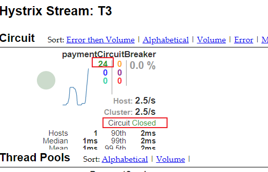

     持续访问错误路径：

     

   - 看图指南

     - 七色

       

     - 1圈

       

       实心圆：共有两种含义。它通过颜色的变化代表了实例的健康程度，它的健康度从绿色<黄色<橙色<红色递减。
       该实心圆除了颜色的变化之外，它的大小也会根据实例的请求流量发生变化，流量越大该实心圆就越大。所以通过该实心圆的展示，就可以在大量的实例中快速的发现故障实例和高压力实例。

     - 1线

       

       用来记录2分钟内流量的相对变化，可以通过它来观察到流量的上升和下降趋势。

     - 整张图

       

       

# 十一、Zuul路由网关

#  十二、Gateway新一代网关

## 01、Gateway概述

上一代zuul 1.X官网：https://github.com/Netflix/zuul/wiki

gateway官网：https://cloud.spring.io/spring-cloud-static/spring-cloud-gateway/2.2.1.RELEASE/reference/html/

### 01-1、Gateway是什么

- Cloud全家桶中有个很重要的组件就是网关，在1.x版本中都是采用的Zuul网关；但在2.x版本中，zuul的升级一直跳票，SpringCloud最后自己研发了一个网关替代Zuul，那就是SpringCloud Gateway一句话：**gateway是原zuul1.x版的替代**

  

- Gateway是在Spring生态系统之上构建的API网关服务，基于Spring 5，Spring Boot 2和 Project Reactor等技术。
  Gateway旨在提供一种简单而有效的方式来对API进行路由，以及提供一些强大的过滤器功能， 例如：熔断、限流、重试等

- SpringCloud Gateway 是 Spring Cloud 的一个全新项目，基于 Spring 5.0+Spring Boot 2.0 和 Project Reactor 等技术开发的网关，它旨在为微服务架构提供一种简单有效的统一的 API 路由管理方式。

- SpringCloud Gateway 作为 Spring Cloud 生态系统中的网关，目标是替代 Zuul，在Spring Cloud 2.0以上版本中，没有对新版本的Zuul 2.0以上最新高性能版本进行集成，仍然还是使用的Zuul 1.x非Reactor模式的老版本。而为了提升网关的性能，SpringCloud Gateway是基于WebFlux框架实现的，而WebFlux框架底层则使用了高性能的Reactor模式通信框架Netty。

- Spring Cloud Gateway的目标提供统一的路由方式且基于 Filter 链的方式提供了网关基本的功能，例如：安全，监控/指标，和限流。

**SpringCloud Gateway 使用的Webflux中的reactor-netty响应式编程组件，底层使用了Netty通讯框架。**

### 01-2、Gateway能干嘛

1. 反向代理
2. 鉴权
3. 流量控制
4. 熔断
5. 日志监控 

网关在微服务架构的位置：

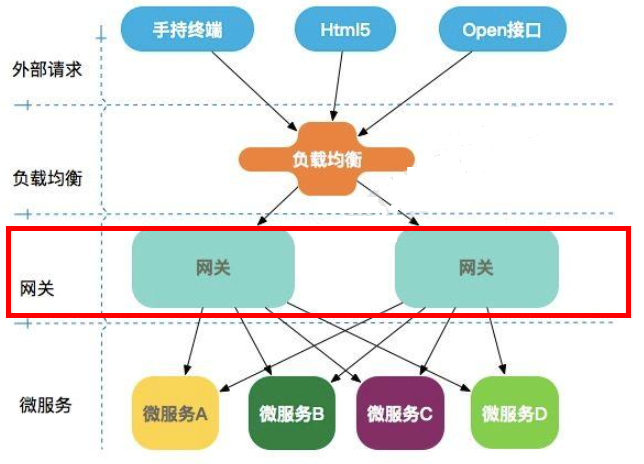

Spring Cloud Gateway 具有如下特性：

- 基于Spring Framework 5, Project Reactor 和 Spring Boot 2.0 进行构建；
- 动态路由：能够匹配任何请求属性；
- 可以对路由指定 Predicate（断言）和 Filter（过滤器）；
- 集成Hystrix的断路器功能；
- 集成 Spring Cloud 服务发现功能；
- 易于编写的 Predicate（断言）和 Filter（过滤器）；
- 请求限流功能；
- 支持路径重写。

Spring Cloud Gateway 与 Zuul的区别
在SpringCloud Finchley 正式版之前，Spring Cloud 推荐的网关是 Netflix 提供的Zuul：

1. Zuul 1.x，是一个基于阻塞 I/ O 的 API Gateway
2. Zuul 1.x 基于**Servlet 2. 5使用阻塞架构**它不支持任何长连接(如 WebSocket) Zuul 的设计模式和Nginx较像，每次 I/ O 操作都是从工作线程中选择一个执行，请求线程被阻塞到工作线程完成，但是差别是Nginx 用C++ 实现，Zuul 用 Java 实现，而 JVM 本身会有第一次加载较慢的情况，使得Zuul 的性能相对较差。
3. Zuul 2.x理念更先进，想基于Netty非阻塞和支持长连接，但SpringCloud目前还没有整合。 Zuul 2.x的性能较 Zuul 1.x 有较大提升。在性能方面，根据官方提供的基准测试， Spring Cloud Gateway 的 RPS（每秒请求数）是Zuul 的 1. 6 倍。 

4. Spring Cloud Gateway 建立 在 Spring Framework 5、 Project Reactor 和 Spring Boot 2 之上， 使用非阻塞 API。

5. Spring Cloud Gateway 还 支持 WebSocket， 并且与Spring紧密集成拥有更好的开发体验

WebFlux是什么

官网：https://docs.spring.io/spring/docs/current/spring-framework-reference/web-reactive.html#webflux-new-framework

- 传统的Web框架，比如说：struts2，springmvc等都是基于Servlet API与Servlet容器基础之上运行的。
  但是在Servlet3.1之后有了异步非阻塞的支持。而WebFlux是一个典型非阻塞异步的框架，它的核心是基于Reactor的相关API实现的。相对于传统的web框架来说，它可以运行在诸如Netty，Undertow及支持Servlet3.1的容器上。非阻塞式+函数式编程（Spring5必须让你使用java8）
- Spring WebFlux 是 Spring 5.0 引入的新的响应式框架，区别于 Spring MVC，它不需要依赖Servlet API，它是完全异步非阻塞的，并且基于 Reactor 来实现响应式流规范。

## 02、三大核心概念

### 02-1、Route(路由)

路由是构建网关的基本模块，它由ID，目标URI，一系列的断言和过滤器组成，如果断言为true则匹配该路由

### 02-2、Predicate(断言)

参考的是Java8的java.util.function.Predicate
开发人员可以匹配HTTP请求中的所有内容(例如请求头或请求参数)，**如果请求与断言相匹配则进行路由**

### 02-3、Filter(过滤)

指的是Spring框架中GatewayFilter的实例，使用过滤器，可以在请求被路由前或者之后对请求进行修改。

### 02-4、总体


web请求，通过一些匹配条件，定位到真正的服务节点。并在这个转发过程的前后，进行一些精细化控制。
predicate就是我们的匹配条件；
而filter，就可以理解为一个无所不能的拦截器。有了这两个元素，再加上目标uri，就可以实现一个具体的路由了

## 03、Gateway工作流程

### 03-1、官网总结


客户端向 Spring Cloud Gateway 发出请求。然后在 Gateway Handler Mapping 中找到与请求相匹配的路由，将其发送到 Gateway Web Handler。

Handler 再通过指定的过滤器链来将请求发送到我们实际的服务执行业务逻辑，然后返回。
过滤器之间用虚线分开是因为过滤器可能会在发送代理请求之前（“pre”）或之后（“post”）执行业务逻辑。

Filter在“pre”类型的过滤器可以做参数校验、权限校验、流量监控、日志输出、协议转换等，
在“post”类型的过滤器中可以做响应内容、响应头的修改，日志的输出，流量监控等有着非常重要的作用。

### 03-2、核心逻辑

**路由转发+执行过滤器链**

## 04、Gateway入门配置

### 04-1、新建cloud-gateway-gateway9527

### 04-2、pom配置

```xml
<?xml version="1.0" encoding="UTF-8"?>
<project xmlns="http://maven.apache.org/POM/4.0.0" xmlns:xsi="http://www.w3.org/2001/XMLSchema-instance"
	xsi:schemaLocation="http://maven.apache.org/POM/4.0.0 https://maven.apache.org/xsd/maven-4.0.0.xsd">
	<modelVersion>4.0.0</modelVersion>
	<parent>
		<artifactId>cloud2020</artifactId>
		<groupId>com.atguigu.springcloud</groupId>
		<version>1.0-SNAPSHOT</version>
	</parent>

	<artifactId>cloud-gateway-gateway9527</artifactId>

	<dependencies>
		<!--gateway-->
		<dependency>
			<groupId>org.springframework.cloud</groupId>
			<artifactId>spring-cloud-starter-gateway</artifactId>
		</dependency>
		<!--eureka-client-->
		<dependency>
			<groupId>org.springframework.cloud</groupId>
			<artifactId>spring-cloud-starter-netflix-eureka-client</artifactId>
		</dependency>
		<!-- 引入自己定义的api通用包，可以使用Payment支付Entity -->
		<dependency>
			<groupId>com.atguigu.springcloud</groupId>
			<artifactId>cloud-api-commons</artifactId>
			<version>${project.version}</version>
		</dependency>
		<!--一般基础配置类-->
		<dependency>
			<groupId>org.springframework.boot</groupId>
			<artifactId>spring-boot-devtools</artifactId>
			<scope>runtime</scope>
			<optional>true</optional>
		</dependency>
		<dependency>
			<groupId>org.projectlombok</groupId>
			<artifactId>lombok</artifactId>
			<optional>true</optional>
		</dependency>
		<dependency>
			<groupId>org.springframework.boot</groupId>
			<artifactId>spring-boot-starter-test</artifactId>
			<scope>test</scope>
		</dependency>
	</dependencies>

</project>
```

Gateway模块不需要添加以下两个依赖

```xml
<dependency>
    <groupId>org.springframework.boot</groupId>
    <artifactId>spring-boot-starter-web</artifactId>
</dependency>
<!--图形化显示和坐标监控-->
<dependency>
    <groupId>org.springframework.boot</groupId>
    <artifactId>spring-boot-starter-actuator</artifactId>
</dependency>
```

### 04-3、yml配置

```yaml
server:
  port: 9527

spring:
  application:
    name: cloud-gateway

eureka:
  instance:
    hostname: cloud-gateway-service
  client: #服务提供者provider注册进eureka服务列表内
    service-url:
      register-with-eureka: true
      fetch-registry: true
      defaultZone: http://eureka7001.com:7001/eureka
```

#### 04-4、主启动类

添加`@EnableEurekaClient`注解

### 04-5、9527网关路由映射

1. 以cloud-provider-payment8001的controller的两个接口为例

   ```java
   @GetMapping("/payment/lb")
   public String getPaymentLB(){
       return serverPort;
   }
   @GetMapping("/payment/get/{id}")
   public CommonResult<Payment> getPaymentById(@PathVariable("id") Long id) {
       Payment payment = paymentService.getPaymentById(id);
       //        System.out.println(payment.toString());
       if (payment != null) {
           return new CommonResult<>(200, "查询数据库成功,serverPort:" + serverPort, payment);
       } else {
           return new CommonResult<>(500, "没有对应记录，查询ID：" + id);
       }
   }
   ```

2. 我们目前不想暴露8001端口，希望在8001外面套一层9527

### 04-6、YML新增网关配置

```yaml
server:
  port: 9527

spring:
  application:
    name: cloud-gateway
  cloud:
    gateway:
      routes:
        - id: payment_routh #payment_route    #路由的ID，没有固定规则但要求唯一，建议配合服务名
          uri: http://localhost:8001          #匹配后提供服务的路由地址
          predicates:
            - Path=/payment/get/**         # 断言，路径相匹配的进行路由

        - id: payment_routh2 #payment_route    #路由的ID，没有固定规则但要求唯一，建议配合服务名
          uri: http://localhost:8001          #匹配后提供服务的路由地址
          predicates:
            - Path=/payment/lb/**         # 断言，路径相匹配的进行路由

eureka:
  instance:
    hostname: cloud-gateway-service
  client: #服务提供者provider注册进eureka服务列表内
    service-url:
      register-with-eureka: true
      fetchRegistry: true
      defaultZone: http://eureka7001.com:7001/eureka
```

### 04-6、测试

1. 启动7001

2. 启动cloud-provider-payment8001

3. 启动9527网关

4. 访问说明

   

   添加网关前访问的路径：http://localhost:8001/payment/get/31

   

   添加网关后访问的路径：http://localhost:9527/payment/get/31

   

### 04-7、Gateway网关路由的两种配置方式

1. 上面yml配置

2. config中注入RouteLocator的Bean

   1. 官网案例

      

   2. 选个百度国内的新闻网址进行测试：http://news.baidu.com/guonei

   3. 实现通过9527网关访问到外网的百度新闻网址

      `config-GatewayConfig`

      ```java
      @Configuration
      public class GatewayConfig {
          /**
           * 配置了一个id为path_route_atguigu的路由规则，
           * 当访问地址 http://localhost:9527/guonei时会自动转发到地址：http://news.baidu.com/guonei
           * @param routeLocatorBuilder
           * @return
           */
          @Bean
          public RouteLocator customerRouteLocator(RouteLocatorBuilder routeLocatorBuilder){
              RouteLocatorBuilder.Builder routes = routeLocatorBuilder.routes();
              routes.route("path_route_atguigu",
                      r -> r.path("/guonei")//访问该接口
                              .uri("http://news.baidu.com/guonei")).build();//跳转到这个网站
              return routes.build();
          }
          
          @Bean
          public RouteLocator customRouteLocator2(RouteLocatorBuilder builder)
          {
              RouteLocatorBuilder.Builder routes = builder.routes();
              routes.route("path_route_atguigu2",
                      r -> r.path("/guoji")
                              .uri("http://news.baidu.com/guoji")).build();
              return routes.build();
          }
      }
      ```

   4. 测试

      访问：http:localhost:9527/guonei

      

      访问：http:localhost:9527/guoji

      

## 05、Gateway配置动态路由

服务提供者往往不止一台，网关访问的服务器不能写死,需要实现负载均衡

```yaml
uri: http://localhost:8001          #匹配后提供服务的路由地址
```

默认情况下Gateway会根据注册中心注册的服务列表，以注册中心上微服务名为路径创建动态路由进行转发，从而实现动态路由的功能

### 05-1、准备

启动eureka7001、7002和两个服务提供者8001、8002

### 05-2、pom配置

网关模块

```xml
<!--eureka-client-->
<dependency>
    <groupId>org.springframework.cloud</groupId>
    <artifactId>spring-cloud-starter-netflix-eureka-client</artifactId>
</dependency>
```

### 05-3、yml配置

```yaml

server:
  port: 9527

spring:
  application:
    name: cloud-gateway
  cloud:
    gateway:
      discovery:
        locator:
          enabled: true
      routes:
        - id: payment_routh #payment_route    #路由的ID，没有固定规则但要求唯一，建议配合服务名
#          uri: http://localhost:8001          #匹配后提供服务的路由地址
          uri: lb://cloud-payment-service   #匹配后提供服务的路由地址
          predicates:
            - Path=/payment/get/**         # 断言，路径相匹配的进行路由

        - id: payment_routh2 #payment_route    #路由的ID，没有固定规则但要求唯一，建议配合服务名
#          uri: http://localhost:8001          #匹配后提供服务的路由地址
          uri: lb://cloud-payment-service   #匹配后提供服务的路由地址
          predicates:
            - Path=/payment/lb/**         # 断言，路径相匹配的进行路由
eureka:
  instance:
    hostname: cloud-gateway-service
  client: #服务提供者provider注册进eureka服务列表内
    service-url:
      register-with-eureka: true
      fetchRegistry: true
      defaultZone: http://eureka7001.com:7001/eureka
```

需要注意的是uri的协议为lb，表示启用Gateway的负载均衡功能。

lb://serviceName是spring cloud gateway在微服务中自动为我们创建的负载均衡uri

### 05-4、测试

调用接口：http://localhost:9527/payment/lb


## 06、Gateway的Predicate断言


### 06-1、RoutePredicateFactories


Spring Cloud Gateway包括许多内置的Route Predicate工厂。所有这些Predicate都与HTTP请求的不同属性匹配。多个Route Predicate工厂可以进行组合

Spring Cloud Gateway 创建 Route 对象时， 使用 RoutePredicateFactory 创建 Predicate 对象，Predicate 对象可以赋值给 Route。 Spring Cloud Gateway 包含许多内置的Route Predicate Factories。

### 06-2、常用的RoutePredicate


#### 06-2-1、After Route Predicate

> 指定一个时间，仅能在这个时间之后访问接口，否则报错404


- 获取指定时区时间

  ```java
  package com.atguigu.test;
  
  
  import java.time.ZoneId;
  import java.time.ZonedDateTime;
  
  /**
   * @auther zzyy
   * @create 2019-12-02 17:37
   */
  public class ZonedDateTimeDemo
  {
      public static void main(String[] args)
      {
          ZonedDateTime zbj = ZonedDateTime.now(); // 默认时区
          System.out.println(zbj);
  //        ZonedDateTime zny = ZonedDateTime.now(ZoneId.of("America/New_York")); // 用指定时区获取当前时间
  //        System.out.println(zny);
      }
  }
  ```

- yml

  ```yaml
          - id: payment_routh2 #payment_route    #路由的ID，没有固定规则但要求唯一，建议配合服务名
            uri: lb://cloud-payment-service   #匹配后提供服务的路由地址
            predicates:
              - Path=/payment/lb/**         # 断言，路径相匹配的进行路由
              - After=2021-11-29T14:48:27.477+08:00[Asia/Shanghai] #仅能在这个时间之后才能访问该接口
  ```

#### 06-2-2、Before Route Predicate

> 指定一个时间，仅能在这个时间之前访问接口

```yaml
        - id: payment_routh2 #payment_route    #路由的ID，没有固定规则但要求唯一，建议配合服务名
          uri: lb://cloud-payment-service   #匹配后提供服务的路由地址
          predicates:
            - Path=/payment/lb/**         # 断言，路径相匹配的进行路由
#            - After=2021-11-29T14:48:27.477+08:00[Asia/Shanghai]
            - Before=2021-11-29T14:48:27.477+08:00[Asia/Shanghai]
```

#### 06-2-3、Between Route Predicate

> 指定两个时间，仅能在这个时间段之内访问接口

```yaml
        - id: payment_routh2 #payment_route    #路由的ID，没有固定规则但要求唯一，建议配合服务名
          uri: lb://cloud-payment-service   #匹配后提供服务的路由地址
          predicates:
            - Path=/payment/lb/**         # 断言，路径相匹配的进行路由
#            - After=2021-11-29T14:48:27.477+08:00[Asia/Shanghai]
#            - Before=2021-11-29T14:48:27.477+08:00[Asia/Shanghai]
            - Between=2021-11-29T14:48:27.477+08:00[Asia/Shanghai],2021-12-29T14:48:27.477+08:00[Asia/Shanghai]
```

#### 06-2-4、Cookie Route Predicate


Cookie Route Predicate需要两个参数，一个是 Cookie name ,一个是正则表达式。
路由规则会通过获取对应的 Cookie name 值和正则表达式去匹配，如果匹配上就会执行路由，如果没有匹配上则不执行

```yaml
        - id: payment_routh2 #payment_route    #路由的ID，没有固定规则但要求唯一，建议配合服务名
          uri: lb://cloud-payment-service   #匹配后提供服务的路由地址
          predicates:
            - Path=/payment/lb/**         # 断言，路径相匹配的进行路由
            - Cookie=username,zzyy
```


1. 不带cookies访问

   ```shell
   curl http://localhost:9527/payment/lb
   ```

   

2. 带上cookies访问

   ```shell
   curl http://localhost:9527/payment/lb --cookie "username=zzyy"
   ```

   

#### 06-2-5、Header Route Predicate


两个参数：一个是属性名称和一个正则表达式，这个属性值和正则表达式匹配则执行。

```yaml
        - id: payment_routh2 #payment_route    #路由的ID，没有固定规则但要求唯一，建议配合服务名
#          uri: http://localhost:8001          #匹配后提供服务的路由地址
          uri: lb://cloud-payment-service   #匹配后提供服务的路由地址
          predicates:
            - Path=/payment/lb/**         # 断言，路径相匹配的进行路由
#            - After=2021-11-29T14:48:27.477+08:00[Asia/Shanghai]
#            - Cookie=username,zzyy
            - Header=X-Request-Id, \d+  # 请求头要有X-Request-Id属性并且值为整数的正则表达式
```

测试

```shell
curl http://localhost:9527/payment/lb -H "X-Request-Id:123"
```

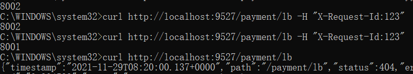

#### 06-2-6、Host Route Predicate


Host Route Predicate 接收一组参数，一组匹配的域名列表，这个模板是一个 ant 分隔的模板，用.号作为分隔符。
它通过参数中的主机地址作为匹配规则。

```yaml
        - id: payment_routh2 #payment_route    #路由的ID，没有固定规则但要求唯一，建议配合服务名
#          uri: http://localhost:8001          #匹配后提供服务的路由地址
          uri: lb://cloud-payment-service   #匹配后提供服务的路由地址
          predicates:
            - Path=/payment/lb/**         # 断言，路径相匹配的进行路由
            - Host=**.atguigu.com
```

测试

```shell
curl http://localhost:9527/payment/lb -H "Host: java.atguigu.com"
```


#### 06-2-7、Method Route Predicate


指定接收的请求方式

```yaml
        - id: payment_routh2 #payment_route    #路由的ID，没有固定规则但要求唯一，建议配合服务名
#          uri: http://localhost:8001          #匹配后提供服务的路由地址
          uri: lb://cloud-payment-service   #匹配后提供服务的路由地址
          predicates:
            - Path=/payment/lb/**         # 断言，路径相匹配的进行路由
            - Method=GET
```

测试

```shell
curl http://localhost:9527/payment/lb
```


#### 06-2-8、Path Route Predicate

路径相匹配的进行路由

#### 06-2-9、Query Route Predicate


支持传入两个参数，一个是属性名，一个为属性值，属性值可以是正则表达式。

```yaml
        - id: payment_routh2 #payment_route    #路由的ID，没有固定规则但要求唯一，建议配合服务名
#          uri: http://localhost:8001          #匹配后提供服务的路由地址
          uri: lb://cloud-payment-service   #匹配后提供服务的路由地址
          predicates:
            - Path=/payment/lb/**         # 断言，路径相匹配的进行路由
            - Method=GET
            - Query=username, \d+ #要有参数名username并且值还要是正整数才能路由
```

测试

```shell
curl http://localhost:9527/payment/lb?username=31
```


 

### 06-3、总结

Predicate就是为了实现一组匹配规则，让请求过来找到对应的Route进行处理。

## 07、Gateway的Filter

路由过滤器可用于修改进入的HTTP请求和返回的HTTP响应，路由过滤器只能指定路由进行使用。

Spring Cloud Gateway 内置了多种路由过滤器，他们都由GatewayFilter的工厂类来产生

### 07-1、生命周期

1. pre
2. post

### 07-2、种类

1. GatewayFilter 单一过滤器

   官网：https://cloud.spring.io/spring-cloud-static/spring-cloud-gateway/2.2.1.RELEASE/reference/html/#the-addrequestparameter-gatewayfilter-factory

   共31种

2. GlobalFilter 全局过滤器 

   

### 07-3、常用的GatewayFilter

yaml配置

```yaml

server:
  port: 9527

spring:
  application:
    name: cloud-gateway
  cloud:
    gateway:
      discovery:
        locator:
          enabled: true
      routes:
        - id: payment_routh #payment_route    #路由的ID，没有固定规则但要求唯一，建议配合服务名
#          uri: http://localhost:8001          #匹配后提供服务的路由地址
          uri: lb://cloud-payment-service   #匹配后提供服务的路由地址
          predicates:
            - Path=/payment/get/**         # 断言，路径相匹配的进行路由

        - id: payment_routh2 #payment_route    #路由的ID，没有固定规则但要求唯一，建议配合服务名
#          uri: http://localhost:8001          #匹配后提供服务的路由地址
          uri: lb://cloud-payment-service   #匹配后提供服务的路由地址
          filters:
            - AddRequestParameter=X-Request-Id,1024 #过滤器工厂会在匹配的请求头加上一对请求头，名称为X-Request-Id值为1024
          predicates:
            - Path=/payment/lb/**         # 断言，路径相匹配的进行路由
eureka:
  instance:
    hostname: cloud-gateway-service
  client: #服务提供者provider注册进eureka服务列表内
    service-url:
      register-with-eureka: true
      fetchRegistry: true
      defaultZone: http://eureka7001.com:7001/eureka
```

这个方法不通用不方便，通常用下面的自定义过滤器

### 07-4、自定义过滤器

> 自定义全局GlobalFilter

#### 07-4-1、实现两个接口

implements GlobalFilter,Ordered

#### 07-4-2、功能

1. 全局日志记录
2. 统一网关鉴权

#### 07-4-3、实现

```java
package com.atguigu.springcloud.filter;

import lombok.extern.slf4j.Slf4j;
import org.springframework.cloud.gateway.filter.GatewayFilterChain;
import org.springframework.cloud.gateway.filter.GlobalFilter;
import org.springframework.core.Ordered;
import org.springframework.http.HttpStatus;
import org.springframework.stereotype.Component;
import org.springframework.web.server.ServerWebExchange;
import reactor.core.publisher.Mono;

import java.util.Date;

/**
 * @ClassName MyLogGatewayFilter
 * @Description TODO
 * @Author Lambert
 * @Date 2021/11/30 9:20
 * @Version 1.0
 **/

@Component
@Slf4j
public class MyLogGatewayFilter implements GlobalFilter, Ordered {
    @Override
    public Mono<Void> filter(ServerWebExchange exchange, GatewayFilterChain chain) {
        log.info("*******come in MyLogGatewayFilter" + new Date());
        String uname = exchange.getRequest().getQueryParams().getFirst("uname");//获取请求的参数是否含有uname
        if (uname == null){
            log.info("********用户为null，非法用户，/(ㄒoㄒ)/~~");
            exchange.getResponse().setStatusCode(HttpStatus.NOT_ACCEPTABLE);//响应用户状态码为“不被接收”
            return exchange.getResponse().setComplete();
        }
        return chain.filter(exchange);
    }

    /**
     * 决定加载过滤器的顺序
     * 返回值越小 优先级越高
     * @return
     */
    @Override
    public int getOrder() {
        return 0;
    }
}

```

#### 07-4-4、测试

1. 启动7001、7002
2. 启动8001、8002
3. 启动9527网关

调用正确的接口：http://localhost:9527/payment/lb?uname=z3


错误的接口（没有参数uname）：http://localhost:9527/payment/lb....


# 十三、SpringCloud Config分布式配置中心

## 01、概述

官网：https://cloud.spring.io/spring-cloud-static/spring-cloud-config/2.2.1.RELEASE/reference/html/

### 01-1、分布式系统面临的配置问题

微服务意味着要将单体应用中的业务拆分成一个个子服务，每个服务的粒度相对较小，因此系统中会出现大量的服务。由于每个服务都需要必要的配置信息才能运行，所以一套集中式的、动态的配置管理设施是必不可少的。

SpringCloud提供了ConfigServer来解决这个问题，我们每一个微服务自己带着一个application.yml，上百个配置文件的管

### 01-2、SpringCloud Config


- 概念

  SpringCloud Config为微服务架构中的微服务提供集中化的外部配置支持，配置服务器为各个不同微服务应用的所有环境提供了一个中心化的外部配置。

- 使用

  SpringCloud Config分为服务端和客户端两部分。

  服务端也称为分布式配置中心，它是一个独立的微服务应用，用来连接配置服务器并为客户端提供获取配置信息，加密/解密信息等访问接口

  客户端则是通过指定的配置中心来管理应用资源，以及与业务相关的配置内容，并在启动的时候从配置中心获取和加载配置信息配置服务器默认采用git来存储配置信息，这样就有助于对环境配置进行版本管理，并且可以通过git客户端工具来方便的管理和访问配置内容。

- 作用

  - 集中管理配置文件
  - 不同环境不同配置，动态化的配置更新，分环境部署比如dev/test/prod/beta/release
  - 运行期间动态调整配置，不再需要在每个服务部署的机器上编写配置文件，服务会向配置中心统一拉取配置自己的信息
  - 当配置发生变动时，服务不需要重启即可感知到配置的变化并应用新的配置
  - 将配置信息以REST接口的形式暴露：post、curl访问刷新均可......

### 01-3、与GitHub整合配置

由于SpringCloud Config默认使用Git来存储配置文件(也有其它方式,比如支持SVN和本地文件)，但最推荐的还是Git，而且使用的是http/https访问的形式

## 02、Config服务端配置与测试

### 02-1、Github操作部署流程

1. 用自己的账号在GitHub上新建一个名为`springcloud-config`的新Repository

2. 将repository克隆到本地`H:\self-study\SpringCloud\SpringCloudConfig\springcloud-config`

3. 添加三个开发环境的yml配置

   

4. 推到github上去

### 02-1、新建cloud-config-center-3344

它即为Cloud的配置中心模块cloudConfig Center

### 02-2、pom配置

```xml
<?xml version="1.0" encoding="UTF-8"?>
<project xmlns="http://maven.apache.org/POM/4.0.0" xmlns:xsi="http://www.w3.org/2001/XMLSchema-instance"
	xsi:schemaLocation="http://maven.apache.org/POM/4.0.0 https://maven.apache.org/xsd/maven-4.0.0.xsd">
	<modelVersion>4.0.0</modelVersion>
	<parent>
		<artifactId>cloud2020</artifactId>
		<groupId>com.atguigu.springcloud</groupId>
		<version>1.0-SNAPSHOT</version>
	</parent>
	<artifactId>cloud-config-center-3344</artifactId>

	<dependencies>
		<dependency>
			<groupId>org.springframework.cloud</groupId>
			<artifactId>spring-cloud-config-server</artifactId>
		</dependency>
		<dependency>
			<groupId>org.springframework.cloud</groupId>
			<artifactId>spring-cloud-starter-netflix-eureka-client</artifactId>
		</dependency>
		<dependency>
			<groupId>org.springframework.boot</groupId>
			<artifactId>spring-boot-starter-web</artifactId>
		</dependency>

		<dependency>
			<groupId>org.springframework.boot</groupId>
			<artifactId>spring-boot-starter-actuator</artifactId>
		</dependency>
		<dependency>
			<groupId>org.springframework.boot</groupId>
			<artifactId>spring-boot-devtools</artifactId>
			<scope>runtime</scope>
			<optional>true</optional>
		</dependency>
		<dependency>
			<groupId>org.projectlombok</groupId>
			<artifactId>lombok</artifactId>
			<optional>true</optional>
		</dependency>
		<dependency>
			<groupId>org.springframework.boot</groupId>
			<artifactId>spring-boot-starter-test</artifactId>
			<scope>test</scope>
		</dependency>
	</dependencies>

</project>
```

### 02-3、yml配置

```yaml
server:
  port: 3344

spring:
  application:
    name:  cloud-config-center #注册进Eureka服务器的微服务名
  cloud:
    config:
      server:
        git:
          uri: git@github.com:Lambertcmd/springcloud-config.git #GitHub上面的git仓库名字
          ####搜索目录
          search-paths:
            - springcloud-config
      ####读取分支
      label: main

#服务注册到eureka地址
eureka:
  client:
    service-url:
      defaultZone: http://localhost:7001/eureka
```

### 02-5、主启动类

添加`@EnableConfigServer`注解

```java
@SpringBootApplication
@EnableConfigServer
public class CloudConfigCenter3344Application {

	public static void main(String[] args) {
		SpringApplication.run(CloudConfigCenter3344Application.class, args);
	}
}
```

### 02-6、Windows下修改hosts文件，增加映射

启动管理员权限，使用Notepad++打开host文件修改保存

```tex
127.0.0.1  config-3344.com
```

### 02-7、测试

> 测试Config微服务是否可以从Github上获取配置内容

1. 启动微服务3344

2. 访问路径：http://config-3344.com:3344/main/config-dev.yml

   

   常见错误：

   SSH身份校验失败

   ```java
   org.eclipse.jgit.api.errors.TransportException: git@github.com:Lambertcmd/springcloud-config.git: Auth fail
   ```

   解决：

   重新获取新的SSH密钥到github，即可解决

   ```shell
   ssh-keygen -m PEM -t rsa -b 4096 -C "xxxxxxxxx@qq.com"
   ```

### 02-8、配置读取规则


label：分支(branch)
name ：服务名
profiles：环境(dev/test/prod)

1. **/{label}/{application}-{profile}.yml**(通常用这种清晰明了)
   - master分支
     1. http://config-3344.com:3344/main/config-dev.yml
     2. http://config-3344.com:3344/main/config-test.yml
     3. http://config-3344.com:3344/main/config-prod.yml
   - dev分支
     1. http://config-3344.com:3344/dev/config-dev.yml
     2. http://config-3344.com:3344/dev/config-test.yml
     3. http://config-3344.com:3344/dev/config-prod.yml
2. **/{application}-{profile}.yml**
   - http://config-3344.com:3344/config-dev.yml
   - http://config-3344.com:3344/config-test.yml
   - http://config-3344.com:3344/config-prod.yml
   - http://config-3344.com:3344/config-xxxx.yml(不存在的配置)
3. **/{application}/{profile}[/{label}]**
   - http://config-3344.com:3344/config/dev/master
   - http://config-3344.com:3344/config/test/master
   - http://config-3344.com:3344/config/test/dev

成功实现了用SpringCloud Config通过GitHub获取配置信息

## 03、Config客户端配置与测试

### 03-1、新建cloud-config-client-3355

### 03-2、pom配置

```xml
<?xml version="1.0" encoding="UTF-8"?>
<project xmlns="http://maven.apache.org/POM/4.0.0" xmlns:xsi="http://www.w3.org/2001/XMLSchema-instance"
	xsi:schemaLocation="http://maven.apache.org/POM/4.0.0 https://maven.apache.org/xsd/maven-4.0.0.xsd">
	<modelVersion>4.0.0</modelVersion>
	<parent>
		<artifactId>cloud2020</artifactId>
		<groupId>com.atguigu.springcloud</groupId>
		<version>1.0-SNAPSHOT</version>
	</parent>
	<artifactId>cloud-config-client-3355</artifactId>

	<dependencies>
		<dependency>
			<groupId>org.springframework.cloud</groupId>
			<artifactId>spring-cloud-starter-config</artifactId>
		</dependency>
		<dependency>
			<groupId>org.springframework.cloud</groupId>
			<artifactId>spring-cloud-starter-netflix-eureka-client</artifactId>
		</dependency>
		<dependency>
			<groupId>org.springframework.boot</groupId>
			<artifactId>spring-boot-starter-web</artifactId>
		</dependency>
		<dependency>
			<groupId>org.springframework.boot</groupId>
			<artifactId>spring-boot-starter-actuator</artifactId>
		</dependency>

		<dependency>
			<groupId>org.springframework.boot</groupId>
			<artifactId>spring-boot-devtools</artifactId>
			<scope>runtime</scope>
			<optional>true</optional>
		</dependency>
		<dependency>
			<groupId>org.projectlombok</groupId>
			<artifactId>lombok</artifactId>
			<optional>true</optional>
		</dependency>
		<dependency>
			<groupId>org.springframework.boot</groupId>
			<artifactId>spring-boot-starter-test</artifactId>
			<scope>test</scope>
		</dependency>
	</dependencies>

</project>
```

### 03-3、bootstrap.yml

applicaiton.yml是用户级的资源配置项
bootstrap.yml是系统级的，**优先级更加高**


Spring Cloud会创建一个“Bootstrap Context”，作为Spring应用的`Application Context`的**父上下文**。初始化的时候，`Bootstrap Context`负责从外部源加载配置属性并解析配置。这两个上下文共享一个从外部获取的`Environment`。


`Bootstrap`属性有高优先级，默认情况下，它们不会被本地配置覆盖。 `Bootstrap context`和`Application Context`有着不同的约定，所以新增了一个`bootstrap.yml`文件，保证`Bootstrap Context`和`Application Context`配置的分离。

**要将Client模块下的application.yml文件改为bootstrap.yml,这是很关键的，**
因为bootstrap.yml是比application.yml先加载的。bootstrap.yml优先级高于application.yml

```yaml
server:
  port: 3355

spring:
  application:
    name: config-client
  cloud:
    #Config客户端配置
    config:
      label: main #分支名称
      name: config #配置文件名称
      profile: dev #读取后缀名称   上述3个综合：master分支上config-dev.yml的配置文件被读取http://config-3344.com:3344/master/config-dev.yml
      uri: http://localhost:3344 #配置中心地址k

#服务注册到eureka地址
eureka:
  client:
    service-url:
      defaultZone: http://localhost:7001/eureka
```

### 03-4、config-dev.yml

修改config-dev.yml配置并提交到GitHub中，比如加个变量age或者版本号version

### 03-5、主启动类

```java
@SpringBootApplication
@EnableEurekaClient
public class CloudConfigClient3355Application {

	public static void main(String[] args) {
		SpringApplication.run(CloudConfigClient3355Application.class, args);
	}

}
```

### 03-6、业务类

```java
@RestController
public class ConfigClientController
{
    @Value("${config.info}")
    private String configInfo;

    @GetMapping("/configInfo")
    public String getConfigInfo()
    {
        return configInfo;
    }
}
```

### 03-7、测试

1. 启动7001

2. 启动Config配置中心3344微服务并自测

3. 启动3355作为Clinet准备访问：http://localhost:3355/configInfo

   

> 成功实现了客户端3355访问SpringCloud Config3344通过GitHub获取配置信息

问题随时而来，分布式配置的动态刷新问题

### 03-8、分布式配置的动态刷新问题

1. Linux运维修改GitHub上的配置文件内容做调整
2. 刷新3344，发现ConfigServer配置中心立刻响应
3. 刷新3355，发现ConfigClient客户端没有任何响应
4. 3355没有变化除非自己重启或者重新加载
5. 难到每次运维修改配置文件，客户端都需要重启？？

## 04、Config客户端之动态刷新

避免每次更新配置都要重启客户端微服务3355

### 04-1、pom配置

添加actuator图形化监控

```xml
<dependency>
    <groupId>org.springframework.boot</groupId>
    <artifactId>spring-boot-starter-actuator</artifactId>
</dependency>
```

### 04-2、yml配置

暴露监控端口

```yaml
server:
  port: 3355

spring:
  application:
    name: config-client
  cloud:
    #Config客户端配置
    config:
      label: main #分支名称
      name: config #配置文件名称
      profile: dev #读取后缀名称   上述3个综合：master分支上config-dev.yml的配置文件被读取http://config-3344.com:3344/master/config-dev.yml
      uri: http://localhost:3344 #配置中心地址k

#服务注册到eureka地址
eureka:
  client:
    service-url:
      defaultZone: http://localhost:7001/eureka

# 暴露监控端点
management:
  endpoints:
    web:
      exposure:
        include: "*"
```

### 04-3、业务类controller

添加`@RefreshScope`

```java
@RestController
@RefreshScope
public class ConfigClientController
{
    @Value("${config.info}")
    private String configInfo;

    @GetMapping("/configInfo")
    public String getConfigInfo()
    {
        return configInfo;
    }
}
```

### 04-4、测试

1. 修改git上的config-dev.yml

   

2. 查看3344是否改变

   

3. 发送刷新请求

   请求方式：POST

   请求路径：curl -X POST "http://localhost:3355/actuator/refresh"

   

4. 查看3355是否改变

   


> 成功实现了客户端3355刷新到最新配置内容，避免了服务重启

# 十四、SpringCloud Bus消息总线

## 01、概述

> 分布式自动刷新配置功能，Spring Cloud Bus 配合 Spring Cloud Config 使用可以实现配置的动态刷新。


- Spring Cloud Bus是用来将分布式系统的节点与轻量级消息系统链接起来的框架，它整合了Java的事件处理机制和消息中间件的功能。

- Bus支持两种消息代理RabbitMQ 和 Kafka

- Spring Cloud Bus能管理和传播分布式系统间的消息，就像一个分布式执行器，可用于广播状态更改、事件推送等，也可以当作微服务间的通信通道。

  

- 什么是总线

  在微服务架构的系统中，通常会使用轻量级的消息代理来构建一个共用的消息主题，并让系统中所有微服务实例都连接上来。由于该主题中产生的消息会被所有实例监听和消费，所以称它为消息总线。在总线上的各个实例，都可以方便地广播一些需要让其他连接在该主题上的实例都知道的消息。

- 基本原理

  ConfigClient实例都监听MQ中同一个topic(默认是springCloudBus)。当一个服务刷新数据的时候，它会把这个信息放入到Topic中，这样其它监听同一Topic的服务就能得到通知，然后去更新自身的配置。

## 02、RabbitMQ环境配置

.........

## 03、SpringCloud Bus动态刷新全局广播

> 必须先具备良好的RabbitMQ环境，为演示广播效果，增加复杂度，再以3355为模板再制作一个3366

### 03-1、新建cloud-config-client-3366模块

#### 03-1-1、新建cloud-config-client-3366

#### 03-1-2、pom配置

```xml
<?xml version="1.0" encoding="UTF-8"?>
<project xmlns="http://maven.apache.org/POM/4.0.0" xmlns:xsi="http://www.w3.org/2001/XMLSchema-instance"
	xsi:schemaLocation="http://maven.apache.org/POM/4.0.0 https://maven.apache.org/xsd/maven-4.0.0.xsd">
	<modelVersion>4.0.0</modelVersion>
	<parent>
		<artifactId>cloud2020</artifactId>
		<groupId>com.atguigu.springcloud</groupId>
		<version>1.0-SNAPSHOT</version>
	</parent>

	<artifactId>cloud-config-client-3366</artifactId>

	<dependencies>
		<dependency>
			<groupId>org.springframework.cloud</groupId>
			<artifactId>spring-cloud-starter-config</artifactId>
		</dependency>
		<dependency>
			<groupId>org.springframework.cloud</groupId>
			<artifactId>spring-cloud-starter-netflix-eureka-client</artifactId>
		</dependency>
		<dependency>
			<groupId>org.springframework.boot</groupId>
			<artifactId>spring-boot-starter-web</artifactId>
		</dependency>
		<dependency>
			<groupId>org.springframework.boot</groupId>
			<artifactId>spring-boot-starter-actuator</artifactId>
		</dependency>

		<dependency>
			<groupId>org.springframework.boot</groupId>
			<artifactId>spring-boot-devtools</artifactId>
			<scope>runtime</scope>
			<optional>true</optional>
		</dependency>
		<dependency>
			<groupId>org.projectlombok</groupId>
			<artifactId>lombok</artifactId>
			<optional>true</optional>
		</dependency>
		<dependency>
			<groupId>org.springframework.boot</groupId>
			<artifactId>spring-boot-starter-test</artifactId>
			<scope>test</scope>
		</dependency>
	</dependencies>
</project>
```

#### 03-1-3、bootstrap.yml

```yaml
server:
  port: 3366

spring:
  application:
    name: config-client
  cloud:
    #Config客户端配置
    config:
      label: master #分支名称
      name: config #配置文件名称
      profile: dev #读取后缀名称   上述3个综合：master分支上config-dev.yml的配置文件被读取http://config-3344.com:3344/master/config-dev.yml
      uri: http://localhost:3344 #配置中心地址

#服务注册到eureka地址
eureka:
  client:
    service-url:
      defaultZone: http://localhost:7001/eureka

# 暴露监控端点
management:
  endpoints:
    web:
      exposure:
        include: "*"
```

#### 03-1-4、主启动

```java
@SpringBootApplication
@EnableEurekaClient
public class CloudConfigClient3366Application {

	public static void main(String[] args) {
		SpringApplication.run(CloudConfigClient3366Application.class, args);
	}

}
```

#### 03-1-5、业务类Controller

```java
@RestController
@RefreshScope
public class ConfigClientController
{
    @Value("${server.port}")
    private String serverPort;

    @Value("${config.info}")
    private String configInfo;

    @GetMapping("/configInfo")
    public String configInfo()
    {
        return "serverPort: "+serverPort+"\t\n\n configInfo: "+configInfo;
    }

}
```

### 03-2、设计思想

- 利用消息总线触发一个客户端/bus/refresh,而刷新所有客户端的配置

  

- 利用消息总线触发一个服务端ConfigServer的/bus/refresh端点，而刷新所有客户端的配置

  

图二的架构显然更加适合

### 03-3、给3344服务端添加消息总线支持

> 给cloud-config-center-3344配置中心服务端添加消息总线支持

#### 03-3-1、pom配置

```xml
<!--添加消息总线RabbitMQ支持-->
<dependency>
    <groupId>org.springframework.cloud</groupId>
    <artifactId>spring-cloud-starter-bus-amqp</artifactId>
</dependency>
<dependency>
    <groupId>org.springframework.boot</groupId>
    <artifactId>spring-boot-starter-actuator</artifactId>
</dependency>
```

#### 03-3-2、yml配置

```yaml
server:
  port: 3344

spring:
  application:
    name:  cloud-config-center #注册进Eureka服务器的微服务名
  cloud:
    config:
      server:
        git:
          uri: git@github.com:Lambertcmd/springcloud-config.git #GitHub上面的git仓库名字
          ####搜索目录
          search-paths:
            - springcloud-config
      ####读取分支
      label: main
  #rabbitmq相关配置
  rabbitmq:
    host: 10.1.53.169
    port: 5672
    username: admin
    password: admin
#服务注册到eureka地址
eureka:
  client:
    service-url:
      defaultZone: http://localhost:7001/eureka

##rabbitmq相关配置,暴露bus刷新配置的端点
management:
  endpoints: #暴露bus刷新配置的端点
    web:
      exposure:
        include: 'bus-refresh'
```

### 03-4、给3355客户端添加消息总线支持

#### 03-4-1、pom配置

```xml
<!--添加消息总线RabbitMQ支持-->
<dependency>
    <groupId>org.springframework.cloud</groupId>
    <artifactId>spring-cloud-starter-bus-amqp</artifactId>
</dependency>
<dependency>
    <groupId>org.springframework.boot</groupId>
    <artifactId>spring-boot-starter-actuator</artifactId>
</dependency>
```

#### 03-4-2、yml配置

```yaml
server:
  port: 3355

spring:
  application:
    name: config-client
  cloud:
    #Config客户端配置
    config:
      label: main #分支名称
      name: config #配置文件名称
      profile: dev #读取后缀名称   上述3个综合：master分支上config-dev.yml的配置文件被读取http://config-3344.com:3344/master/config-dev.yml
      uri: http://localhost:3344 #配置中心地址k
    #rabbitmq相关配置 15672是Web管理界面的端口；5672是MQ访问的端口
  rabbitmq:
    host: 10.1.53.169
    port: 5672
    username: admin
    password: admin

#服务注册到eureka地址
eureka:
  client:
    service-url:
      defaultZone: http://localhost:7001/eureka

# 暴露监控端点
management:
  endpoints:
    web:
      exposure:
        include: "*"
```

### 03-4、给3366客户端添加消息总线支持

#### 03-4-1、pom配置

```xml
<!--添加消息总线RabbitMQ支持-->
<dependency>
    <groupId>org.springframework.cloud</groupId>
    <artifactId>spring-cloud-starter-bus-amqp</artifactId>
</dependency>
<dependency>
    <groupId>org.springframework.boot</groupId>
    <artifactId>spring-boot-starter-actuator</artifactId>
</dependency>
```

#### 03-4-2、yml配置

```yaml
server:
  port: 3366

spring:
  application:
    name: config-client
  cloud:
    #Config客户端配置
    config:
      label: main #分支名称
      name: config #配置文件名称
      profile: dev #读取后缀名称   上述3个综合：master分支上config-dev.yml的配置文件被读取http://config-3344.com:3344/master/config-dev.yml
      uri: http://localhost:3344 #配置中心地址
  #rabbitmq相关配置 15672是Web管理界面的端口；5672是MQ访问的端口
  rabbitmq:
    host: 10.1.53.169
    port: 5672
    username: admin
    password: admin

#服务注册到eureka地址
eureka:
  client:
    service-url:
      defaultZone: http://localhost:7001/eureka

# 暴露监控端点
management:
  endpoints:
    web:
      exposure:
        include: "*"
```

### 03-5、测试

> 启动3355和3366客户端时必须一个一个启动

1. 修改github上的配置文件信息（增加版本号）

   

2. 发送post请求：curl -X POST "http://localhost:3344/actuator/bus-refresh"

   

   一次发送，所有客户端都生效

3. 访问一个服务端和两个客户端的借口能否获取配置信息

   http://config-3344.com:3344/config-dev.yml

   http://localhost:3355/configInfo

   

   http://localhost:3366/configInfo

   

## 04、SpringCloud Bus动态刷新定点通知

> 不想全部通知，只想定点通知

请求：http://localhost:配置中心的端口号/actuator/bus-refresh/{spring.application.name}:port

/bus/refresh请求不再发送到具体的服务实例上，而是发给config server并通过destination参数类指定需要更新配置的服务或实例

> 举例只通知3355，不通知3366

```shell
curl -X POST "http://localhost:3344/actuator/bus-refresh/config-client:3355"
```


# 十五、SpringCloud Stream 消息驱动

## 01、消息驱动概述

### 01-1、消息驱动概念

官方定义 Spring Cloud Stream 是一个构建消息驱动微服务的框架。

应用程序通过 inputs 或者 outputs 来与 Spring Cloud Stream中binder对象交互。
通过我们配置来binding(绑定) ，而 Spring Cloud Stream 的 binder对象负责与消息中间件交互。
所以，我们只需要搞清楚如何与 Spring Cloud Stream 交互就可以方便使用消息驱动的方式。

通过使用Spring Integration来连接消息代理中间件以实现消息事件驱动。
Spring Cloud Stream 为一些供应商的消息中间件产品提供了个性化的自动化配置实现，引用了发布-订阅、消费组、分区的三个核心概念。

目前仅支持RabbitMQ、Kafka。

> 一句话：屏蔽底层消息中间件的差异,降低切换成本，统一消息的编程模型

官网：https://spring.io/projects/spring-cloud-stream#overview

https://cloud.spring.io/spring-cloud-static/spring-cloud-stream/3.0.1.RELEASE/reference/html/

Spring Cloud Stream中文指导手册：https://m.wang1314.com/doc/webapp/topic/20971999.html

### 01-2、设计思想

标准MQ：


生产者/消费者之间靠**消息**媒介传递信息内容：Message

消息必须走特定的**通道**：消息通道MessageChannel

消息通道里的消息如何被消费呢，谁负责收发**处理**：消息通道MessageChannel的子接口SubscribableChannel，由MessageHandler消息处理器所订阅

Stream中的消息通信方式遵循了发布-订阅模式

来认识一下 Spring Cloud Stream 中的几个重要概念。

- Destination Binders：目标绑定器，目标指的是 kafka 还是 RabbitMQ，绑定器就是封装了目标中间件的包。如果操作的是 kafka 就使用 kafka binder ，如果操作的是 RabbitMQ 就使用 rabbitmq binder。
- Destination Bindings：外部消息传递系统和应用程序之间的桥梁，提供消息的“生产者”和“消费者”（由目标绑定器创建）
- Message：一种规范化的数据结构，生产者和消费者基于这个数据结构通过外部消息系统与目标绑定器和其他应用程序通信。

- Binder：很方便的连接中间件，屏蔽差异

  

- Channel：通道，是队列Queue的一种抽象，在消息通讯系统中就是实现存储和转发的媒介，通过Channel对队列进行配置

- Source和Sink：简单的可理解为参照对象是Spring Cloud Stream自身，从Stream发布消息就是输出，接受消息就是输入。


### 01-3、编码API和常用注解


## 02、实现消息驱动准备

1. RabbitMQ环境已经OK

2. 新建三个子模块

   cloud-stream-rabbitmq-provider8801，作为生产者进行发消息模块

   cloud-stream-rabbitmq-consumer8802，作为消息接收模块

   cloud-stream-rabbitmq-consumer8803  作为消息接收模块

## 03、消息驱动之生产者8801

### 03-1、新建cloud-stream-rabbitmq-provider8801

### 03-2、pom配置

```xml
<?xml version="1.0" encoding="UTF-8"?>
<project xmlns="http://maven.apache.org/POM/4.0.0" xmlns:xsi="http://www.w3.org/2001/XMLSchema-instance"
	xsi:schemaLocation="http://maven.apache.org/POM/4.0.0 https://maven.apache.org/xsd/maven-4.0.0.xsd">
	<modelVersion>4.0.0</modelVersion>
	<parent>
		<artifactId>cloud2020</artifactId>
		<groupId>com.atguigu.springcloud</groupId>
		<version>1.0-SNAPSHOT</version>
	</parent>
	<artifactId>cloud-stream-rabbitmq-provider8801</artifactId>

	<dependencies>
		<dependency>
			<groupId>org.springframework.boot</groupId>
			<artifactId>spring-boot-starter-web</artifactId>
		</dependency>
		<dependency>
			<groupId>org.springframework.boot</groupId>
			<artifactId>spring-boot-starter-actuator</artifactId>
		</dependency>
		<dependency>
			<groupId>org.springframework.cloud</groupId>
			<artifactId>spring-cloud-starter-netflix-eureka-client</artifactId>
		</dependency>
        
		<dependency>
			<groupId>org.springframework.cloud</groupId>
			<artifactId>spring-cloud-starter-stream-rabbit</artifactId>
		</dependency>
		<!--基础配置-->
		<dependency>
			<groupId>org.springframework.boot</groupId>
			<artifactId>spring-boot-devtools</artifactId>
			<scope>runtime</scope>
			<optional>true</optional>
		</dependency>
		<dependency>
			<groupId>org.projectlombok</groupId>
			<artifactId>lombok</artifactId>
			<optional>true</optional>
		</dependency>
		<dependency>
			<groupId>org.springframework.boot</groupId>
			<artifactId>spring-boot-starter-test</artifactId>
			<scope>test</scope>
		</dependency>
	</dependencies>

</project>
```

### 03-3、yml配置

```yaml
server:
  port: 8801

spring:
  application:
    name: cloud-stream-provider
  cloud:
    stream:
      binders: # 在此处配置要绑定的rabbitmq的服务信息；
        defaultRabbit: # 表示定义的名称，用于于binding整合
          type: rabbit # 消息组件类型
          environment: # 设置rabbitmq的相关的环境配置
            spring:
              rabbitmq:
                host: 10.1.53.169
                port: 5672
                username: admin
                password: admin
      bindings: # 服务的整合处理
        output: # 这个名字是一个通道的名称
          destination: studyExchange # 表示要使用的Exchange名称定义
          content-type: application/json # 设置消息类型，本次为json，文本则设置“text/plain”
          binder: defaultRabbit # 设置要绑定的消息服务的具体设置
  rabbitmq:
    host: 10.1.53.169
    
eureka:
  client: # 客户端进行Eureka注册的配置
    service-url:
      defaultZone: http://localhost:7001/eureka
  instance:
    lease-renewal-interval-in-seconds: 2 # 设置心跳的时间间隔（默认是30秒）
    lease-expiration-duration-in-seconds: 5 # 如果现在超过了5秒的间隔（默认是90秒）
    instance-id: send-8801.com  # 在信息列表时显示主机名称
    prefer-ip-address: true     # 访问的路径变为IP地址
```

### 03-4、业务类

#### 03-4-1、发送消息接口

```java
public interface IMessageProvider {
    public String send();
}
```

#### 03-4-2、发送消息接口实现类

```java
package com.atguigu.springcloud.service.impl;

import com.atguigu.springcloud.service.IMessageProvider;
import org.springframework.cloud.stream.annotation.EnableBinding;
import org.springframework.cloud.stream.messaging.Source;
import org.springframework.messaging.MessageChannel;
import org.springframework.messaging.support.MessageBuilder;

import javax.annotation.Resource;
import java.util.UUID;

/**
 * @ClassName IMessageProvider
 * @Description TODO
 * @Author Lambert
 * @Date 2021/12/3 9:22
 * @Version 1.0
 **/
@EnableBinding(Source.class)//定义消息的推送管道
public class MessageProviderImpl implements IMessageProvider {

    @Resource
    private MessageChannel output;//消息发送管道

    @Override
    public String send() {
        String serial = UUID.randomUUID().toString();
        output.send(MessageBuilder.withPayload(serial)
                .build());
        System.out.println("serial" + serial);
        return null;
    }
}
```

#### 03-4-3、Controller

```java
@RestController
public class SendMessageController {
    @Resource
    private IMessageProvider messageProvider;

    @GetMapping("/sendMessage")
    public String sendMessage(){
        return messageProvider.send();
    }
}
```

### 03-5、测试

1. 启动Eureaka7001、7002

2. 启动rabbitmq

3. 启动8801

4. 访问测试：http://localhost:8801/sendMessage

   消息波峰：

   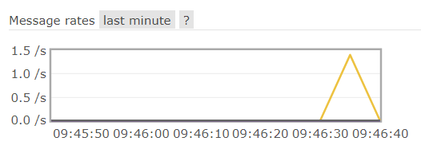

## 04、消息驱动之消费者8802

### 04-1、新建cloud-stream-rabbitmq-consumer8802

### 04-2、pom配置

```xml
<?xml version="1.0" encoding="UTF-8"?>
<project xmlns="http://maven.apache.org/POM/4.0.0" xmlns:xsi="http://www.w3.org/2001/XMLSchema-instance"
	xsi:schemaLocation="http://maven.apache.org/POM/4.0.0 https://maven.apache.org/xsd/maven-4.0.0.xsd">
	<modelVersion>4.0.0</modelVersion>
	<parent>
		<artifactId>cloud2020</artifactId>
		<groupId>com.atguigu.springcloud</groupId>
		<version>1.0-SNAPSHOT</version>
	</parent>
	<artifactId>cloud-stream-rabbitmq-consumer8802</artifactId>

	<dependencies>
		<dependency>
			<groupId>org.springframework.boot</groupId>
			<artifactId>spring-boot-starter-web</artifactId>
		</dependency>
		<dependency>
			<groupId>org.springframework.cloud</groupId>
			<artifactId>spring-cloud-starter-netflix-eureka-client</artifactId>
		</dependency>
		<dependency>
			<groupId>org.springframework.cloud</groupId>
			<artifactId>spring-cloud-starter-stream-rabbit</artifactId>
		</dependency>
		<dependency>
			<groupId>org.springframework.boot</groupId>
			<artifactId>spring-boot-starter-actuator</artifactId>
		</dependency>
		<!--基础配置-->
		<dependency>
			<groupId>org.springframework.boot</groupId>
			<artifactId>spring-boot-devtools</artifactId>
			<scope>runtime</scope>
			<optional>true</optional>
		</dependency>
		<dependency>
			<groupId>org.projectlombok</groupId>
			<artifactId>lombok</artifactId>
			<optional>true</optional>
		</dependency>
		<dependency>
			<groupId>org.springframework.boot</groupId>
			<artifactId>spring-boot-starter-test</artifactId>
			<scope>test</scope>
		</dependency>
	</dependencies>
</project>
```

### 04-3、yml配置

```yaml
server:
  port: 8802

spring:
  application:
    name: cloud-stream-consumer
  cloud:
    stream:
      binders: # 在此处配置要绑定的rabbitmq的服务信息；
        defaultRabbit: # 表示定义的名称，用于于binding整合
          type: rabbit # 消息组件类型
          environment: # 设置rabbitmq的相关的环境配置
            spring:
              rabbitmq:
                host: 10.1.53.169
                port: 5672
                username: admin
                password: admin
      bindings: # 服务的整合处理
        input: # 这个名字是一个通道的名称
          destination: studyExchange # 表示要使用的Exchange名称定义
          content-type: application/json # 设置消息类型，本次为对象json，如果是文本则设置“text/plain”
          binder: defaultRabbit # 设置要绑定的消息服务的具体设置
  rabbitmq:
    host: 10.1.53.169

eureka:
  client: # 客户端进行Eureka注册的配置
    service-url:
      defaultZone: http://localhost:7001/eureka
  instance:
    lease-renewal-interval-in-seconds: 2 # 设置心跳的时间间隔（默认是30秒）
    lease-expiration-duration-in-seconds: 5 # 如果现在超过了5秒的间隔（默认是90秒）
    instance-id: receive-8802.com  # 在信息列表时显示主机名称
    prefer-ip-address: true     # 访问的路径变为IP地址
```

### 04-4、业务类

#### 04-4-1、监听器

```java
package com.atguigu.springcloud.listener;

import org.springframework.beans.factory.annotation.Value;
import org.springframework.cloud.stream.annotation.EnableBinding;
import org.springframework.cloud.stream.annotation.StreamListener;
import org.springframework.cloud.stream.messaging.Sink;
import org.springframework.messaging.Message;
import org.springframework.stereotype.Component;

/**
 * @ClassName ReceiveMessageListener
 * @Description TODO
 * @Author Lambert
 * @Date 2021/12/3 11:14
 * @Version 1.0
 **/
@Component
@EnableBinding(Sink.class)
public class ReceiveMessageListener {
    @Value("${server.port}")
    private String serverPort;

    @StreamListener(Sink.INPUT)
    public void input(Message<String> message)
    {
        System.out.println("消费者1号，------->接收到的消息：" + message.getPayload()+"\t port: "+serverPort);
    }
}
```

### 04-5、测试

1. 测试8801发送消息：http://localhost:8801/sendMessage

   

2. 8802接收监听消息

   


## 05、分组消费与持久化

### 05-1、新建消费者模块8803

#### 05-1-1、新建cloud-stream-rabbitmq-consumer8803

#### 05-1-2、pom配置

```xml
<?xml version="1.0" encoding="UTF-8"?>
<project xmlns="http://maven.apache.org/POM/4.0.0" xmlns:xsi="http://www.w3.org/2001/XMLSchema-instance"
	xsi:schemaLocation="http://maven.apache.org/POM/4.0.0 https://maven.apache.org/xsd/maven-4.0.0.xsd">
	<modelVersion>4.0.0</modelVersion>
	<parent>
		<artifactId>cloud2020</artifactId>
		<groupId>com.atguigu.springcloud</groupId>
		<version>1.0-SNAPSHOT</version>
	</parent>
	<artifactId>cloud-stream-rabbitmq-consumer8803</artifactId>
	<dependencies>
		<dependency>
			<groupId>org.springframework.boot</groupId>
			<artifactId>spring-boot-starter-web</artifactId>
		</dependency>
		<dependency>
			<groupId>org.springframework.cloud</groupId>
			<artifactId>spring-cloud-starter-netflix-eureka-client</artifactId>
		</dependency>
		<dependency>
			<groupId>org.springframework.cloud</groupId>
			<artifactId>spring-cloud-starter-stream-rabbit</artifactId>
		</dependency>
		<dependency>
			<groupId>org.springframework.boot</groupId>
			<artifactId>spring-boot-starter-actuator</artifactId>
		</dependency>
		<!--基础配置-->
		<dependency>
			<groupId>org.springframework.boot</groupId>
			<artifactId>spring-boot-devtools</artifactId>
			<scope>runtime</scope>
			<optional>true</optional>
		</dependency>
		<dependency>
			<groupId>org.projectlombok</groupId>
			<artifactId>lombok</artifactId>
			<optional>true</optional>
		</dependency>
		<dependency>
			<groupId>org.springframework.boot</groupId>
			<artifactId>spring-boot-starter-test</artifactId>
			<scope>test</scope>
		</dependency>
	</dependencies>

</project>
```

#### 05-1-3、yml配置

```yaml
server:
  port: 8803

spring:
  application:
    name: cloud-stream-consumer
  cloud:
    stream:
      binders: # 在此处配置要绑定的rabbitmq的服务信息；
        defaultRabbit: # 表示定义的名称，用于于binding整合
          type: rabbit # 消息组件类型
          environment: # 设置rabbitmq的相关的环境配置
            spring:
              rabbitmq:
                host: 10.1.53.169
                port: 5672
      bindings: # 服务的整合处理
        input: # 这个名字是一个通道的名称
          destination: studyExchange # 表示要使用的Exchange名称定义
          content-type: application/json # 设置消息类型，本次为对象json，如果是文本则设置“text/plain”
          binder: defaultRabbit # 设置要绑定的消息服务的具体设置
  rabbitmq:
    host: 10.1.53.169
    username: admin
    password: admin

eureka:
  client: # 客户端进行Eureka注册的配置
    service-url:
      defaultZone: http://localhost:7001/eureka
  instance:
    lease-renewal-interval-in-seconds: 2 # 设置心跳的时间间隔（默认是30秒）
    lease-expiration-duration-in-seconds: 5 # 如果现在超过了5秒的间隔（默认是90秒）
    instance-id: receive-8802.com  # 在信息列表时显示主机名称
    prefer-ip-address: true     # 访问的路径变为IP地址
```

#### 05-1-4、业务类

```java
@Component
@EnableBinding(Sink.class)
public class ReceiveMessageListener
{
    @Value("${server.port}")
    private String serverPort;

    @StreamListener(Sink.INPUT)
    public void input(Message<String> message)
    {
        System.out.println("消费者2号，------->接收到的消息：" + message.getPayload()+"\t port: "+serverPort);
    }
}
```

### 05-2、启动

7001：服务注册

8801、消息生产

8802、消息消费

8803、消息消费

### 05-3、运行后有两个问题

1. 重复消费
2. 消息持久化


### 05-4、消费

目前是8802/8803同时都收到了，两条消息消费了四次，存在重复消费问题。

#### 05-4-1、生产实际案例

比如在如下场景中，订单系统我们做集群部署，都会从RabbitMQ中获取订单信息，那如果一个订单同时被两个服务获取到，那么就会造成数据错误，我们得避免这种情况。这时我们就可以使用Stream中的消息分组来解决


注意在Stream中处于同一个group中的多个消费者是竞争关系，就能够保证消息只会被其中一个应用消费一次。
**不同组是可以全面消费的(重复消费)，同一组内会发生竞争关系，只有其中一个可以消费**。

导致原因：8802和8803是不同的两个组的，会出现重复消费


#### 05-4-2、解决

> 分组和持久化属性group

1. 自定义配置分组
2. 自定义配置8802和8803分为同个组，解决重复消费问题

原理：微服务应用放置于同一个group中，就能够保证消息只会被其中一个应用消费一次。不同的组是可以消费的，同一个组内会发生竞争关系，只有其中一个可以消费。

实现：8802/8803都变成不同组，group两个不同（group: atguiguA、atguiguB）

1. 8802.yml

   ```yaml
         bindings: # 服务的整合处理
           input: # 这个名字是一个通道的名称
             destination: studyExchange # 表示要使用的Exchange名称定义
             content-type: application/json # 设置消息类型，本次为对象json，如果是文本则设置“text/plain”
             binder: defaultRabbit # 设置要绑定的消息服务的具体设置
             group: atguiguA
   ```

2. 8803.yml

   ```yaml
         bindings: # 服务的整合处理
           input: # 这个名字是一个通道的名称
             destination: studyExchange # 表示要使用的Exchange名称定义
             content-type: application/json # 设置消息类型，本次为对象json，如果是文本则设置“text/plain”
             binder: defaultRabbit # 设置要绑定的消息服务的具体设置
             group: atguiguB
   ```

3. 15672

   

4. 测试，重复消费

   

   

实现：8802/8803实现了轮询分组，每次只有一个消费者，8801模块的发的消息只能被8802或8803其中一个接收到，这样避免了重复消费。

1. 将8802和8803的yml配置的组改成相同的名字

   ```yaml
         bindings: # 服务的整合处理
           input: # 这个名字是一个通道的名称
             destination: studyExchange # 表示要使用的Exchange名称定义
             content-type: application/json # 设置消息类型，本次为对象json，如果是文本则设置“text/plain”
             binder: defaultRabbit # 设置要绑定的消息服务的具体设置
             group: atguiguA
   ```

2. 测试，轮询消费，不会出现重复消费

   

   


### 05-5、持久化

1. 停止8802/8803并去除掉8802的分组group: atguiguA，8803的分组group: atguiguA没有去掉

2. 8801先发送4条消息到rabbitmq

   

3. 先启动8802，无分组属性配置，后台没有打出来消息

4. 再启动8803，有分组属性配置，后台打出来了MQ上的消息

# 十六、SpringCloud Sleuth 分布式请求链路跟踪

## 01、SpringCloud Sleuth概述

### 01-1、为什么会出现这个技术

在微服务框架中，一个由客户端发起的请求在后端系统中会经过多个不同的的服务节点调用来协同产生最后的请求结果，每一个前段请求都会形成一条复杂的分布式服务调用链路，链路中的任何一环出现高延时或错误都会引起整个请求最后的失败。


### 01-2、概述

官网：https://github.com/spring-cloud/spring-cloud-sleuth

Spring Cloud Sleuth提供了一套完整的服务跟踪的解决方案

在分布式系统中提供追踪解决方案并且兼容支持了zipkin

Spring Cloud Sleuth：收集整理

zipkin：图形化工具


## 02、搭建链路监控

### 02-1、zipkin

#### 02-1-1、下载

SpringCloud从F版起已不需要自己构建Zipkin Server了，只需调用jar包即可

1. 下载地址：https://repo1.maven.org/maven2/io/zipkin/zipkin-server/
2. 下载 zipkin-server-2.12.9-exec.jar

#### 02-1-2、运行jar


#### 02-1-3、运行控制台

链接：http://localhost:9411/zipkin/


#### 02-1-4、术语

1. 完整的调用链路

   

   表示一请求链路，一条链路通过Trace Id唯一标识，Span标识发起的请求信息，各span通过parent id 关联起来

   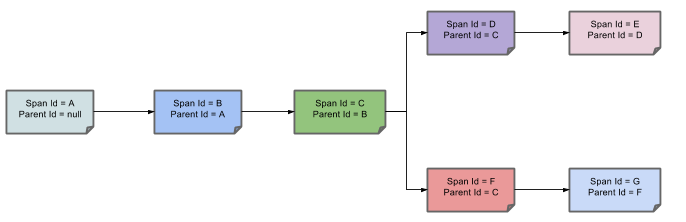

   

2. 名词解释

   Trace:类似于树结构的Span集合，表示一条调用链路，存在唯一标识

   span:表示调用链路来源，通俗的理解span就是一次请求信息

### 02-2、服务提供者

> cloud-provider-payment8001

#### 02-2-1、pom配置

```xml
<?xml version="1.0" encoding="UTF-8"?>
<project xmlns="http://maven.apache.org/POM/4.0.0"
         xmlns:xsi="http://www.w3.org/2001/XMLSchema-instance"
         xsi:schemaLocation="http://maven.apache.org/POM/4.0.0 http://maven.apache.org/xsd/maven-4.0.0.xsd">
    <parent>
        <artifactId>cloud2020</artifactId>
        <groupId>com.atguigu.springcloud</groupId>
        <version>1.0-SNAPSHOT</version>
    </parent>
    <modelVersion>4.0.0</modelVersion>

    <artifactId>cloud-provider-payment8001</artifactId>

    <dependencies>
        <!--包含了sleuth+zipkin-->
        <dependency>
            <groupId>org.springframework.cloud</groupId>
            <artifactId>spring-cloud-starter-zipkin</artifactId>
        </dependency>
        <!-- 引入自己定义的api通用包，可以使用Payment支付Entity -->
        <dependency>
            <groupId>com.atguigu.springcloud</groupId>
            <artifactId>cloud-api-commons</artifactId>
            <version>${project.version}</version>
        </dependency>
        <!--  引入Eureka Client      -->
        <dependency>
            <groupId>org.springframework.cloud</groupId>
            <artifactId>spring-cloud-starter-netflix-eureka-client</artifactId>
        </dependency>
        <dependency>
            <groupId>org.springframework.boot</groupId>
            <artifactId>spring-boot-starter-web</artifactId>
        </dependency>
        <!--图形化显示和坐标监控-->
        <dependency>
            <groupId>org.springframework.boot</groupId>
            <artifactId>spring-boot-starter-actuator</artifactId>
        </dependency>
        <dependency>
            <groupId>org.mybatis.spring.boot</groupId>
            <artifactId>mybatis-spring-boot-starter</artifactId>
        </dependency>
        <dependency>
            <groupId>com.alibaba</groupId>
            <artifactId>druid-spring-boot-starter</artifactId>
            <version>1.1.10</version>
        </dependency>
        <!--mysql-connector-java-->
        <dependency>
            <groupId>mysql</groupId>
            <artifactId>mysql-connector-java</artifactId>
        </dependency>
        <!--jdbc-->
        <dependency>
            <groupId>org.springframework.boot</groupId>
            <artifactId>spring-boot-starter-jdbc</artifactId>
        </dependency>
        <!--devtools-->
        <dependency>
            <groupId>org.springframework.boot</groupId>
            <artifactId>spring-boot-devtools</artifactId>
            <scope>runtime</scope>
            <optional>true</optional>
        </dependency>
        <dependency>
            <groupId>org.springframework.boot</groupId>
            <artifactId>spring-boot-devtools</artifactId>
            <scope>runtime</scope>
            <optional>true</optional>
        </dependency>
        <dependency>
            <groupId>org.projectlombok</groupId>
            <artifactId>lombok</artifactId>
            <optional>true</optional>
        </dependency>
        <dependency>
            <groupId>org.springframework.boot</groupId>
            <artifactId>spring-boot-starter-test</artifactId>
            <scope>test</scope>
        </dependency>
    </dependencies>
</project>
```

#### 02-2-2、yml配置

```yaml
server:
  port: 8001

spring:
  application:
    name: cloud-payment-service
  zipkin:
    base-url: http://localhost:9411
  sleuth:
    sampler:
      #采样率值介于 0 到 1 之间，1 则表示全部采集
      probability: 1
  datasource:
    type: com.alibaba.druid.pool.DruidDataSource            # 当前数据源操作类型
    driver-class-name: org.gjt.mm.mysql.Driver              # mysql驱动包
    url: jdbc:mysql://localhost:3306/db2019?useUnicode=true&characterEncoding=utf-8&useSSL=false
    username: root
    password: 123456
eureka:
  client:
    #表示是否将自己注册进EurekaServer默认为true。
    register-with-eureka: true
    #是否从EurekaServer抓取已有的注册信息，默认为true。单节点无所谓，集群必须设置为true才能配合ribbon使用负载均衡
    fetchRegistry: true
    service-url:
      #defaultZone: http://localhost:7001/eureka
      defaultZone: http://eureka7001.com:7001/eureka,http://eureka7002.com:7002/eureka #集群版
  instance:
    instance-id: payment8001
    prefer-ip-address: true     #访问路径可以显示IP地址

mybatis:
  mapperLocations: classpath:mapper/*.xml
  type-aliases-package: com.atguigu.springcloud.entities    # 所有Entity别名类所在包
```

#### 02-2-3、业务类PaymentController

添加接口

```java
@GetMapping("/payment/zipkin")
public String paymentZipkin()
{
    return "hi ,i'am paymentzipkin server fall back，welcome to atguigu，O(∩_∩)O哈哈~";
}
```

### 02-3、服务消费者

> cloud-consumer-order80

#### 02-3-1、pom配置

```xml
<?xml version="1.0" encoding="UTF-8"?>
<project xmlns="http://maven.apache.org/POM/4.0.0"
         xmlns:xsi="http://www.w3.org/2001/XMLSchema-instance"
         xsi:schemaLocation="http://maven.apache.org/POM/4.0.0 http://maven.apache.org/xsd/maven-4.0.0.xsd">
    <parent>
        <artifactId>cloud2020</artifactId>
        <groupId>com.atguigu.springcloud</groupId>
        <version>1.0-SNAPSHOT</version>
    </parent>
    <modelVersion>4.0.0</modelVersion>

    <artifactId>cloud-consumer-order80</artifactId>

    <dependencies>
        <!--包含了sleuth+zipkin-->
        <dependency>
            <groupId>org.springframework.cloud</groupId>
            <artifactId>spring-cloud-starter-zipkin</artifactId>
        </dependency>
        <!--  引入Eureka Client      -->
        <dependency>
            <groupId>org.springframework.cloud</groupId>
            <artifactId>spring-cloud-starter-netflix-eureka-client</artifactId>
        </dependency>
        <!-- 引入自己定义的api通用包，可以使用Payment支付Entity -->
        <dependency>
            <groupId>com.atguigu.springcloud</groupId>
            <artifactId>cloud-api-commons</artifactId>
            <version>${project.version}</version>
        </dependency>
        <dependency>
            <groupId>org.springframework.boot</groupId>
            <artifactId>spring-boot-starter-web</artifactId>
        </dependency>
        <!--图形化显示和坐标监控-->
        <dependency>
            <groupId>org.springframework.boot</groupId>
            <artifactId>spring-boot-starter-actuator</artifactId>
        </dependency>
        <!--devtools-->
        <dependency>
            <groupId>org.springframework.boot</groupId>
            <artifactId>spring-boot-devtools</artifactId>
            <scope>runtime</scope>
            <optional>true</optional>
        </dependency>
        <dependency>
            <groupId>org.projectlombok</groupId>
            <artifactId>lombok</artifactId>
            <optional>true</optional>
        </dependency>
        <dependency>
            <groupId>org.springframework.boot</groupId>
            <artifactId>spring-boot-starter-test</artifactId>
            <scope>test</scope>
        </dependency>
    </dependencies>
</project>
```

#### 02-3-2、yml配置

```yaml
server:
  port: 80

spring:
  application:
    name: cloud-order-service
  zipkin:
    base-url: http://localhost:9411
  sleuth:
    sampler:
      probability: 1
eureka:
  client:
    #表示是否将自己注册进EurekaServer默认为true。
    register-with-eureka: true
    #是否从EurekaServer抓取已有的注册信息，默认为true。单节点无所谓，集群必须设置为true才能配合ribbon使用负载均衡
    fetchRegistry: true
    service-url:
      #defaultZone: http://localhost:7001/eureka
      defaultZone: http://eureka7001.com:7001/eureka,http://eureka7002.com:7002/eureka #集群版

mybatis:
  mapperLocations: classpath:mapper/*.xml
  type-aliases-package: com.atguigu.springcloud.entities    # 所有Entity别名类所在包
```

#### 02-3-3、业务类

```java
// ====================> zipkin+sleuth
@GetMapping("/consumer/payment/zipkin")
public String paymentZipkin()
{
    String result = restTemplate.getForObject("http://localhost:8001"+"/payment/zipkin/", String.class);
    return result;
}
```

### 02-4、测试

1. 依次启动eureka7001/8001/80

2. 80调用8001几次测试下：http://localhost/consumer/payment/zipkin

3. 打开浏览器访问：http://localhost:9411

   - 会出现以下界面

     

     点击进入下面的请求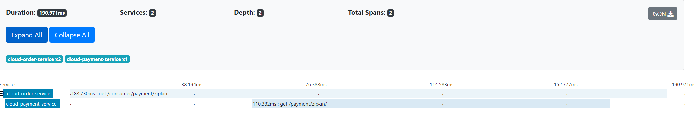

   - 查看依赖关系

     


# 十七、SpringCloud Alibaba 入门简介

## 01、出现SpringCloud alibaba的的原因

由于Spring Cloud Netflix项目进入维护模式，将模块置于维护模式，意味着 Spring Cloud 团队将不会再向模块添加新功能。我们将修复 block 级别的 bug 以及安全问题，我们也会考虑并审查社区的小型 pull request。

进入维护模式意味着

Spring Cloud Netflix 将不再开发新的组件
我们都知道Spring Cloud 版本迭代算是比较快的，因而出现了很多重大ISSUE都还来不及Fix就又推另一个Release了。进入维护模式意思就是目前一直以后一段时间Spring Cloud Netflix提供的服务和功能就这么多了，不在开发新的组件和功能了。以后将以维护和Merge分支Full Request为主

## 02、SpringCloud alibaba带来了什么

官网：https://github.com/alibaba/spring-cloud-alibaba/blob/master/README-zh.md

2018.10.31，Spring Cloud Alibaba 正式入驻了 Spring Cloud 官方孵化器，并在 Maven 中央库发布了第一个版本。

### 02-1、主要功能

- 服务限流降级：默认支持 Servlet、Feign、RestTemplate、Dubbo 和 RocketMQ 限流降级功能的接入，可以在运行时通过控制台实时修改限流降级规则，还支持查看限流降级 Metrics 监控。
- 服务注册与发现：适配 Spring Cloud 服务注册与发现标准，默认集成了 Ribbon 的支持。
- 分布式配置管理：支持分布式系统中的外部化配置，配置更改时自动刷新。
- 消息驱动能力：基于 Spring Cloud Stream 为微服务应用构建消息驱动能力。
- 阿里云对象存储：阿里云提供的海量、安全、低成本、高可靠的云存储服务。支持在任何应用、任何时间、任何地点存储和访问任意类型的数据。
- 分布式任务调度：提供秒级、精准、高可靠、高可用的定时（基于 Cron 表达式）任务调度服务。同时提供分布式的任务执行模型，如网格任务。网格任务支持海量子任务均匀分配到所有 Worker（schedulerx-client）上执行。

### 02-2、下载

https://github.com/alibaba/spring-cloud-alibaba/blob/master/README-zh.md

### 02-3、组件

- Sentinel：把流量作为切入点，从流量控制、熔断降级、系统负载保护等多个维度保护服务的稳定性。

- Nacos：一个更易于构建云原生应用的动态服务发现、配置管理和服务管理平台。

- RocketMQ：一款开源的分布式消息系统，基于高可用分布式集群技术，提供低延时的、高可靠的消息发布与订阅服务。

- Dubbo：Apache Dubbo™ 是一款高性能 Java RPC 框架。

- Seata：阿里巴巴开源产品，一个易于使用的高性能微服务分布式事务解决方案。

- Alibaba Cloud OSS: 阿里云对象存储服务（Object Storage Service，简称 OSS），是阿里云提供的海量、安全、低成本、高可靠的云存储服务。您可以在任何应用、任何时间、任何地点存储和访问任意类型的数据。

- Alibaba Cloud SchedulerX: 阿里中间件团队开发的一款分布式任务调度产品，提供秒级、精准、高可靠、高可用的定时（基于 Cron 表达式）任务调度服务。

- Alibaba Cloud SMS: 覆盖全球的短信服务，友好、高效、智能的互联化通讯能力，帮助企业迅速搭建客户触达通道。


## 03、SpringCloud alibaba资料

官网：https://spring.io/projects/spring-cloud-alibaba#overview

英文版：https://github.com/alibaba/spring-cloud-alibaba，https://spring-cloud-alibaba-group.github.io/github-pages/greenwich/spring-cloud-alibaba.html

中文版：https://github.com/alibaba/spring-cloud-alibaba/blob/master/README-zh.md


# 十八、SpringCloud Alibaba Nacos服务注册和配置中心

## 01、Nacos简介

> Nacos的由来：前四个字母分别为Naming和Configuration的前两个字母，最后的s为Service。
>
> Nacos: Dynamic Naming and Configuration Service

Nacos是一个更易于构建云原生应用的动态服务发现、配置管理和服务管理平台。Nacos就是注册中心 + 配置中心的组合

Nacos = Eureka+Config+Bus

### 01-1、Nacos的目的

- 替代Eureka做服务注册中心
- 替代Config做服务配置中心

### 01-2、下载

官网：https://github.com/alibaba/Nacos：

官方文档：https://nacos.io/zh-cn/index.html，

https://spring-cloud-alibaba-group.github.io/github-pages/greenwich/spring-cloud-alibaba.html#_spring_cloud_alibaba_nacos_discovery

### 01-3、各种注册中心比较


据说 Nacos 在阿里巴巴内部有超过 10 万的实例运行，已经过了类似双十一等各种大型流量的考验

## 02、Nacos安装并运行

> 前提本地Java8+Maven环境已经OK

1. 先从官网下载Nacos：https://github.com/alibaba/nacos/releases

   

2. 解压安装包，直接运行bin目录下的startup.cmd

   > 1.2以上默认集群启动nacos,单机启动命令：startup.cmd -m standalone

   

3. 命令运行成功后直接访问http://localhost:8848/nacos

   

   默认账号密码:nacos

   登录后：

   

## 03、Nacos之服务注册中心

> 官方文档：https://spring-cloud-alibaba-group.github.io/github-pages/greenwich/spring-cloud-alibaba.html#_spring_cloud_alibaba_nacos_config

### 03-1、基于Nacos的服务提供者

#### 03-1-1、新建cloudalibaba-provider-payment9001

#### 03-1-2、pom配置

父pom

```xml
<!--spring cloud alibaba 2.1.0.RELEASE-->
<dependency>
    <groupId>com.alibaba.cloud</groupId>
    <artifactId>spring-cloud-alibaba-dependencies</artifactId>
    <version>2.1.0.RELEASE</version>
    <type>pom</type>
    <scope>import</scope>
</dependency>
```

本模块pom

```xml
<?xml version="1.0" encoding="UTF-8"?>
<project xmlns="http://maven.apache.org/POM/4.0.0" xmlns:xsi="http://www.w3.org/2001/XMLSchema-instance"
	xsi:schemaLocation="http://maven.apache.org/POM/4.0.0 https://maven.apache.org/xsd/maven-4.0.0.xsd">
	<modelVersion>4.0.0</modelVersion>
	<parent>
		<artifactId>cloud2020</artifactId>
		<groupId>com.atguigu.springcloud</groupId>
		<version>1.0-SNAPSHOT</version>
	</parent>

	<artifactId>cloudalibaba-provider-payment9001</artifactId>

	<dependencies>
		<!--SpringCloud ailibaba nacos -->
		<dependency>
			<groupId>com.alibaba.cloud</groupId>
			<artifactId>spring-cloud-starter-alibaba-nacos-discovery</artifactId>
		</dependency>
		<!-- SpringBoot整合Web组件 -->
		<dependency>
			<groupId>org.springframework.boot</groupId>
			<artifactId>spring-boot-starter-web</artifactId>
		</dependency>
		<dependency>
			<groupId>org.springframework.boot</groupId>
			<artifactId>spring-boot-starter-actuator</artifactId>
		</dependency>
		<!--日常通用jar包配置-->
		<dependency>
			<groupId>org.springframework.boot</groupId>
			<artifactId>spring-boot-devtools</artifactId>
			<scope>runtime</scope>
			<optional>true</optional>
		</dependency>
		<dependency>
			<groupId>org.projectlombok</groupId>
			<artifactId>lombok</artifactId>
			<optional>true</optional>
		</dependency>
		<dependency>
			<groupId>org.springframework.boot</groupId>
			<artifactId>spring-boot-starter-test</artifactId>
			<scope>test</scope>
		</dependency>
	</dependencies>
</project>
```

#### 03-1-3、yml配置

```yaml
server:
  port: 9001

spring:
  application:
    name: nacos-payment-provider
  cloud:
    nacos:
      discovery:
        server-addr: localhost:8848 #配置Nacos地址

management:
  endpoints:
    web:
      exposure:
        include: '*'
```

#### 03-1-4、主启动

```java
@SpringBootApplication
@EnableDiscoveryClient
public class CloudalibabaProviderPayment9001Application {

	public static void main(String[] args) {
		SpringApplication.run(CloudalibabaProviderPayment9001Application.class, args);
	}

}
```

#### 03-1-5、业务类

```java
@RestController
public class PaymentController {
    @Value("${server.port}")
    private String serverPort;

    @GetMapping(value = "/payment/nacos/{id}")
    public String getPayment(@PathVariable("id") Integer id)
    {
        return "nacos registry, serverPort: "+ serverPort+"\t id"+id;
    }
}
```

#### 03-1-6、测试

1. 启动nacos8848

2. 启动9001服务提供者

3. 调用接口：http://localhost:9001/payment/nacos/1

   

4. 查看Nacos8848上注册分服务

   

为了下一章节演示nacos的负载均衡，参照9001新建9002


### 03-2、基于Nacos的服务消费者

#### 03-2-1、新建cloudalibaba-consumer-nacos-order83

#### 03-2-2、pom配置

```xml
<?xml version="1.0" encoding="UTF-8"?>
<project xmlns="http://maven.apache.org/POM/4.0.0" xmlns:xsi="http://www.w3.org/2001/XMLSchema-instance"
	xsi:schemaLocation="http://maven.apache.org/POM/4.0.0 https://maven.apache.org/xsd/maven-4.0.0.xsd">
	<modelVersion>4.0.0</modelVersion>
	<parent>
		<artifactId>cloud2020</artifactId>
		<groupId>com.atguigu.springcloud</groupId>
		<version>1.0-SNAPSHOT</version>
	</parent>
	<artifactId>cloudalibaba-consumer-nacos-order83</artifactId>

	<dependencies>
		<!--SpringCloud ailibaba nacos -->
		<dependency>
			<groupId>com.alibaba.cloud</groupId>
			<artifactId>spring-cloud-starter-alibaba-nacos-discovery</artifactId>
		</dependency>
		<!-- 引入自己定义的api通用包，可以使用Payment支付Entity -->
		<dependency>
			<groupId>com.atguigu.springcloud</groupId>
			<artifactId>cloud-api-commons</artifactId>
			<version>${project.version}</version>
		</dependency>
		<!-- SpringBoot整合Web组件 -->
		<dependency>
			<groupId>org.springframework.boot</groupId>
			<artifactId>spring-boot-starter-web</artifactId>
		</dependency>
		<dependency>
			<groupId>org.springframework.boot</groupId>
			<artifactId>spring-boot-starter-actuator</artifactId>
		</dependency>
		<!--日常通用jar包配置-->
		<dependency>
			<groupId>org.springframework.boot</groupId>
			<artifactId>spring-boot-devtools</artifactId>
			<scope>runtime</scope>
			<optional>true</optional>
		</dependency>
		<dependency>
			<groupId>org.projectlombok</groupId>
			<artifactId>lombok</artifactId>
			<optional>true</optional>
		</dependency>
		<dependency>
			<groupId>org.springframework.boot</groupId>
			<artifactId>spring-boot-starter-test</artifactId>
			<scope>test</scope>
		</dependency>
	</dependencies>
</project>
```

为什么nacos支持负载均衡:

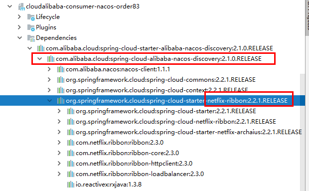

#### 03-2-3、yml配置

```yaml
server:
  port: 83


spring:
  application:
    name: nacos-order-consumer
  cloud:
    nacos:
      discovery:
        server-addr: localhost:8848


#消费者将要去访问的微服务名称(注册成功进nacos的微服务提供者)
service-url:
  nacos-user-service: http://nacos-payment-provider 
```

#### 03-2-4、主启动

添加`@EnableDiscoveryClient`注解

#### 03-2-5、业务类

`config.ApplicationContextBean`

```java
package com.atguigu.cloudalibaba.config;

import org.springframework.cloud.client.loadbalancer.LoadBalanced;
import org.springframework.context.annotation.Bean;
import org.springframework.context.annotation.Configuration;
import org.springframework.web.client.RestTemplate;

/**
 * @ClassName ApplicationContextBean
 * @Description TODO
 * @Author Lambert
 * @Date 2021/12/7 11:19
 * @Version 1.0
 **/
@Configuration
public class ApplicationContextBean
{
    @Bean
    @LoadBalanced
    public RestTemplate getRestTemplate()
    {
        return new RestTemplate();
    }
}
```

`controller.OrderNacosController`

```java
package com.atguigu.cloudalibaba.controller;

import org.springframework.beans.factory.annotation.Value;
import org.springframework.web.bind.annotation.GetMapping;
import org.springframework.web.bind.annotation.PathVariable;
import org.springframework.web.bind.annotation.RestController;
import org.springframework.web.client.RestTemplate;

import javax.annotation.Resource;

/**
 * @ClassName OrderNacosController
 * @Description TODO
 * @Author Lambert
 * @Date 2021/12/7 11:20
 * @Version 1.0
 **/
@RestController
public class OrderNacosController
{
    @Resource
    private RestTemplate restTemplate;

    @Value("${service-url.nacos-user-service}")
    private String serverURL;

    @GetMapping("/consumer/payment/nacos/{id}")
    public String paymentInfo(@PathVariable("id") Long id)
    {
        return restTemplate.getForObject(serverURL+"/payment/nacos/"+id,String.class);
    }

}

```

#### 03-2-6、测试

1. 启动83端口消费端

2. Nacos控制台：

   

3. 调用消费端接口远程调用服务端：http://localhost:83/consumer/payment/nacos/13

   

   

### 03-3、服务注册中心对比


#### 03-3-1、Nacos 支持AP和CP模式的切换

> C是所有节点在同一时间看到的数据是一致的；而A的定义是所有的请求都会收到响应

一般来说，
如果不需要存储服务级别的信息且服务实例是通过nacos-client注册，并能够保持心跳上报，那么就可以选择AP模式。当前主流的服务如 Spring cloud 和 Dubbo 服务，都适用于AP模式，AP模式为了服务的可能性而减弱了一致性，因此AP模式下只支持注册临时实例。

如果需要在服务级别编辑或者存储配置信息，那么 CP 是必须，K8S服务和DNS服务则适用于CP模式。
CP模式下则支持注册持久化实例，此时则是以 Raft 协议为集群运行模式，该模式下注册实例之前必须先注册服务，如果服务不存在，则会返回错误。

```shell
curl -X PUT '$NACOS_SERVER:8848/nacos/v1/ns/operator/switches?entry=serverMode&value=CP'
```

## 04、Nacos之服务配置中心

### 04-1、基础配置

#### 04-1-1、新建cloudalibaba-config-nacos-client3377

#### 04-1-2、pom配置

```xml
<?xml version="1.0" encoding="UTF-8"?>
<project xmlns="http://maven.apache.org/POM/4.0.0" xmlns:xsi="http://www.w3.org/2001/XMLSchema-instance"
	xsi:schemaLocation="http://maven.apache.org/POM/4.0.0 https://maven.apache.org/xsd/maven-4.0.0.xsd">
	<modelVersion>4.0.0</modelVersion>
	<parent>
		<artifactId>cloud2020</artifactId>
		<groupId>com.atguigu.springcloud</groupId>
		<version>1.0-SNAPSHOT</version>
	</parent>

	<artifactId>cloudalibaba-config-nacos-client3377</artifactId>

	<dependencies>
		<!--nacos-config-->
		<dependency>
			<groupId>com.alibaba.cloud</groupId>
			<artifactId>spring-cloud-starter-alibaba-nacos-config</artifactId>
		</dependency>
		<!--nacos-discovery-->
		<dependency>
			<groupId>com.alibaba.cloud</groupId>
			<artifactId>spring-cloud-starter-alibaba-nacos-discovery</artifactId>
		</dependency>
		<!--web + actuator-->
		<dependency>
			<groupId>org.springframework.boot</groupId>
			<artifactId>spring-boot-starter-web</artifactId>
		</dependency>
		<dependency>
			<groupId>org.springframework.boot</groupId>
			<artifactId>spring-boot-starter-actuator</artifactId>
		</dependency>
		<!--一般基础配置-->
		<dependency>
			<groupId>org.springframework.boot</groupId>
			<artifactId>spring-boot-devtools</artifactId>
			<scope>runtime</scope>
			<optional>true</optional>
		</dependency>
		<dependency>
			<groupId>org.projectlombok</groupId>
			<artifactId>lombok</artifactId>
			<optional>true</optional>
		</dependency>
		<dependency>
			<groupId>org.springframework.boot</groupId>
			<artifactId>spring-boot-starter-test</artifactId>
			<scope>test</scope>
		</dependency>
	</dependencies>

</project>
```

#### 04-1-3、yml配置

需要配置两个yml文件：

Nacos同springcloud-config一样，在项目初始化时，要保证先从配置中心进行配置拉取，
拉取配置之后，才能保证项目的正常启动。

springboot中配置文件的加载是存在优先级顺序的，bootstrap优先级高于application

`bootstrap.yml`

```yaml
# nacos配置
server:
  port: 3377

spring:
  application:
    name: nacos-config-client
  cloud:
    nacos:
      discovery:
        server-addr: localhost:8848 #Nacos服务注册中心地址
      config:
        server-addr: localhost:8848 #Nacos作为配置中心地址
        file-extension: yaml #指定yaml格式的配置
# ${spring.application.name}-${spring.profile.active}.${spring.cloud.nacos.config.file-extension}
```

`application.yml`

```yaml
spring:
  profiles:
    active: dev # 表示开发环境
```

#### 04-1-4、主启动

添加`@EnableDiscoveryClient`注解

#### 04-1-5、业务类

`ConfigClientController`

```java
@RestController
@RefreshScope //在控制器类加入@RefreshScope注解使当前类下的配置支持Nacos的动态刷新功能。
public class ConfigClientController
{
    @Value("${config.info}")
    private String configInfo;

    @GetMapping("/config/info")
    public String getConfigInfo() {
        return configInfo;
    }
}
```

@RefreshScope:通过SpringCloud 原生注解`@RefreshScope`实现配置自动更新

#### 04-1-6、在Nacos控制台中添加配置信息

- 理论：Nacos中的dataid的组成格式及与SpringBoot配置文件中的匹配规则

  官网：https://nacos.io/zh-cn/docs/quick-start-spring-cloud.html

  

  最后公式：
  ${spring.application.name}-${spring.profiles.active}.${spring.cloud.nacos.config.file-extension}

  

- 实操

  - 新增配置

    

    

历史配置

- 理论

  Nacos会记录配置文件的历史版本默认保留30天，此外还有一键回滚功能，回滚操作将会触发配置更新

- 实操

  1. 先去修改一次nacos-config-client-dev.yaml配置文件

  2. 再去查询历史配置

     

#### 04-1-7、测试

> 启动前需要在nacos客户端-配置管理-配置管理栏目下有对应的yaml配置文件

1. 运行cloud-config-nacos-client3377的主启动类

2. 调用接口查看配置信息，http://localhost:3377/config/info

   

3. Nacos控制台修改配置信息，版本改为4

4. 再次调用接口查看配置信息，http://localhost:3377/config/info

   

> 自带动态刷新

### 04-2、分类配置

#### 04-2-1、问题

多环境多项目管理

- 问题1：
  实际开发中，通常一个系统会准备
  dev开发环境
  test测试环境
  prod生产环境。
  如何保证指定环境启动时服务能正确读取到Nacos上相应环境的配置文件呢？
- 问题2：
  一个大型分布式微服务系统会有很多微服务子项目，
  每个微服务项目又都会有相应的开发环境、测试环境、预发环境、正式环境......
  那怎么对这些微服务配置进行管理呢？

#### 04-2-2、Nacos的图形化管理界面

- 配置管理

  

- 命名空间

  

Namespace+Group+Data ID三者关系？为什么这么设计？

类似Java里面的package名和类名
最外层的namespace是可以用于区分部署环境的，Group和DataID逻辑上区分两个目标对象。

三者情况：


默认情况：
Namespace=public，Group=DEFAULT_GROUP, 默认Cluster是DEFAULT

Nacos默认的命名空间是public，Namespace主要用来实现隔离。
**比方说我们现在有三个环境：开发、测试、生产环境，我们就可以创建三个Namespace，不同的Namespace之间是隔离的**。

Group默认是DEFAULT_GROUP，Group可以把不同的微服务划分到同一个分组里面去

Service就是微服务；一个Service可以包含多个Cluster（集群），Nacos默认Cluster是DEFAULT，Cluster是对指定微服务的一个虚拟划分。

比方说为了容灾，将Service微服务分别部署在了杭州机房和广州机房，
这时就可以给杭州机房的Service微服务起一个集群名称（HZ），
给广州机房的Service微服务起一个集群名称（GZ），还可以尽量让同一个机房的微服务互相调用，以提升性能。

最后是Instance，就是微服务的实例。

#### 04-2-3、Case

> 三种方案加载配置

1. DataID方案（常用）

   指定spring.profile.active和配置文件的DataID来使不同环境下读取不同的配置

   默认空间+默认分组+新建dev和test两个DataID

   1. 新建dev配置DataID

      

   2. 新建test配置DataID

      

      Nacos控制台当前配置

      

   3. 通过spring.profile.active属性就能进行多环境下配置文件的读取

      `application.yml`

      ```yaml
      spring:
        profiles:
      #    active: dev # 表示开发环境
          active: test
      ```

   4. 测试

      重启3377服务

      调用接口：http://localhost:3377/config/info

      

      切换为测试环境了

2. Group方案

   > 通过Group实现环境区分

   - 新建一个开发DEVGroup和TESTGroup分组

     

     

     

   - 配置bootstrap和application.yml

     > 在config下增加一条group的配置即可。可配置为DEV_GROUP或TEST_GROUP

     `bootstrap.yml`

     ```yaml
     # nacos配置
     server:
       port: 3377
     
     spring:
       application:
         name: nacos-config-client
       cloud:
         nacos:
           discovery:
             server-addr: localhost:8848 #Nacos服务注册中心地址
           config:
             server-addr: localhost:8848 #Nacos作为配置中心地址
             file-extension: yaml #指定yaml格式的配置
             group: TEST_GROUP #Group方案 确定开发环境或者测试环境
     ```

     `application.yml`

     ```yaml
     spring:
       profiles:
         active: info #Group策略
     ```

   - 测试

     重启3377服务

     调用接口：http://localhost:3377/config/info

     

     > 需要切换环境只需要修改Group配置

3. Namespace方案

   - 新建dev/test的Namespace

     

     新建dev命名空间

     

     新建test命名空间

     

     可以看见已建好的命名空间

     

     配置列表多了两个命名空间

     

   - 配置bootstrap和application.yml

     `bootstrap.yml`

     ```yaml
     # nacos配置
     server:
       port: 3377
     
     spring:
       application:
         name: nacos-config-client
       cloud:
         nacos:
           discovery:
             server-addr: localhost:8848 #Nacos服务注册中心地址
           config:
             server-addr: localhost:8848 #Nacos作为配置中心地址
             file-extension: yaml #指定yaml格式的配置
             group: TEST_GROUP #Group方案 确定开发环境或者测试环境
             namespace: 59936919-8940-445b-9076-f7d0fac85634
     ```

     `application.yml`

     ```yaml
     spring:
       profiles:
           active: dev # 表示开发环境
     ```

   - 在DEV的命名空间下新建三个配置

      

     

     

   - 测试

     重启3377，调用接口：http://localhost:3377/config/info

     

     > 需要修改Nacos的指定配置时只需要去bootstrap修改Group或者application修改spring.profiles.actives


## 05、Nacos集群和持久化配置

### 05-1、官网说明

官网：https://nacos.io/zh-cn/docs/cluster-mode-quick-start.html

官网部署架构图：


上图官网翻译，真实情况

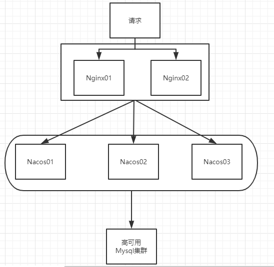

默认Nacos使用嵌入式数据库实现数据的存储。所以，如果启动多个默认配置下的Nacos节点，数据存储是存在一致性问题的。
为了解决这个问题，Nacos采用了集中式存储的方式来支持集群化部署，目前只支持MySQL的存储。

**Nacos支持三种部署模式**

- 单机模式，用于测试和单机试用
- 集群模式，用于生产环境，确保高可用
- 多集群模式，用于多数据中心场景

Windows：双击startup.cmd文件

**单机模式支持mysql**

官方文档：https://nacos.io/zh-cn/docs/deployment.html

在0.7版本之前，在单机模式时nacos使用嵌入式数据库实现数据的存储，不方便观察数据存储的基本情况。0.7版本增加了支持mysql数据源能力，具体的操作步骤:

- 1.安装数据库，版本要求: 5.6.5+

- 2.初始化mysq|数据库， 数据库初始化文件: nacos-mysql.sql

- 3.修改conf/application.properties文件， 增加支持mysq|数据源配置(目前只支持mysql)，添加mysq|数据源的url、用户名和密码。

  ```properties
  spring.datasource.platform=mysql
  
  db.num=1
  db.url.0=jdbc:mysql://11.162.196.16:3306/nacos_devtest?characterEncoding=utf8&connectTimeout=1000&socketTimeout=3000&autoReconnect=true
  db.user=nacos_devtest
  db.password=youdontknow
  ```

- 4.再以单机模式启动nacos,nacos所有写嵌入式数据库的数据都写到了mysq|

### 05-2、Nacos持久化配置解释

> Nacos默认自带的是嵌入式数据库derby
>
> 官网：https://github.com/alibaba/nacos/blob/develop/config/pom.xml

#### 05-2-1、derby到mysql切换配置步骤

1. `nacos-server-1.1.4\nacos\conf`目录下找到sql脚本(nacos-mysql.sql)，复制该文件的内容

2. 前往sql数据库执行以下sql脚本

   ```sql
   /******************************************/
   /*   数据库全名 = nacos_config   */
   /*   表名称 = config_info   */
   /******************************************/
   CREATE TABLE `config_info` (
     `id` bigint(20) NOT NULL AUTO_INCREMENT COMMENT 'id',
     `data_id` varchar(255) NOT NULL COMMENT 'data_id',
     `group_id` varchar(255) DEFAULT NULL,
     `content` longtext NOT NULL COMMENT 'content',
     `md5` varchar(32) DEFAULT NULL COMMENT 'md5',
     `gmt_create` datetime NOT NULL DEFAULT '2010-05-05 00:00:00' COMMENT '创建时间',
     `gmt_modified` datetime NOT NULL DEFAULT '2010-05-05 00:00:00' COMMENT '修改时间',
     `src_user` text COMMENT 'source user',
     `src_ip` varchar(20) DEFAULT NULL COMMENT 'source ip',
     `app_name` varchar(128) DEFAULT NULL,
     `tenant_id` varchar(128) DEFAULT '' COMMENT '租户字段',
     `c_desc` varchar(256) DEFAULT NULL,
     `c_use` varchar(64) DEFAULT NULL,
     `effect` varchar(64) DEFAULT NULL,
     `type` varchar(64) DEFAULT NULL,
     `c_schema` text,
     PRIMARY KEY (`id`),
     UNIQUE KEY `uk_configinfo_datagrouptenant` (`data_id`,`group_id`,`tenant_id`)
   ) ENGINE=InnoDB DEFAULT CHARSET=utf8 COLLATE=utf8_bin COMMENT='config_info';
   
   /******************************************/
   /*   数据库全名 = nacos_config   */
   /*   表名称 = config_info_aggr   */
   /******************************************/
   CREATE TABLE `config_info_aggr` (
     `id` bigint(20) NOT NULL AUTO_INCREMENT COMMENT 'id',
     `data_id` varchar(255) NOT NULL COMMENT 'data_id',
     `group_id` varchar(255) NOT NULL COMMENT 'group_id',
     `datum_id` varchar(255) NOT NULL COMMENT 'datum_id',
     `content` longtext NOT NULL COMMENT '内容',
     `gmt_modified` datetime NOT NULL COMMENT '修改时间',
     `app_name` varchar(128) DEFAULT NULL,
     `tenant_id` varchar(128) DEFAULT '' COMMENT '租户字段',
     PRIMARY KEY (`id`),
     UNIQUE KEY `uk_configinfoaggr_datagrouptenantdatum` (`data_id`,`group_id`,`tenant_id`,`datum_id`)
   ) ENGINE=InnoDB DEFAULT CHARSET=utf8 COLLATE=utf8_bin COMMENT='增加租户字段';
   
   
   /******************************************/
   /*   数据库全名 = nacos_config   */
   /*   表名称 = config_info_beta   */
   /******************************************/
   CREATE TABLE `config_info_beta` (
     `id` bigint(20) NOT NULL AUTO_INCREMENT COMMENT 'id',
     `data_id` varchar(255) NOT NULL COMMENT 'data_id',
     `group_id` varchar(128) NOT NULL COMMENT 'group_id',
     `app_name` varchar(128) DEFAULT NULL COMMENT 'app_name',
     `content` longtext NOT NULL COMMENT 'content',
     `beta_ips` varchar(1024) DEFAULT NULL COMMENT 'betaIps',
     `md5` varchar(32) DEFAULT NULL COMMENT 'md5',
     `gmt_create` datetime NOT NULL DEFAULT '2010-05-05 00:00:00' COMMENT '创建时间',
     `gmt_modified` datetime NOT NULL DEFAULT '2010-05-05 00:00:00' COMMENT '修改时间',
     `src_user` text COMMENT 'source user',
     `src_ip` varchar(20) DEFAULT NULL COMMENT 'source ip',
     `tenant_id` varchar(128) DEFAULT '' COMMENT '租户字段',
     PRIMARY KEY (`id`),
     UNIQUE KEY `uk_configinfobeta_datagrouptenant` (`data_id`,`group_id`,`tenant_id`)
   ) ENGINE=InnoDB DEFAULT CHARSET=utf8 COLLATE=utf8_bin COMMENT='config_info_beta';
   
   /******************************************/
   /*   数据库全名 = nacos_config   */
   /*   表名称 = config_info_tag   */
   /******************************************/
   CREATE TABLE `config_info_tag` (
     `id` bigint(20) NOT NULL AUTO_INCREMENT COMMENT 'id',
     `data_id` varchar(255) NOT NULL COMMENT 'data_id',
     `group_id` varchar(128) NOT NULL COMMENT 'group_id',
     `tenant_id` varchar(128) DEFAULT '' COMMENT 'tenant_id',
     `tag_id` varchar(128) NOT NULL COMMENT 'tag_id',
     `app_name` varchar(128) DEFAULT NULL COMMENT 'app_name',
     `content` longtext NOT NULL COMMENT 'content',
     `md5` varchar(32) DEFAULT NULL COMMENT 'md5',
     `gmt_create` datetime NOT NULL DEFAULT '2010-05-05 00:00:00' COMMENT '创建时间',
     `gmt_modified` datetime NOT NULL DEFAULT '2010-05-05 00:00:00' COMMENT '修改时间',
     `src_user` text COMMENT 'source user',
     `src_ip` varchar(20) DEFAULT NULL COMMENT 'source ip',
     PRIMARY KEY (`id`),
     UNIQUE KEY `uk_configinfotag_datagrouptenanttag` (`data_id`,`group_id`,`tenant_id`,`tag_id`)
   ) ENGINE=InnoDB DEFAULT CHARSET=utf8 COLLATE=utf8_bin COMMENT='config_info_tag';
   
   /******************************************/
   /*   数据库全名 = nacos_config   */
   /*   表名称 = config_tags_relation   */
   /******************************************/
   CREATE TABLE `config_tags_relation` (
     `id` bigint(20) NOT NULL COMMENT 'id',
     `tag_name` varchar(128) NOT NULL COMMENT 'tag_name',
     `tag_type` varchar(64) DEFAULT NULL COMMENT 'tag_type',
     `data_id` varchar(255) NOT NULL COMMENT 'data_id',
     `group_id` varchar(128) NOT NULL COMMENT 'group_id',
     `tenant_id` varchar(128) DEFAULT '' COMMENT 'tenant_id',
     `nid` bigint(20) NOT NULL AUTO_INCREMENT,
     PRIMARY KEY (`nid`),
     UNIQUE KEY `uk_configtagrelation_configidtag` (`id`,`tag_name`,`tag_type`),
     KEY `idx_tenant_id` (`tenant_id`)
   ) ENGINE=InnoDB DEFAULT CHARSET=utf8 COLLATE=utf8_bin COMMENT='config_tag_relation';
   
   /******************************************/
   /*   数据库全名 = nacos_config   */
   /*   表名称 = group_capacity   */
   /******************************************/
   CREATE TABLE `group_capacity` (
     `id` bigint(20) unsigned NOT NULL AUTO_INCREMENT COMMENT '主键ID',
     `group_id` varchar(128) NOT NULL DEFAULT '' COMMENT 'Group ID，空字符表示整个集群',
     `quota` int(10) unsigned NOT NULL DEFAULT '0' COMMENT '配额，0表示使用默认值',
     `usage` int(10) unsigned NOT NULL DEFAULT '0' COMMENT '使用量',
     `max_size` int(10) unsigned NOT NULL DEFAULT '0' COMMENT '单个配置大小上限，单位为字节，0表示使用默认值',
     `max_aggr_count` int(10) unsigned NOT NULL DEFAULT '0' COMMENT '聚合子配置最大个数，，0表示使用默认值',
     `max_aggr_size` int(10) unsigned NOT NULL DEFAULT '0' COMMENT '单个聚合数据的子配置大小上限，单位为字节，0表示使用默认值',
     `max_history_count` int(10) unsigned NOT NULL DEFAULT '0' COMMENT '最大变更历史数量',
     `gmt_create` datetime NOT NULL DEFAULT '2010-05-05 00:00:00' COMMENT '创建时间',
     `gmt_modified` datetime NOT NULL DEFAULT '2010-05-05 00:00:00' COMMENT '修改时间',
     PRIMARY KEY (`id`),
     UNIQUE KEY `uk_group_id` (`group_id`)
   ) ENGINE=InnoDB DEFAULT CHARSET=utf8 COLLATE=utf8_bin COMMENT='集群、各Group容量信息表';
   
   /******************************************/
   /*   数据库全名 = nacos_config   */
   /*   表名称 = his_config_info   */
   /******************************************/
   CREATE TABLE `his_config_info` (
     `id` bigint(64) unsigned NOT NULL,
     `nid` bigint(20) unsigned NOT NULL AUTO_INCREMENT,
     `data_id` varchar(255) NOT NULL,
     `group_id` varchar(128) NOT NULL,
     `app_name` varchar(128) DEFAULT NULL COMMENT 'app_name',
     `content` longtext NOT NULL,
     `md5` varchar(32) DEFAULT NULL,
     `gmt_create` datetime NOT NULL DEFAULT '2010-05-05 00:00:00',
     `gmt_modified` datetime NOT NULL DEFAULT '2010-05-05 00:00:00',
     `src_user` text,
     `src_ip` varchar(20) DEFAULT NULL,
     `op_type` char(10) DEFAULT NULL,
     `tenant_id` varchar(128) DEFAULT '' COMMENT '租户字段',
     PRIMARY KEY (`nid`),
     KEY `idx_gmt_create` (`gmt_create`),
     KEY `idx_gmt_modified` (`gmt_modified`),
     KEY `idx_did` (`data_id`)
   ) ENGINE=InnoDB DEFAULT CHARSET=utf8 COLLATE=utf8_bin COMMENT='多租户改造';
   
   
   /******************************************/
   /*   数据库全名 = nacos_config   */
   /*   表名称 = tenant_capacity   */
   /******************************************/
   CREATE TABLE `tenant_capacity` (
     `id` bigint(20) unsigned NOT NULL AUTO_INCREMENT COMMENT '主键ID',
     `tenant_id` varchar(128) NOT NULL DEFAULT '' COMMENT 'Tenant ID',
     `quota` int(10) unsigned NOT NULL DEFAULT '0' COMMENT '配额，0表示使用默认值',
     `usage` int(10) unsigned NOT NULL DEFAULT '0' COMMENT '使用量',
     `max_size` int(10) unsigned NOT NULL DEFAULT '0' COMMENT '单个配置大小上限，单位为字节，0表示使用默认值',
     `max_aggr_count` int(10) unsigned NOT NULL DEFAULT '0' COMMENT '聚合子配置最大个数',
     `max_aggr_size` int(10) unsigned NOT NULL DEFAULT '0' COMMENT '单个聚合数据的子配置大小上限，单位为字节，0表示使用默认值',
     `max_history_count` int(10) unsigned NOT NULL DEFAULT '0' COMMENT '最大变更历史数量',
     `gmt_create` datetime NOT NULL DEFAULT '2010-05-05 00:00:00' COMMENT '创建时间',
     `gmt_modified` datetime NOT NULL DEFAULT '2010-05-05 00:00:00' COMMENT '修改时间',
     PRIMARY KEY (`id`),
     UNIQUE KEY `uk_tenant_id` (`tenant_id`)
   ) ENGINE=InnoDB DEFAULT CHARSET=utf8 COLLATE=utf8_bin COMMENT='租户容量信息表';
   
   
   CREATE TABLE `tenant_info` (
     `id` bigint(20) NOT NULL AUTO_INCREMENT COMMENT 'id',
     `kp` varchar(128) NOT NULL COMMENT 'kp',
     `tenant_id` varchar(128) default '' COMMENT 'tenant_id',
     `tenant_name` varchar(128) default '' COMMENT 'tenant_name',
     `tenant_desc` varchar(256) DEFAULT NULL COMMENT 'tenant_desc',
     `create_source` varchar(32) DEFAULT NULL COMMENT 'create_source',
     `gmt_create` bigint(20) NOT NULL COMMENT '创建时间',
     `gmt_modified` bigint(20) NOT NULL COMMENT '修改时间',
     PRIMARY KEY (`id`),
     UNIQUE KEY `uk_tenant_info_kptenantid` (`kp`,`tenant_id`),
     KEY `idx_tenant_id` (`tenant_id`)
   ) ENGINE=InnoDB DEFAULT CHARSET=utf8 COLLATE=utf8_bin COMMENT='tenant_info';
   
   CREATE TABLE users (
   	username varchar(50) NOT NULL PRIMARY KEY,
   	password varchar(500) NOT NULL,
   	enabled boolean NOT NULL
   );
   
   CREATE TABLE roles (
   	username varchar(50) NOT NULL,
   	role varchar(50) NOT NULL
   );
   
   INSERT INTO users (username, password, enabled) VALUES ('nacos', '$2a$10$EuWPZHzz32dJN7jexM34MOeYirDdFAZm2kuWj7VEOJhhZkDrxfvUu', TRUE);
   
   INSERT INTO roles (username, role) VALUES ('nacos', 'ROLE_ADMIN');
   ```

   

3. `nacos-server-1.1.4\nacos\conf`目录下找到application.properties

   向文件添加一段数据源配置

   ```properties
   spring.datasource.platform=mysql
   
   db.num=1
   db.url.0=jdbc:mysql://localhost:3306/nacos_config?useSSL=false&useUnicode=true&characterEncoding=utf-8&serverTimezone=UTC
   db.user=root
   db.password=123456
   ```

4. 重启Nacos

   > 若本地mysql版本时8.0+版本时会报错
   >
   > ```java
   > Failed to obtain JDBC Connection; nested exception is org.apache.commons.dbcp.SQLNestedException: Cannot create PoolableConnectionFactory，
   > ```
   >
   > 需要将Nacos改为1.2版本以上才能兼容
   >
   > **(这里我重新下载了个1.4.1版本的Nacos并切换成1.4.1版本的Nacos)**

5. 可以看到是个全新的空记录界面，以前是记录进derby,现在是记录到本地的mysql数据库

   

   

   - 测试添加配置后在数据库中显示

     

   

#### 05-2-2、Linux版Nacos+MySQL生产环境配置

> 前提准备：1个Nginx+3个nacos注册中心+1个mysql

##### 1、Linux版本Nacos安装


1. 下载路径：https://github.com/alibaba/nacos/releases/tag/1.4.1

2. 选择下载nacos-server-1.4.1.tar.gz

3. 将压缩包放到linux的路径`/opt`并解压

   ```nginx
   [root@localhost opt]# ls
   containerd  module  nacos-server-1.4.1.tar.gz  redis-6.2.4  redis-6.2.4.tar.gz  rh
   [root@localhost opt]# tar -zxvf nacos-server-1.4.1.tar.gz
   nacos/LICENSE
   nacos/NOTICE
   nacos/target/nacos-server.jar
   .....
   [root@localhost opt]# ls
   containerd  module  nacos  nacos-server-1.4.1.tar.gz  redis-6.2.4  redis-6.2.4.tar.gz  rh
   ```

   解压成一个nacos文件夹,将nacos文件夹复制一份到`/mynacos`目录

   ```nginx
   [root@localhost opt]# cp -r nacos /mynacos/
   [root@localhost /]# ls
   bin  boot  data  dev  etc  home  lib  lib64  media  mnt  mynacos  myredis
   ```

   nacos文件目录

   ```nginx
   [root@localhost mynacos]# ll
   总用量 24
   drwxr-xr-x 2 root root    82 12月  8 14:32 bin
   drwxr-xr-x 2 root root   205 12月  8 14:32 conf
   -rw-r--r-- 1 root root 16583 12月  8 14:32 LICENSE
   -rw-r--r-- 1 root root  1305 12月  8 14:32 NOTICE
   drwxr-xr-x 2 root root    30 12月  8 14:32 target
   # bin的文件目录，不同于Windows，Linux启动nacos执行的是startup.sh
   [root@localhost mynacos]# cd bin
   [root@localhost bin]# ll
   总用量 20
   -rwxr-xr-x 1 root root  954 12月  8 14:32 shutdown.cmd
   -rwxr-xr-x 1 root root  951 12月  8 14:32 shutdown.sh
   -rwxr-xr-x 1 root root 3340 12月  8 14:32 startup.cmd
   -rwxr-xr-x 1 root root 4923 12月  8 14:32 startup.sh
   ```

##### 2、集群配置步骤(重点)

1. Linux服务器上mysql数据库配置

   同windows，复制`nacos/conf/nacos-mysql.sql`的sql脚本，在Linux机器上的mysql数据库执行sql语句

   ```nginx
   # 进入sql脚本目录
   [root@localhost conf]# cd /mynacos/conf
   [root@localhost conf]# ls
   1.4.0-ipv6_support-update.sql  application.properties.example  nacos-logback.xml  schema.sql
   application.properties         cluster.conf.example            nacos-mysql.sql
   # 进入Mysql操作界面
   [root@localhost conf]# mysql -uroot -p
   ```

   ```mysql
   Welcome to the MySQL monitor.  Commands end with ; or \g.
   Your MySQL connection id is 12
   Server version: 8.0.27 MySQL Community Server - GPL
   
   Copyright (c) 2000, 2021, Oracle and/or its affiliates.
   
   Oracle is a registered trademark of Oracle Corporation and/or its
   affiliates. Other names may be trademarks of their respective
   owners.
   
   Type 'help;' or '\h' for help. Type '\c' to clear the current input statement.
   # 新建nacos_config数据库
   mysql> create database nacos_config;
   Query OK, 1 row affected (0.00 sec)
   # 选择数据库
   mysql> use nacos_config
   Database changed
   # 执行sql脚本
   mysql> source nacos-mysql.sql
   Query OK, 0 rows affected, 3 warnings (0.03 sec)
   
   Query OK, 0 rows affected, 3 warnings (0.01 sec)
   
   Query OK, 0 rows affected, 3 warnings (0.01 sec)
   
   Query OK, 0 rows affected, 3 warnings (0.00 sec)
   .....
   mysql> show tables;
   +------------------------+
   | Tables_in_nacos_config |
   +------------------------+
   | config_info            |
   | config_info_aggr       |
   | config_info_beta       |
   | config_info_tag        |
   | config_tags_relation   |
   | group_capacity         |
   | his_config_info        |
   | permissions            |
   | roles                  |
   | tenant_capacity        |
   | tenant_info            |
   | users                  |
   +------------------------+
   12 rows in set (0.00 sec)
   ```

2. application.properties配置Mysql数据源

   位置：`/mynacos/conf/application.properties`

   ```nginx
   # 先备份一份配置文件
   [root@localhost conf]# cp application.properties application.properties.init
   [root@localhost conf]# ll
   总用量 84
   -rw-r--r-- 1 root root  1224 12月  8 14:32 1.4.0-ipv6_support-update.sql
   -rw-r--r-- 1 root root  7142 12月  8 14:32 application.properties
   -rw-r--r-- 1 root root  6515 12月  8 14:32 application.properties.example
   -rw-r--r-- 1 root root  7142 12月  9 11:23 application.properties.init
   -rw-r--r-- 1 root root   670 12月  8 14:32 cluster.conf.example
   -rw-r--r-- 1 root root 25710 12月  8 14:32 nacos-logback.xml
   -rw-r--r-- 1 root root 10660 12月  8 14:45 nacos-mysql.sql
   -rw-r--r-- 1 root root  8795 12月  8 14:32 schema.sql
   #添加mysql数据源
   [root@localhost conf]# vim application.properties
   .....
   #*************** Istio Related Configurations ***************#
   ### If turn on the MCP server:
   nacos.istio.mcp.server.enabled=false
   
   ###################################
   spring.datasource.platform=mysql
   
   db.num=1
   db.url.0=jdbc:mysql://127.0.0.1:3306/nacos_config?useSSL=false&useUnicode=true&characterEncoding=utf-8&serverTimezone=UTC
   db.user=root
   db.password=123456
   
   ###*************** Add from 1.3.0 ***************###
   ```

3. Linux服务器上nacos配置集群配置cluster.conf

   > 梳理出3台nacos集器的不同服务端口号：3333 4444 5555

   ```nginx
   # 先备份一份cluster.conf
   [root@localhost conf]# ls
   1.4.0-ipv6_support-update.sql  application.properties.example  cluster.conf.example  nacos-mysql.sql
   application.properties         application.properties.init     nacos-logback.xml     schema.sql
   [root@localhost conf]# cp cluster.conf.example cluster.conf
   # 修改集群配置
   [root@localhost conf]# vim cluster.conf
   #it is ip
   #example
   10.1.53.169:3333
   10.1.53.169:4444
   10.1.53.169:5555
   ```

   这个IP不能写127.0.0.1，必须是Linux命令hostname -I能够识别的IP

   ```nginx
   [root@localhost conf]# hostname -I
   10.1.53.169
   ```

4. 编辑Nacos的启动脚本startup.sh，使它能够接受不同的启动端口

   > 目录：/mynacos/nacos/bin 目录下有个startup.sh

   /mynacos/nacos/bin 目录下有startup.sh平时单机版的启动，都是./startup.sh即可。但是集群启动，我们希望可以类似其它软件的shell命令，传递不同的端口号启动不同的nacos实例。
   命令：./startup.sh -p 3333 表示启动端口号为3333的nacos服务器实例，和上一步的cluster.conf配置的一致。

   ```nginx
   [root@localhost mynacos]# cd bin
   [root@localhost bin]# ls
   shutdown.cmd  shutdown.sh  startup.cmd  startup.sh
   [root@localhost bin]# cp startup.sh startup.sh.bk
   [root@localhost bin]# ls
   shutdown.cmd  shutdown.sh  startup.cmd  startup.sh  startup.sh.bk
   [root@localhost bin]# vim startup.sh32
   ```

   修改前：

   

   

   修改后：

   

   

   启动Nacos:

   ```nginx
   [root@localhost bin]# ./startup.sh -p 3333
   /usr/lib/jvm/java-1.8.0-openjdk-1.8.0.312.b07-1.el7_9.x86_64/bin/java  -server -Xms2g -Xmx2g -Xmn1g -
   ......
   nacos is starting with cluster
   nacos is starting，you can check the /mynacos/logs/start.out
   [root@localhost bin]# ./startup.sh -p 4444
   /usr/lib/jvm/java-1.8.0-openjdk-1.8.0.312.b07-1.el7_9.x86_64/bin/java  -server -Xms2g -Xmx2g -Xmn1g -
   .......
   nacos is starting with cluster
   nacos is starting，you can check the /mynacos/logs/start.out
   [root@localhost bin]# ./startup.sh -p 5555
   /usr/lib/jvm/java-1.8.0-openjdk-1.8.0.312.b07-1.el7_9.x86_64/bin/java  -server -Xms2g -Xmx2g -Xmn1g -
   .......
   nacos is starting with cluster
   nacos is starting，you can check the /mynacos/logs/start.out
   # 查看启动了几个nacos集群
   [root@localhost bin]# ps -ef|grep nacos|grep -v grep | wc -l
   1
   # 查看nacos启动状态
   [root@localhost bin]# ps -ef|grep nacos
   root      74293      1 50 19:35 pts/0    00:00:07 /usr/lib/jvm/java-1.8.0-openjdk-1.8.0.312.b07-1.el7_9.x86_64/bin/java -Dserver.port=3333 -server -Xms2g -Xmx2g -Xmn1g -XX:MetaspaceSize=128m -XX:MaxMetaspaceSize=320m -XX:-OmitStackTraceInFastThrow -XX:+HeapDumpOnOutOfMemoryError -XX:HeapDumpPath=/mynacos/logs/java_heapdump.hprof -XX:-UseLargePages -Dnacos.member.list= -Djava.ext.dirs=/usr/lib/jvm/java-1.8.0-openjdk-1.8.0.312.b07-1.el7_9.x86_64/jre/lib/ext:/usr/lib/jvm/java-1.8.0-openjdk-1.8.0.312.b07-1.el7_9.x86_64/lib/ext -Xloggc:/mynacos/logs/nacos_gc.log -verbose:gc -XX:+PrintGCDetails -XX:+PrintGCDateStamps -XX:+PrintGCTimeStamps -XX:+UseGCLogFileRotation -XX:NumberOfGCLogFiles=10 -XX:GCLogFileSize=100M -Dloader.path=/mynacos/plugins/health,/mynacos/plugins/cmdb -Dnacos.home=/mynacos -jar /mynacos/target/nacos-server.jar --spring.config.additional-location=file:/mynacos/conf/ --logging.config=/mynacos/conf/nacos-logback.xml --server.max-http-header-size=524288 nacos.nacos
   ......
   
   
   # 关闭nacos服务指令
   [root@localhost bin]# sh shutdown.sh
   ```

   此时你启动了三个服务，查看服务状态只显示启动了一个 
   解决：修改 nacos 启动堆栈大小 （进入 bin 目录 使用vim startup.sh对其进行修改，将其按照配置修改到指定大小即可）

   

   虚拟机建议改为128m

   Xms 是指设定程序启动时占用内存大小。一般来讲，大点，程序会启动的快一点，但是也可能会导致机器暂时间变慢。
   Xmx 是指设定程序运行期间最大可占用的内存大小。如果程序运行需要占用更多的内存，超出了这个设置值，就会抛出
   OutOfMemory异常。

5. Nginx的配置，由它作为负载均衡器

   ```nginx
   [root@localhost bin]# whereis nginx
   nginx: /usr/local/nginx
   ```

   > 我本机Nginx的配置文件路径：/usr/local/nginx/conf/nginx.conf

   

   启动Nginx

   ```nginx
   [root@localhost conf]# pwd
   /usr/local/nginx/conf
   [root@localhost conf]# cd ../sbin
   [root@localhost sbin]# ./nginx -c /usr/local/nginx/conf/nginx.conf
   [root@localhost local]# ps -ef | grep nginx
   root      72893      1  0 19:23 ?        00:00:00 nginx: master process ./nginx -c /usr/local/nginx/conf/nginx.conf
   nobody    72894  72893  0 19:23 ?        00:00:00 nginx: worker process
   root      79997  20850  0 20:26 pts/0    00:00:00 grep --color=auto nginx
   ```

6. 截止到此处，1个Nginx+3个nacos注册中心+1个mysql

   > 测试前需要为1111、3333、4444、5555端口开放防火墙
   >
   > ```nginx
   > [root@localhost conf]# firewall-cmd --zone=public --add-port=1111/tcp --permanent
   > success
   > [root@localhost conf]# firewall-cmd --zone=public --add-port=3333/tcp --permanent
   > success
   > [root@localhost conf]# firewall-cmd --zone=public --add-port=4444/tcp --permanent
   > success
   > [root@localhost conf]# firewall-cmd --zone=public --add-port=5555/tcp --permanent
   > success
   > [root@localhost conf]# firewall-cmd --reload
   > ```

   1. 测试 通过nginx访问nacos：http://10.1.53.169:1111/nacos/#/login

      > 配置好mysql，启动Nginx,启动Nacos集群三个节点
      
      
      
   2. 新建一个配置测试

      

   3. linux服务器的mysql成功插入一条记录
   
      
   

##### 3、测试

> 微服务cloudalibaba-provider-payment9002启动注册进nacos集群


小总结：


# 十九、SpringCloud Alibaba Sentinel实现熔断与限流

## 01、Sentinel简介

> 轻量级的流量控制、熔断降级Java库

官网：https://github.com/alibaba/Sentinel

中文官网：https://github.com/alibaba/Sentinel/wiki/%E4%BB%8B%E7%BB%8D

下载：https://github.com/alibaba/Sentinel/releases


### 01-1、Sentinel的特征

- **丰富的应用场景**：Sentinel 承接了阿里巴巴近 10 年的双十一大促流量的核心场景，例如秒杀（即突发流量控制在系统容量可以承受的范围）、消息削峰填谷、集群流量控制、实时熔断下游不可用应用等。
- **完备的实时监控**：Sentinel 同时提供实时的监控功能。您可以在控制台中看到接入应用的单台机器秒级数据，甚至 500 台以下规模的集群的汇总运行情况。
- **广泛的开源生态**：Sentinel 提供开箱即用的与其它开源框架/库的整合模块，例如与 Spring Cloud、Apache Dubbo、gRPC、Quarkus 的整合。您只需要引入相应的依赖并进行简单的配置即可快速地接入 Sentinel。同时 Sentinel 提供 Java/Go/C++ 等多语言的原生实现。
- **完善的 SPI 扩展机制**：Sentinel 提供简单易用、完善的 SPI 扩展接口。您可以通过实现扩展接口来快速地定制逻辑。例如定制规则管理、适配动态数据源等。

### 01-2、Sentinel的特性


### 01-3、Sentinel的开源生态


Sentinel 分为两个部分:

- 核心库（Java 客户端）不依赖任何框架/库，能够运行于所有 Java 运行时环境，同时对 Dubbo / Spring Cloud 等框架也有较好的支持。
- 控制台（Dashboard）基于 Spring Boot 开发，打包后可以直接运行，不需要额外的 Tomcat 等应用容器。

解决服务使用中的各种问题：服务雪崩、服务降级、服务熔断、服务限流

## 02、安装Sentinel控制台

### 02-1、下载

1. https://github.com/alibaba/Sentinel/releases
2. 选择下载sentinel-dashboard-1.7.0.jar

### 02-2、运行命令

> 前提：java8环境OK 8080端口不能被占用

```shell
java -jar sentinel-dashboard-1.7.0.jar
```

### 02-3、访问Sentinel管理界面

访问路径：http://localhost:8080

登录账号和密码均为`sentinel`


## 03、Sentinel初始化监控工程

### 03-1、启动Nacos8848

启动命令：

```shell
startup.cmd -m standalone
```

### 03-2、新建cloudalibaba-sentinel-service8401

#### 03-2-1、pom配置

```xml
<?xml version="1.0" encoding="UTF-8"?>
<project xmlns="http://maven.apache.org/POM/4.0.0" xmlns:xsi="http://www.w3.org/2001/XMLSchema-instance"
         xsi:schemaLocation="http://maven.apache.org/POM/4.0.0 https://maven.apache.org/xsd/maven-4.0.0.xsd">
    <modelVersion>4.0.0</modelVersion>
    <parent>
        <artifactId>cloud2020</artifactId>
        <groupId>com.atguigu.springcloud</groupId>
        <version>1.0-SNAPSHOT</version>
    </parent>
    <artifactId>cloudalibaba-sentinel-service8401</artifactId>

    <dependencies>
        <!--SpringCloud ailibaba nacos -->
        <dependency>
            <groupId>com.alibaba.cloud</groupId>
            <artifactId>spring-cloud-starter-alibaba-nacos-discovery</artifactId>
        </dependency>
        <!--SpringCloud ailibaba sentinel-datasource-nacos 后续做持久化用到-->
        <dependency>
            <groupId>com.alibaba.csp</groupId>
            <artifactId>sentinel-datasource-nacos</artifactId>
        </dependency>
        <!--SpringCloud ailibaba sentinel -->
        <dependency>
            <groupId>com.alibaba.cloud</groupId>
            <artifactId>spring-cloud-starter-alibaba-sentinel</artifactId>
        </dependency>
        <!--openfeign-->
        <dependency>
            <groupId>org.springframework.cloud</groupId>
            <artifactId>spring-cloud-starter-openfeign</artifactId>
        </dependency>
        <!-- SpringBoot整合Web组件+actuator -->
        <dependency>
            <groupId>org.springframework.boot</groupId>
            <artifactId>spring-boot-starter-web</artifactId>
        </dependency>
        <dependency>
            <groupId>org.springframework.boot</groupId>
            <artifactId>spring-boot-starter-actuator</artifactId>
        </dependency>
        <!--日常通用jar包配置-->
        <dependency>
            <groupId>org.springframework.boot</groupId>
            <artifactId>spring-boot-devtools</artifactId>
            <scope>runtime</scope>
            <optional>true</optional>
        </dependency>
        <dependency>
            <groupId>cn.hutool</groupId>
            <artifactId>hutool-all</artifactId>
            <version>4.6.3</version>
        </dependency>
        <dependency>
            <groupId>org.projectlombok</groupId>
            <artifactId>lombok</artifactId>
            <optional>true</optional>
        </dependency>
        <dependency>
            <groupId>org.springframework.boot</groupId>
            <artifactId>spring-boot-starter-test</artifactId>
            <scope>test</scope>
        </dependency>
    </dependencies>
</project>
```

#### 03-2-2、yml配置

```yaml
server:
  port: 8401

spring:
  application:
    name: cloudalibaba-sentinel-service
  cloud:
    nacos:
      discovery:
        #Nacos服务注册中心地址
        server-addr: localhost:8848
    sentinel:
      transport:
        #配置Sentinel dashboard地址
        dashboard: localhost:8080
        #默认8719端口，假如被占用会自动从8719开始依次+1扫描,直至找到未被占用的端口
        port: 8719

management:
  endpoints:
    web:
      exposure:
        include: '*'
```

#### 03-2-3、主启动

添加注解`@EnableDiscoveryClient`


#### 03-2-4、业务类FlowLimitController

```java
@RestController
public class FlowLimitController {

    @GetMapping("/testA")
    public String testA() {
        return "------testA";
    }

    @GetMapping("/testB")
    public String testB() {
        return "------testB";
    }
}
```

### 03-3、测试

1. 启动Sentinel8080

2. 启动微服务cloudalibaba-sentinel-service8401

3. 查看sentinel控制台

   发现没有8401的服务注册进sentinel

   

4. 由于Sentinel采用的懒加载机制，需要执行一次访问/接口调用才能加载出来，调用接口：

   - http://localhost:8401/testA
   - http://localhost:8401/testB

5. 再次查看sentinel控制台

   

   此时sentinel8080正在监控微服务8401

## 04、Sentinel流控规则

### 04-1、基本介绍


- 资源名：唯一名称，默认请求路径
- 针对来源：Sentinel可以针对调用者进行限流，填写微服务名，默认default（不区分来源）
- 阈值类型/单机阈值：
  - QPS（每秒钟的请求数量）：当调用该api的QPS达到阈值的时候，进行限流
  - 线程数：当调用该api的线程数达到阈值的时候，进行限流
- 是否集群：不需要集群
- 流控模式
  - 直接：api达到限流条件时，直接限流
  - 关联：当关联的资源达到阈值时，就限流自己
  - 链路：只记录指定链路上的流量（指定资源从入口资源进来的流量，如果达到阈值，就进行限流）【api级别的针对来源】
- 流控效果：
  - 快速失败：直接失败，抛异常
  - Warm Up：根据codeFactor(冷加载因子，默认3）的值，从阈值/codeFactor，经过预热时长，才达到设置的QPS阈值
  - 排队等待：匀速排队，让请求以匀速的速度通过，阈值类型必须设置为QPS，否则无效

### 04-2、流控模式

#### 04-2-1、直接(默认)

> 直接->快速失败（系统默认）

- QPS直接->快速失败

  添加方法：Sentinel控制台-左侧选择微服务-簇点链路-选择对应接口添加流控

  

  

  

  表示1秒钟内查询1次就是OK，若超过次数1，就直接-快速失败，报默认错误

  

  

  - 测试

    快速点击访问：http://localhost:8401/testA

    当1s内的访问次数超过1次时会直接限流报错

    

    根据需求在不同的情况下的流控限流，后续还需要做服务降级

- 线程数直接->快速失败(无流控效果)

  qps表示每秒只能接收一个请求，

  Sentinel会控制访问该资源的线程数，超出的请求直接拒绝，直到堆积的线程处理完成

  - 修改流控规则

    

  - 修改controller

    ```java
    @GetMapping("/testA")
    public String testA() {
        try {
            TimeUnit.MILLISECONDS.sleep(2000);
        } catch (InterruptedException e) {
            e.printStackTrace();
        }
        return "------testA";
    }
    ```

  - 测试

    一个页面先调用testA接口，此时第二个页面马上调用testA接口

    由于第一个页面还未完成调用，第二个页面直接报流控错误

    

#### 04-2-2、关联

> 当关联的资源达到阈值时，就限流自己

当与A关联的资源B达到阀值后，就限流A自己

- 配置A

  

  当关联资源/testB的qps阀值超过1时，就限流/testA的Rest访问地址，当关联资源到阈值后限制配置好的资源名

- 测试

  - postman模拟并发密集访问testB

    首先新建一个集合，集合内放两个接口：http://localhost:8401/testB，配置每0.3秒进行一次访问，共访问20次

    此时testA不会被限流，开始Run这个集合

    再去调用testA接口，可以看见testA被限流了

    

#### 04-2-3、链路

> 只记录指定链路上的流量（指定资源从**<u>入口资源进来的流量</u>**，如果达到阈值，就进行限流）【api级别的针对来源】

添加`SentinelService`

```java
@Service
@Slf4j
public class SentinelService {
    
 	@SentinelResource("sentinelChain")
    public String sentinelChain(){
        log.info("测试sentinel流控模式 —— 链路模式");
        return "Sentinel Mode - Chain";
    }
}
```

修改`FlowLimitController`

```java
@RestController
public class FlowLimitController {

    @Resource
    private SentinelService sentinelService;

    @GetMapping("/testA")
    public String testA() {
        return sentinelService.sentinelChain();
    }

    @GetMapping("/testB")
    public String testB() {
        return sentinelService.sentinelChain();
    }
}
```

添加流控规则


从1.6.3 版本开始， Sentinel Web filter默认收敛所有URL的入口context，因此链路限流不生效； 

1.7.0 版本开始（对应Spring Cloud Alibaba的2.1.1.RELEASE)，官方在CommonFilter 引入了WEB_CONTEXT_UNIFY 参数，用于控制是否收敛context；将其配置为 false 即可根据不同的URL 进行链路限流；

```java
@Configuration
public class FilterContextConfig {
    @Bean
    public FilterRegistrationBean sentinelFilterRegistration() {
        FilterRegistrationBean registration = new FilterRegistrationBean();
        registration.setFilter(new CommonFilter());
        registration.addUrlPatterns("/*");
        // 入口资源关闭聚合
        registration.addInitParameter(CommonFilter.WEB_CONTEXT_UNIFY, "false");
        registration.setName("sentinelFilter");
        registration.setOrder(1);
        return registration;
    }
}
```

由于我们Spring Cloud Alibaba使用的是2.1.0.RELEASE版本，CommonFilter暂时还没有WEB_CONTEXT_UNIFY属性，所以这里就不演示链路流控了，有兴趣的小伙伴可以升级到spring-cloud-alibaba v2.1.1.RELEASE以后的版本试一下。

> **小总结：链路的功能有点类似于针对来源配置项，区别在于：针对来源是针对上级微服务，而链路流控是针对上级接口，也就是说它的粒度更细。**

### 04-3、流控效果

#### 04-3-1、直接->快速失败(默认的流控处理)

直接失败，抛出异常 -> Blocked by Sentinel (flow limiting)

源码：com.alibaba.csp.sentinel.slots.block.flow.controller.DefaultController

#### 04-3-2、预热

> 根据codeFactor(冷加载因子，默认3）的值，从阈值/codeFactor，经过预热时长，才达到设置的QPS阈值

- 说明

  公式：阈值除以coldFactor(默认值为3),经过预热时长后才会达到阈值

  官网：https://github.com/alibaba/Sentinel/wiki/%E6%B5%81%E9%87%8F%E6%8E%A7%E5%88%B6

  

  默认coldFactor为3，即请求 QPS 从 threshold / 3 开始，经预热时长逐渐升至设定的 QPS 阈值。

  

> 简单来讲，就是你选了warm up流控效果，单机阈值是10，假如系统承受不了一开始就10个访问，给你5秒时间10除以默认的3就是3条访问，5秒之后就必须承受的起10条访问的压力

官网的限流冷启动说明：https://github.com/alibaba/Sentinel/wiki/%E9%99%90%E6%B5%81---%E5%86%B7%E5%90%AF%E5%8A%A8

- 源码com.alibaba.csp.sentinel.slots.block.flow.controller.WarmUpController

  

- 测试

  多次点击http://localhost:8401/testB

  刚开始不行，后续慢慢OK

- 应用场景

  秒杀系统在开启的瞬间，会有很多流量上来，很有可能把系统打死，预热方式就是把为了保护系统，可慢慢的把流量放进来，慢慢的把阀值增长到设置的阀值。

#### 04-3-3、排队等待

> 匀速排队，让请求以均匀的速度通过，阀值类型必须设成QPS，否则无效。

- 官网：https://github.com/alibaba/Sentinel/wiki/%E6%B5%81%E9%87%8F%E6%8E%A7%E5%88%B6-%E5%8C%80%E9%80%9F%E6%8E%92%E9%98%9F%E6%A8%A1%E5%BC%8F

  

- 源码：com.alibaba.csp.sentinel.slots.block.flow.controller.RateLimiterController

- 测试

  设置含义：/testA每秒1次请求，超过的话就排队等待，等待的超时时间为20000毫秒。

  

  每0.1s发送1个请求，共发送10个请求

  

  测试结果：1s内请求超过阈值1，按照阈值1，每1s排队执行1个

  

## 05、降级规则

官网：https://github.com/alibaba/Sentinel/wiki/%E7%86%94%E6%96%AD%E9%99%8D%E7%BA%A7

### 05-1、基本介绍


- RT（平均响应时间，毫秒级）

  平均响应时间**<u>超出阈值</u>**且**<u>在时间窗口内通过的请求>=5</u>**，两个条件同时满足后触发降级窗口期过后关闭断路器，RT最大4900（更大的需要通过-Dcsp.sentinel.statistic.max.rt=XXXX才能生效）

- 异常比例（秒级）
  QPS >= 5 且异常比例（秒级统计）超过阈值时，触发降级；时间窗口结束后，关闭降级

- 异常数（分钟级）

  异常数（分钟统计）超过阈值时，触发降级；时间窗口结束后，关闭降级

Sentinel熔断降级会在调用链路中某个资源出现不稳定状态时（例如调用超时或异常比例升高），对这个资源的调用进行限制，让请求快速失败，避免影响到其它的资源而导致级联错误。当资源被降级后，在接下来的降级时间窗口之内，对该资源的调用都自动熔断，默认行为是抛出DegradeException

### 05-2、降级策略实战

#### 05-2-1、RT


- 测试

  - 代码

    ```java
    @GetMapping("/testD")
    public String testD()
    {
        //暂停几秒钟线程
        try { TimeUnit.SECONDS.sleep(1); } catch (InterruptedException e) { e.printStackTrace(); }
        log.info("testD 测试RT");
        return "------testD";
    }
    ```

  - 配置

    

  - jmter压测

    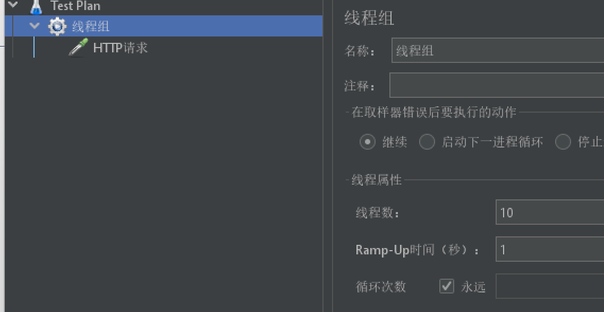

  - 结果

    永远一秒钟打进来10个线程（大于5个了）调用testD，我们希望200毫秒处理完本次任务，
    如果超过200毫秒还没处理完，在未来1秒钟的时间窗口内，断路器打开(保险丝跳闸)微服务不可用，拒绝所有请求。

    后续我停止jmeter，没有这么大的访问量了，断路器关闭(保险丝恢复)，微服务恢复OK


#### 05-2-2、异常比例


- 测试

  - 代码

    ```java
    /**
         * 测试降级策略：异常比例
         * @return
         */
    @GetMapping("/testE")
    public String testE()
    {
        log.info("testE 测试异常比例");
        int age = 10/0;
        return "------testE";
    }
    ```

  - 配置（异常比例超过20％时，往后的3s内开启服务熔断降级）

    

  - jmter（1s发送20个线程）

    

  - 结果

    单独访问一次，必然来一次报错一次(int age  = 10/0)，调一次错一次；

    开启jmeter后，直接高并发发送请求，多次调用达到我们的配置条件了。断路器开启(保险丝跳闸)，微服务不可用了，不再报错error而是服务降级了。

    断路器开启(保险丝跳闸)，微服务不可用了，不再报错error而是服务降级了。

    

#### 05-2-3、异常数


<u>**时间窗口一定要大于等于60秒。**</u>

**<u>异常数是按照分钟统计的</u>**

- 测试

  - 代码

    ```java
    /**
         * 测试降级策略：异常数
         * @return
         */
    @GetMapping("/testF")
    public String testF()
    {
        log.info("testF 测试异常数");
        int age = 10/0;
        return "------testF 测试异常数";
    }
    ```

  - 配置

    

  - 结果

    http://localhost:8401/testE，第一次访问绝对报错，因为除数不能为零，

    我们看到error窗口，但是达到5次报错后，进入熔断后降级,等待60s

    

  - 时间窗口需要大于60s的原因

    当5次异常后，还没到异常周期的一分钟已经熔断了，如果时间窗口比如只有10s，熔断关闭后还是在当前异常计数分钟内，此时异常数>5所以会再次熔断，只有超过60s，才会开始新的异常计数周期

## 06、热点key限流

### 06-1、基本介绍

热点即经常访问的数据，很多时候我们希望统计或者限制某个热点数据中访问频次最高的TopN数据，并对其访问进行限流或者其它操作


官网：https://github.com/alibaba/Sentinel/wiki/%E7%83%AD%E7%82%B9%E5%8F%82%E6%95%B0%E9%99%90%E6%B5%81

### 06-2、服务降级的兜底方法

兜底方法分为系统默认和客户自定义两种

- 之前的case，限流出问题后，都是用sentinel系统默认的提示：Blocked by Sentinel (flow limiting)

- 我们能不能自定?类似hystrix，某个方法出问题了，就找对应的兜底降级方法？

  结论：从HystrixCommand到`@SentinelResource`

### 06-3、代码

```java
@GetMapping("/testHotKey")
@SentinelResource(value = "testHotKey",blockHandler = "dealHandler_testHotKey")
public String testHotKey(@RequestParam(value = "p1",required = false) String p1,
                         @RequestParam(value = "p2",required = false) String p2){
    return "----------testHotKey";
}

public String dealHandler_testHotKey(String p1, String p2, BlockException exception){
    return "dealHandler_testHotKey /(ㄒoㄒ)/~~";
}
```

### 06-4、配置


限流模式只支持QPS模式，固定写死了。（这才叫热点）
@SentinelResource注解的方法参数索引，0代表第一个参数，1代表第二个参数，以此类推
单机阀值以及统计窗口时长表示**在此窗口时间超过阀值就限流**。
就是第一个参数有值的话，1秒的QPS为1，超过就限流，限流后调用dealHandler_testHotKey支持方法。

或者在热点限流中配置了限流，但没有配置限流后的兜底方法，会直接在报BlockException错误。

- 测试

  正常点击（没超出阈值）：

  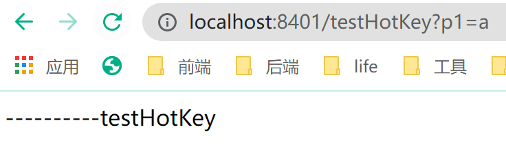

  快速点击（超出阈值1）：

  

- 对比

  - @SentinelResource(value = "testHotKey")

    异常打到了前台用户界面看到，不友好

  - @SentinelResource(value = "testHotKey",blockHandler = "dealHandler_testHotKey")

    方法testHotKey里面第一个参数只要QPS超过每秒1次，马上降级处理,用了我们自己定义的。

### 06-5、参数例外项


测试三个不同的接口：

- 接口中存在配置的p1参数，调用参数值相同时，超出阈值后会限流

  http://localhost:8401/testHotKey?p1=abc

  http://localhost:8401/testHotKey?p1=abc&p2=33

- 接口中不存在配置的p1参数，超出阈值不会限流：

  http://localhost:8401/testHotKey?p2=abc

> **<u>sentinel的热点限流配置的是参数的值，调用接口时，当参数相同且参数的值相同时，超出阈值才会被限流</u>**

上述案例演示了第一个参数p1，当QPS超过1秒1次点击后马上被限流

特例情况：

- 普通：超过1秒钟一个后，达到阈值1后马上被限流

  我们期望p1参数当它是某个特殊值时，它的限流值和平时不一样

- 特例：假如当p1的值等于5时，它的阈值可以达到200

#### 06-5-1、配置


#### 06-5-2、测试

当访问接口：http://localhost:8401/testHotKey?p1=5时，阈值变为200，测试中单点刷新时不会限流


当访问接口(参数值p1!=5)时：http://localhost:8401/testHotKey?p1=a，阈值一直为1，超出QPS=1时限流


> 前提条件：热点参数的注意点，参数必须是基本类型或者String(int，double，java.lang.String，long，float，char，byte)

#### 06-5-3、其它

添加代码中运行时报错

```java
@GetMapping("/testHotKey")
@SentinelResource(value = "testHotKey",blockHandler = "dealHandler_testHotKey")
public String testHotKey(@RequestParam(value = "p1",required = false) String p1,
                         @RequestParam(value = "p2",required = false) String p2){
    int age = 10/0;
    return "----------testHotKey";
}
```

此时去调用该接口时，会出现运行时报错，并不会执行兜底的方法：


- @SentinelResource

  处理的是Sentinel控制台配置的违规情况，有blockHandler方法配置的兜底处理；

- RuntimeException

  int age = 10/0,这个是java运行时报出的运行时异常RunTimeException，@SentinelResource不管

> 总结：@SentinelResource主管配置出错，运行出错该走异常走异常

## 07、系统规则


官网：https://github.com/alibaba/Sentinel/wiki/%E7%B3%BB%E7%BB%9F%E8%87%AA%E9%80%82%E5%BA%94%E9%99%90%E6%B5%81

### 07-1、基本介绍

系统保护规则是从应用级别的入口流量进行控制，从单台机器的 load、CPU 使用率、平均 RT、入口 QPS 和并发线程数等几个维度监控应用指标，让系统尽可能跑在最大吞吐量的同时保证系统整体的稳定性。

系统保护规则是**应用整体维度的**，而不是资源维度的，并且**仅对入口流量生效**。入口流量指的是进入应用的流量（`EntryType.IN`），比如 Web 服务或 Dubbo 服务端接收的请求，都属于入口流量。

系统规则支持以下的模式：

- **Load 自适应**（仅对 Linux/Unix-like 机器生效）：系统的 load1 作为启发指标，进行自适应系统保护。当系统 load1 超过设定的启发值，且系统当前的并发线程数超过估算的系统容量时才会触发系统保护（BBR 阶段）。系统容量由系统的 `maxQps * minRt` 估算得出。设定参考值一般是 `CPU cores * 2.5`。
- **CPU usage**（1.5.0+ 版本）：当系统 CPU 使用率超过阈值即触发系统保护（取值范围 0.0-1.0），比较灵敏。
- **平均 RT**：当单台机器上所有入口流量的平均 RT 达到阈值即触发系统保护，单位是毫秒。
- **并发线程数**：当单台机器上所有入口流量的并发线程数达到阈值即触发系统保护。
- **入口 QPS**：当单台机器上所有入口流量的 QPS 达到阈值即触发系统保护。

演示入口QPS限流

1. 设置入口QPS为1

   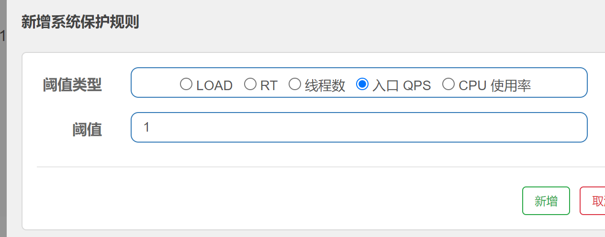

2. 调用没有配置限流规则的testA和testB接口

   

   

   QPS大于1时，对接口进行限流

> 系统保护规则是**应用整体维度的**，总控

## 08、@SentinelResourece

### 08-1、根据资源名称限流以及后续处理

1. 启动Nacos8848
2. 启动Sentinel8080

#### 08-1-1、修改sentinel8401模块

1. pom配置

   引入一个依赖

   ```xml
   <!-- 引入自己定义的api通用包，可以使用Payment支付Entity -->
   <dependency>
       <groupId>com.atguigu.springcloud</groupId>
       <artifactId>cloud-api-commons</artifactId>
       <version>${project.version}</version>
   </dependency>
   ```

2. 新增业务类RateLimitController

   ```java
   @RestController
   public class RateLimitController {
   
       @GetMapping("/byResource")
       @SentinelResource(value = "byResource",blockHandler = "handleException")
       public CommonResult byResource()
       {
           return new CommonResult(200,"按资源名称限流测试OK",new Payment(2020L,"serial001"));
       }
   
       public CommonResult handleException(BlockException exception)
       {
           return new CommonResult(444,exception.getClass().getCanonicalName()+"\t 服务不可用");
       }
   }
   ```

#### 08-1-2、配置流控规则

> 资源名称无/


表示1秒钟内若查询次数大于1，就调用我们自定义的服务限流；


#### 08-1-3、测试

- 1秒钟点击1下，服务正常

  

- 疯狂点击，QPS超出阈值，返回了自己定义的限流处理信息，限流发生

  

#### 08-1-4、其他问题

关闭问服务8401，发现Sentinel控制台，流控规则消失了


### 08-2、根据URL地址限流以及后续处理

> 通过访问的URL来限流，会返回Sentinel自带默认的限流处理信息

#### 08-2-1、修改业务类RateLimitController

```java
@RestController
public class RateLimitController {

    @GetMapping("/byResource")
    @SentinelResource(value = "byResource",blockHandler = "handleException")
    public CommonResult byResource()
    {
        return new CommonResult(200,"按资源名称限流测试OK",new Payment(2020L,"serial001"));
    }

    public CommonResult handleException(BlockException exception)
    {
        return new CommonResult(444,exception.getClass().getCanonicalName()+"\t 服务不可用");
    }
    @GetMapping("/rateLimit/byUrl")
    @SentinelResource(value = "byUrl")
    public CommonResult byUrl()
    {
        return new CommonResult(200,"按url限流测试OK",new Payment(2020L,"serial002"));
    }
}
```

#### 08-2-2、配置流控规则


表示1秒钟内若查询次数大于1，会返回Sentinel自带默认的限流处理信息

> 由于@SentinelResource没有配置blockHandler，限流时会返回Sentinel自带默认的限流处理信息

#### 08-2-3、测试

疯狂点击http://localhost:8401/rateLimit/byUrl

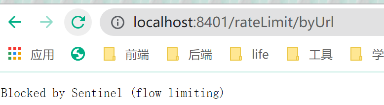


### 08-3、上面兜底方案面临的问题

1. 系统默认的限流处理信息，没有体现我们自己的业务要求。
2. 依照现有条件，我们自定义的处理方法又和业务代码耦合在一块，不直观。

3. 每个业务方法都添加一个兜底的，那代码膨胀加剧。

4. 全局统一的处理方法没有体现。

### 08-4、客户自定义限流处理逻辑

创建CustomerBlockHandler类用于自定义限流处理逻辑

#### 08-4-1、自定义限流处理类CustomerBlockHandler

`myhandler.CustomerBlockHandler`

```java
public class CustomerBlockHandler
{
    public static CommonResult handleException(BlockException exception){
        return new CommonResult(4444,"自定义的限流处理信息......CustomerBlockHandler----1");
    }
    public static CommonResult handleException2(BlockException exception){
        return new CommonResult(4444,"自定义的限流处理信息......CustomerBlockHandler----2");
    }
}
```

#### 08-4-2、修改RateLimitController

```java
/**
  * 自定义通用的限流处理逻辑
  * blockHandlerClass = CustomerBlockHandler.class
  * blockHandler = handleException2
  * 上述配置：找CustomerBlockHandler类里的handleException2方法进行兜底处理
  */
@GetMapping("/rateLimit/customerBlockHandler")
@SentinelResource(value = "customerBlockHandler",
                  blockHandlerClass = CustomerBlockHandler.class, blockHandler = "handleException2")
public CommonResult customerBlockHandler()
{
    return new CommonResult(200,"按客户自定义限流处理逻辑",new Payment(2020L,"serial003"));
}
```

#### 08-4-3、Sentinel控制台限流配置


#### 08-4-4、测试

疯狂点击调用接口：http://localhost:8401/rateLimit/customerBlockHandler


成功返回我们指定的服务限流信息


### 08-5、更多注解的属性说明

> 注解方式埋点不支持private私有方法

例如接口，都是public

```java
public CommonResult customerBlockHandler()
```

`@SentinelResource` 用于定义资源，并提供可选的异常处理和 fallback 配置项。 `@SentinelResource` 注解包含以下属性：

- `value`：资源名称，必需项（不能为空）
- `entryType`：entry 类型，可选项（默认为 `EntryType.OUT`）
- `blockHandler` / `blockHandlerClass`: `blockHandler` 对应处理 `BlockException` 的函数名称，可选项。blockHandler 函数访问范围需要是 `public`，返回类型需要与原方法相匹配，参数类型需要和原方法相匹配并且最后加一个额外的参数，类型为 `BlockException`。blockHandler 函数默认需要和原方法在同一个类中。若希望使用其他类的函数，则可以指定 `blockHandlerClass` 为对应的类的 `Class` 对象，注意对应的函数必需为 static 函数，否则无法解析。
- fallback/fallbackClass：fallback 函数名称，可选项，用于在抛出异常的时候提供 fallback 处理逻辑。fallback 函数可以针对所有类型的异常（除了`exceptionsToIgnore`里面排除掉的异常类型）进行处理。fallback 函数签名和位置要求：
  - 返回值类型必须与原函数返回值类型一致；
  - 方法参数列表需要和原函数一致，或者可以额外多一个 `Throwable` 类型的参数用于接收对应的异常。
  - fallback 函数默认需要和原方法在同一个类中。若希望使用其他类的函数，则可以指定 `fallbackClass` 为对应的类的 `Class` 对象，注意对应的函数必需为 static 函数，否则无法解析。
- `defaultFallback`（since 1.6.0）：默认的 fallback 函数名称，可选项，通常用于通用的 fallback 逻辑（即可以用于很多服务或方法）。默认 fallback 函数可以针对所有类型的异常（除了`exceptionsToIgnore`里面排除掉的异常类型）进行处理。若同时配置了 fallback 和 defaultFallback，则只有 fallback 会生效。defaultFallback 函数签名要求：
  - 返回值类型必须与原函数返回值类型一致；
  - 方法参数列表需要为空，或者可以额外多一个 `Throwable` 类型的参数用于接收对应的异常。
  - defaultFallback 函数默认需要和原方法在同一个类中。若希望使用其他类的函数，则可以指定 `fallbackClass` 为对应的类的 `Class` 对象，注意对应的函数必需为 static 函数，否则无法解析。
- `exceptionsToIgnore`（since 1.6.0）：用于指定哪些异常被排除掉，不会计入异常统计中，也不会进入 fallback 逻辑中，而是会原样抛出。

1.8.0 版本开始，`defaultFallback` 支持在类级别进行配置。

> 注：1.6.0 之前的版本 fallback 函数只针对降级异常（`DegradeException`）进行处理，**不能针对业务异常进行处理**。

特别地，若 blockHandler 和 fallback 都进行了配置，则被限流降级而抛出 `BlockException` 时只会进入 `blockHandler` 处理逻辑。若未配置 `blockHandler`、`fallback` 和 `defaultFallback`，则被限流降级时会将 `BlockException` **直接抛出**（若方法本身未定义 throws BlockException 则会被 JVM 包装一层 `UndeclaredThrowableException`）。

- Sentinel主要有三个核心Api
  - SphU定义资源
  - Tracer定义统计
  - ContextUtil定义了上下文

## 09、服务熔断功能

> sentinel整合ribbon+openFeign+fallback

### 09-1、Ribbon系列

> 前提：启动nacos和sentinel

#### 09-1-1、新建模块cloudalibaba-provider-payment9003/9004

1. pom配置

   ```xml
   <?xml version="1.0" encoding="UTF-8"?>
   <project xmlns="http://maven.apache.org/POM/4.0.0" xmlns:xsi="http://www.w3.org/2001/XMLSchema-instance"
   	xsi:schemaLocation="http://maven.apache.org/POM/4.0.0 https://maven.apache.org/xsd/maven-4.0.0.xsd">
   	<modelVersion>4.0.0</modelVersion>
   	<parent>
   		<artifactId>cloud2020</artifactId>
   		<groupId>com.atguigu.springcloud</groupId>
   		<version>1.0-SNAPSHOT</version>
   	</parent>
   	<artifactId>cloudalibaba-provider-payment9003</artifactId>
   
   	<dependencies>
   		<!--SpringCloud ailibaba nacos -->
   		<dependency>
   			<groupId>com.alibaba.cloud</groupId>
   			<artifactId>spring-cloud-starter-alibaba-nacos-discovery</artifactId>
   		</dependency>
   		<dependency><!-- 引入自己定义的api通用包，可以使用Payment支付Entity -->
   			<groupId>com.atguigu.springcloud</groupId>
   			<artifactId>cloud-api-commons</artifactId>
   			<version>${project.version}</version>
   		</dependency>
   		<!-- SpringBoot整合Web组件 -->
   		<dependency>
   			<groupId>org.springframework.boot</groupId>
   			<artifactId>spring-boot-starter-web</artifactId>
   		</dependency>
   		<dependency>
   			<groupId>org.springframework.boot</groupId>
   			<artifactId>spring-boot-starter-actuator</artifactId>
   		</dependency>
   		<!--日常通用jar包配置-->
   		<dependency>
   			<groupId>org.springframework.boot</groupId>
   			<artifactId>spring-boot-devtools</artifactId>
   			<scope>runtime</scope>
   			<optional>true</optional>
   		</dependency>
   		<dependency>
   			<groupId>org.projectlombok</groupId>
   			<artifactId>lombok</artifactId>
   			<optional>true</optional>
   		</dependency>
   		<dependency>
   			<groupId>org.springframework.boot</groupId>
   			<artifactId>spring-boot-starter-test</artifactId>
   			<scope>test</scope>
   		</dependency>
   	</dependencies>
   
   </project>
   ```

2. yml配置

   ```yaml
   server:
     port: 9003
   
   spring:
     application:
       name: nacos-payment-provider
     cloud:
       nacos:
         discovery:
           server-addr: localhost:8848 #配置Nacos地址
   
   management:
     endpoints:
       web:
         exposure:
           include: '*'
   ```

3. 主启动类

   添加`@EnableDiscoveryClient`注解

4. 业务类Controller

   ```java
   @RestController
   public class PaymentController {
   
       @Value("${server.port}")
       private String serverPort;
   
       public static HashMap<Long, Payment> hashMap = new HashMap<>();
       static {
           hashMap.put(1L,new Payment(1L,"28a8c1e3bc2742d8848569891fb42181"));
           hashMap.put(2L,new Payment(2L,"bba8c1e3bc2742d8848569891ac32182"));
           hashMap.put(3L,new Payment(3L,"6ua8c1e3bc2742d8848569891xt92183"));
       }
   
       @GetMapping(value = "/paymentSQL/{id}")
       public CommonResult<Payment> paymentSQL(@PathVariable("id") Long id){
           Payment payment = hashMap.get(id);
           CommonResult<Payment> result = new CommonResult<>(200,"from mysql,serverPort:"+serverPort,payment);
           return result;
       }
   }
   ```

5. 测试

   调用接口：http://localhost:9003/paymentSQL/1


> 再仿上面新建模块cloudalibaba-provider-payment9004

测试无问题

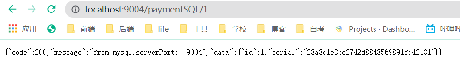

#### 09-1-2、新建模块cloudalibaba-consumer-nacos-order84

1. pom配置

   ```xml
   <?xml version="1.0" encoding="UTF-8"?>
   <project xmlns="http://maven.apache.org/POM/4.0.0" xmlns:xsi="http://www.w3.org/2001/XMLSchema-instance"
   	xsi:schemaLocation="http://maven.apache.org/POM/4.0.0 https://maven.apache.org/xsd/maven-4.0.0.xsd">
   	<modelVersion>4.0.0</modelVersion>
   	<parent>
   		<artifactId>cloud2020</artifactId>
   		<groupId>com.atguigu.springcloud</groupId>
   		<version>1.0-SNAPSHOT</version>
   	</parent>
   	<artifactId>cloudalibaba-consumer-nacos-order84</artifactId>
   
   	<dependencies>
   		<!--SpringCloud ailibaba nacos -->
   		<dependency>
   			<groupId>com.alibaba.cloud</groupId>
   			<artifactId>spring-cloud-starter-alibaba-nacos-discovery</artifactId>
   		</dependency>
   		<!--SpringCloud ailibaba sentinel -->
   		<dependency>
   			<groupId>com.alibaba.cloud</groupId>
   			<artifactId>spring-cloud-starter-alibaba-sentinel</artifactId>
   		</dependency>
   		<!-- 引入自己定义的api通用包，可以使用Payment支付Entity -->
   		<dependency>
   			<groupId>com.atguigu.springcloud</groupId>
   			<artifactId>cloud-api-commons</artifactId>
   			<version>${project.version}</version>
   		</dependency>
   		<!-- SpringBoot整合Web组件 -->
   		<dependency>
   			<groupId>org.springframework.boot</groupId>
   			<artifactId>spring-boot-starter-web</artifactId>
   		</dependency>
   		<dependency>
   			<groupId>org.springframework.boot</groupId>
   			<artifactId>spring-boot-starter-actuator</artifactId>
   		</dependency>
   		<!--日常通用jar包配置-->
   		<dependency>
   			<groupId>org.springframework.boot</groupId>
   			<artifactId>spring-boot-devtools</artifactId>
   			<scope>runtime</scope>
   			<optional>true</optional>
   		</dependency>
   		<dependency>
   			<groupId>org.projectlombok</groupId>
   			<artifactId>lombok</artifactId>
   			<optional>true</optional>
   		</dependency>
   		<dependency>
   			<groupId>org.springframework.boot</groupId>
   			<artifactId>spring-boot-starter-test</artifactId>
   			<scope>test</scope>
   		</dependency>
   	</dependencies>
   </project>
   ```

2. yml配置

   ```yaml
   server:
     port: 84
   spring:
     application:
       name: nacos-order-consumer
     cloud:
       nacos:
         discovery:
           server-addr: localhost:8848
       sentinel:
         transport:
           #配置Sentinel dashboard地址
           dashboard: localhost:8080
           #默认8719端口，假如被占用会自动从8719开始依次+1扫描,直至找到未被占用的端口
           port: 8719
   
   #消费者将要去访问的微服务名称(注册成功进nacos的微服务提供者)
   service-url:
     nacos-user-service: http://nacos-payment-provider
   ```

3. 主启动

   添加`@EnableDiscoveryClient`注解

4. 业务类

   `config.ApplicationContextConfig`

   ```java
   @Configuration
   public class ApplicationContextConfig {
       @Bean
       @LoadBalanced
       public RestTemplate getRestTemplate()
       {
           return new RestTemplate();
       }
   }
   ```

   `controller.CircleBreakerController `

   ```java
   @RestController
   @Slf4j
   public class CircleBreakerController {
       public static final String SERVICE_URL = "http://nacos-payment-provider";
   
       @Resource
       private RestTemplate restTemplate;
   
       @RequestMapping("/consumer/fallback/{id}")
       @SentinelResource(value = "fallback")
       public CommonResult<Payment> fallback(@PathVariable("id") Long id){
           CommonResult<Payment> result = restTemplate.getForObject(SERVICE_URL + "/paymentSQL/" + id, CommonResult.class, id);
           if (id == 4) {
               throw new IllegalArgumentException ("IllegalArgumentException,非法参数异常....");
           }else if (result.getData() == null) {
               throw new NullPointerException ("NullPointerException,该ID没有对应记录,空指针异常");
           }
           return result;
       }
   }
   ```

   这时运行出错会给客户显示error界面，不友好

   > fallback管运行异常
   >
   > blockHandler管sentinel配置违规

   - 只配置fallback

     ```java
     @RestController
     @Slf4j
     public class CircleBreakerController {
         public static final String SERVICE_URL = "http://nacos-payment-provider";
     
         @Resource
         private RestTemplate restTemplate;
     
         @RequestMapping("/consumer/fallback/{id}")
         @SentinelResource(value = "fallback",fallback = "handlerFallback")
         public CommonResult<Payment> fallback(@PathVariable Long id){
             CommonResult<Payment> result = restTemplate.getForObject(SERVICE_URL + "/paymentSQL/" + id, CommonResult.class, id);
             if (id == 4) {
                 throw new IllegalArgumentException ("IllegalArgumentException,非法参数异常....");
             }else if (result.getData() == null) {
                 throw new NullPointerException ("NullPointerException,该ID没有对应记录,空指针异常");
             }
             return result;
         }
         public CommonResult handlerFallback(@PathVariable Long id,Throwable e){
             Payment payment = new Payment(id, "null");
             return new CommonResult<>(444,"服务降级handlerFallback,exception内容"+e.getMessage(),payment);
         }
     }
     ```

   - 测试

     

     

     

     > 此处无配置Sentinel

   - 只配置blockHandler

     ```java
     @RestController
     @Slf4j
     public class CircleBreakerController {
         public static final String SERVICE_URL = "http://nacos-payment-provider";
     
         @Resource
         private RestTemplate restTemplate;
     
         @RequestMapping("/consumer/fallback/{id}")
         @SentinelResource(value = "fallback",blockHandler = "blockHandler")
         public CommonResult<Payment> fallback(@PathVariable Long id){
             CommonResult<Payment> result = restTemplate.getForObject(SERVICE_URL + "/paymentSQL/" + id, CommonResult.class, id);
             if (id == 4) {
                 throw new IllegalArgumentException ("IllegalArgumentException,非法参数异常....");
             }else if (result.getData() == null) {
                 throw new NullPointerException ("NullPointerException,该ID没有对应记录,空指针异常");
             }
             return result;
         }
     
         public CommonResult blockHandler(@PathVariable  Long id, BlockException blockException) {
             Payment payment = new Payment(id,"null");
             return new CommonResult<>(445,"blockHandler-sentinel限流,无此流水: blockException  "+blockException.getMessage(),payment);
         }
     
     }
     
     ```

     需要配置sentinel

     

     1分钟内，若异常超过2次后，断路器打开，断电跳闸，系统被保护

     测试

     前两次：

     第三次：

   - fallback和blockHandler都配置

     ```java
     @RestController
     @Slf4j
     public class CircleBreakerController {
         public static final String SERVICE_URL = "http://nacos-payment-provider";
     
         @Resource
         private RestTemplate restTemplate;
     
         @RequestMapping("/consumer/fallback/{id}")
         @SentinelResource(value = "fallback",fallback = "handlerFallback",blockHandler = "blockHandler")
         public CommonResult<Payment> fallback(@PathVariable Long id){
             CommonResult<Payment> result = restTemplate.getForObject(SERVICE_URL + "/paymentSQL/" + id, CommonResult.class, id);
             if (id == 4) {
                 throw new IllegalArgumentException ("IllegalArgumentException,非法参数异常....");
             }else if (result.getData() == null) {
                 throw new NullPointerException ("NullPointerException,该ID没有对应记录,空指针异常");
             }
             return result;
         }
         public CommonResult handlerFallback(@PathVariable Long id,Throwable e){
             Payment payment = new Payment(id, "null");
             return new CommonResult<>(444,"服务降级handlerFallback,exception内容"+e.getMessage(),payment);
         }
     
         public CommonResult blockHandler(@PathVariable  Long id, BlockException blockException) {
             Payment payment = new Payment(id,"null");
             return new CommonResult<>(445,"blockHandler-sentinel限流,无此流水: blockException  "+blockException.getMessage(),payment);
         }
     
     }
     ```

     配置sentinel流控规则

     

     测试

     

     因限流而降级抛出的BlockException只会进入blockHandler处理逻辑

     

     因运行时错误而降级抛出的RuntimeException只会进入handlerFallback处理逻辑

     > fallback只负责业务异常;blockHandler只负责sentinel控制台配置违规

   - @SentinelResource的exceptionsToIgnore属性

     > 若报配置的异常，不再有fallback方法进行降级，直接报错

     

     ```java
     @SentinelResource(value = "fallback",fallback = "handlerFallback", blockHandler = "blockHandler",exceptionsToIgnore = {IllegalArgumentException.class})
     ```

     测试

     

     

### 09-2、Feign系列

> 修改84消费者调用提供者9003;Feign组件一般是消费侧

#### 09-2-1、pom配置

其实就多添加一个openfeign依赖

```xml
<?xml version="1.0" encoding="UTF-8"?>
<project xmlns="http://maven.apache.org/POM/4.0.0" xmlns:xsi="http://www.w3.org/2001/XMLSchema-instance"
	xsi:schemaLocation="http://maven.apache.org/POM/4.0.0 https://maven.apache.org/xsd/maven-4.0.0.xsd">
	<modelVersion>4.0.0</modelVersion>
	<parent>
		<artifactId>cloud2020</artifactId>
		<groupId>com.atguigu.springcloud</groupId>
		<version>1.0-SNAPSHOT</version>
	</parent>
	<artifactId>cloudalibaba-consumer-nacos-order84</artifactId>

	<dependencies>
		<!--SpringCloud ailibaba nacos -->
		<dependency>
			<groupId>com.alibaba.cloud</groupId>
			<artifactId>spring-cloud-starter-alibaba-nacos-discovery</artifactId>
		</dependency>
		<!--SpringCloud openfeign -->
		<dependency>
			<groupId>org.springframework.cloud</groupId>
			<artifactId>spring-cloud-starter-openfeign</artifactId>
		</dependency>
		<!--SpringCloud ailibaba sentinel -->
		<dependency>
			<groupId>com.alibaba.cloud</groupId>
			<artifactId>spring-cloud-starter-alibaba-sentinel</artifactId>
		</dependency>
		<!-- 引入自己定义的api通用包，可以使用Payment支付Entity -->
		<dependency>
			<groupId>com.atguigu.springcloud</groupId>
			<artifactId>cloud-api-commons</artifactId>
			<version>${project.version}</version>
		</dependency>
		<!-- SpringBoot整合Web组件 -->
		<dependency>
			<groupId>org.springframework.boot</groupId>
			<artifactId>spring-boot-starter-web</artifactId>
		</dependency>
		<dependency>
			<groupId>org.springframework.boot</groupId>
			<artifactId>spring-boot-starter-actuator</artifactId>
		</dependency>
		<!--日常通用jar包配置-->
		<dependency>
			<groupId>org.springframework.boot</groupId>
			<artifactId>spring-boot-devtools</artifactId>
			<scope>runtime</scope>
			<optional>true</optional>
		</dependency>
		<dependency>
			<groupId>org.projectlombok</groupId>
			<artifactId>lombok</artifactId>
			<optional>true</optional>
		</dependency>
		<dependency>
			<groupId>org.springframework.boot</groupId>
			<artifactId>spring-boot-starter-test</artifactId>
			<scope>test</scope>
		</dependency>
	</dependencies>
</project>
```

#### 09-2-2、yml配置

多添加一个 激活Sentinel对Feign的支持

```yaml
server:
  port: 84
spring:
  application:
    name: nacos-order-consumer
  cloud:
    nacos:
      discovery:
        server-addr: localhost:8848
    sentinel:
      transport:
        #配置Sentinel dashboard地址
        dashboard: localhost:8080
        #默认8719端口，假如被占用会自动从8719开始依次+1扫描,直至找到未被占用的端口
        port: 8719

#消费者将要去访问的微服务名称(注册成功进nacos的微服务提供者)
service-url:
  nacos-user-service: http://nacos-payment-provider

# 激活Sentinel对Feign的支持
feign:
  sentinel:
    enabled: true
```

#### 09-2-3、主启动

添加`@EnableFeignClients`启动Feign的功能

#### 09-2-4、业务类

`service.PaymentService`

```java
@FeignClient(value = "nacos-payment-provider",fallback = PaymentFallbackService.class)
public interface PaymentService {
    @GetMapping(value = "/paymentSQL/{id}")
    public CommonResult<Payment> paymentSQL(@PathVariable("id") Long id);
}
```

`service.PaymentFallbackService`

```java
@Component
public class PaymentFallbackService implements PaymentService {

    @Override
    public CommonResult<Payment> paymentSQL(Long id)
    {
        return new CommonResult<>(444,"服务降级返回,没有该流水信息",new Payment(id, "errorSerial......"));
    }
}
```

`controller.CircleBreakerController`

```java
//==================OpenFeign
@Resource
private PaymentService paymentService;

@GetMapping(value = "/consumer/openfeign/{id}")
public CommonResult<Payment> paymentSQL(@PathVariable("id") Long id)
{
    if(id == 4)
    {
        throw new RuntimeException("没有该id");
    }
    return paymentService.paymentSQL(id);
}
```

#### 09-2-5、测试

调用接口：http://localhost:84/consumer/paymentSQL/1


### 09-3、熔断框架比较


## 10、Sentinel规则持久化


一旦我们重启应用，sentinel规则将消失，生产环境需要将配置规则进行持久化

### 10-1、实现

将限流配置规则持久化进Nacos保存，只要刷新8401某个rest地址，sentinel控制台的流控规则就能看到，只要Nacos里面的配置不删除，针对8401上sentinel上的流控规则持续有效

1. 修改pom配置-添加依赖

   ```xml
   <!--SpringCloud ailibaba sentinel-datasource-nacos 后续做持久化用到-->
   <dependency>
       <groupId>com.alibaba.csp</groupId>
       <artifactId>sentinel-datasource-nacos</artifactId>
   </dependency>
   ```

2. yaml配置-添加Nacos数据源配置

   ```yaml
   server:
     port: 8401
   
   spring:
     application:
       name: cloudalibaba-sentinel-service
     cloud:
       nacos:
         discovery:
           #Nacos服务注册中心地址
           server-addr: localhost:8848
       sentinel:
         transport:
           #配置Sentinel dashboard地址
           dashboard: localhost:8080
           #默认8719端口，假如被占用会自动从8719开始依次+1扫描,直至找到未被占用的端口
           port: 8719
         datasource:
           ds1:
             nacos:
               server-addr: localhost:8848
               dataId: cloudalibaba-sentinel-service
               groupId: DEFAULT_GROUP
               data-type: json
               rule-type: flow
   
   management:
     endpoints:
       web:
         exposure:
           include: '*'
   ```

   ```yaml
   spring:
     cloud:
       sentinel:
         datasource:
           ds1:
             nacos:
               server-addr: localhost:8848
               dataId: ${spring.application.name}
               groupId: DEFAULT_GROUP
               data-type: json
               rule-type: flow
   ```

3. 添加Nacos业务规则配置

   

   内容解析

   ```json
   [
       {
           "resource": "/rateLimit/byUrl",	//资源名称
           "limitApp": "default",			//来源应用
           "grade": 1,						//阈值类型，0表示线程数，1表示QPS；
           "count": 1,						//单机阈值；
           "strategy": 0,					//流控模式，0表示直接，1表示关联，2表示链路；
           "controlBehavior": 0,			//流控效果，0表示快速失败，1表示Warm Up，2表示排队等待；
           "clusterMode": false			//是否集群。
       }
   ]
   ```

4. 测试

   1. 重启8401服务器

   2. 此时已经为接口`/rateLimit/byUrl`配置限流规则

   3. 调用接口

      

   4. nacos配置的流控规则出现

      

   > sentinel控制台的规则必须在调用一次接口后才会显示出来，但实际上已经配置了

# 二十、SpringCloud Alibaba Seata处理分布式事务

## 01、分布式事务问题

### 01-1、分布式前

单机单库没这个问题

从1：1  ->  1：N  ->  N：N

### 01-2、分布式之后

单体应用被拆分成微服务应用，原来的三个模块被拆分成三个独立的应用，分别使用三个独立的数据源，
业务操作需要调用三个服务来完成。此时每个服务内部的数据一致性由本地事务来保证，但是全局的数据一致性问题没法保证。


(要么三个微服务同时成功，一个失败全都失败)

> 一次业务操作需要跨多个数据源或需要跨多个系统进行远程调用，就会产生分布式事务问题

## 02、Seata简介

> Seata是一款开源的分布式事务解决方案，致力于在微服务架构下提供高性能和简单易用的分布式事务服务。

官网：http://seata.io/zh-cn/

### 02-1、理论

- 一个典型的分布式事务过程

  - 分布式事务处理过程的一ID+三组件模型
    - Transaction ID XID：全局唯一的事务ID
    - 3组件概念
      - Transaction Coordinator (TC)：事务协调器，维护全局事务的运行状态，负责协调并驱动全局事务的提交或回滚；
      - Transaction Manager (TM)：控制全局事务的边界，负责开启一个全局事务，并最终发起全局提交或全局回滚的决议；
      - Resource Manager (RM)：控制分支事务，负责分支注册、状态汇报，并接收事务协调器的指令，驱动分支（本地）事务的提交和回滚

- 处理过程

  1. TM 向 TC 申请开启一个全局事务，全局事务创建成功并生成一个全局唯一的 XID；
  2. XID 在微服务调用链路的上下文中传播；
  3. RM 向 TC 注册分支事务，将其纳入 XID 对应全局事务的管辖；
  4. TM 向 TC 发起针对 XID 的全局提交或回滚决议；
  5. TC 调度 XID 下管辖的全部分支事务完成提交或回滚请求。

  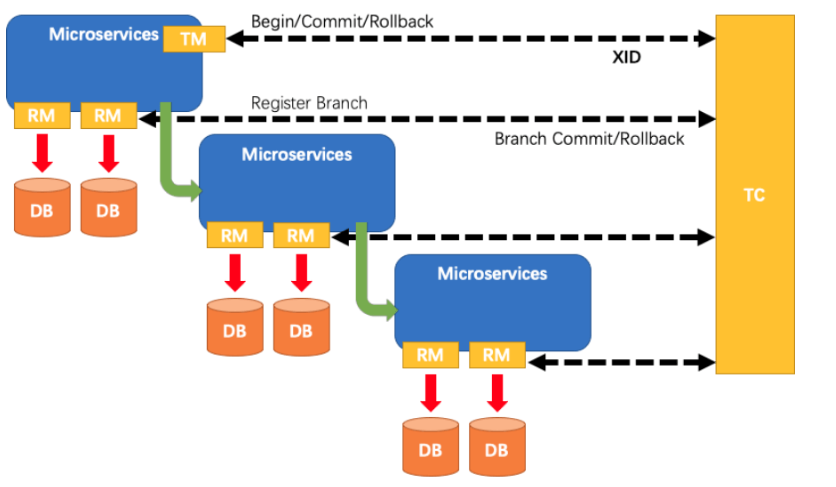

### 02-2、使用

本地`@Transactional`

全局`@GlobalTransactional`

实例：Seata的分布式交易解决方案


## 03、Seata-Server安装

1. 进入https://github.com/seata/seata/releases

2. 下载`seata-server-1.2.0.zip`

3. seata-server-1.2.0.zip解压到指定目录并修改conf目录下的file.conf配置文件

   1. 先备份一份`file.conf`命名为`file出厂默认的.conf`

   2. 主要修改：自定义事务组名称+事务日志存储模式为db+数据库连接信息

   3. 打开file.conf,修改service模块（seata1.2版本没有vgroup_mapping.my_test_tx_group = "fsp_tx_group"了 无需配置)

      ```conf
      service {
       
        vgroup_mapping.my_test_tx_group = "fsp_tx_group"
       
        default.grouplist = "127.0.0.1:8091"
        enableDegrade = false
        disable = false
        max.commit.retry.timeout = "-1"
        max.rollback.retry.timeout = "-1"
      }
      ```

      

      **可自行修改为xxx_tx_group**

   4. 修改store模块

      

   5. 在mysql数据库新建seata数据库

   6. 在seata数据库建表(seata1.0开始没有自带sql文件了)

      ```sql
       -- the table to store GlobalSession data
      drop table if exists `global_table`;
      create table `global_table` (
        `xid` varchar(128)  not null,
        `transaction_id` bigint,
        `status` tinyint not null,
        `application_id` varchar(32),
        `transaction_service_group` varchar(32),
        `transaction_name` varchar(128),
        `timeout` int,
        `begin_time` bigint,
        `application_data` varchar(2000),
        `gmt_create` datetime,
        `gmt_modified` datetime,
        primary key (`xid`),
        key `idx_gmt_modified_status` (`gmt_modified`, `status`),
        key `idx_transaction_id` (`transaction_id`)
      );
       
      -- the table to store BranchSession data
      drop table if exists `branch_table`;
      create table `branch_table` (
        `branch_id` bigint not null,
        `xid` varchar(128) not null,
        `transaction_id` bigint ,
        `resource_group_id` varchar(32),
        `resource_id` varchar(256) ,
        `lock_key` varchar(128) ,
        `branch_type` varchar(8) ,
        `status` tinyint,
        `client_id` varchar(64),
        `application_data` varchar(2000),
        `gmt_create` datetime,
        `gmt_modified` datetime,
        primary key (`branch_id`),
        key `idx_xid` (`xid`)
      );
       
      -- the table to store lock data
      drop table if exists `lock_table`;
      create table `lock_table` (
        `row_key` varchar(128) not null,
        `xid` varchar(96),
        `transaction_id` long ,
        `branch_id` long,
        `resource_id` varchar(256) ,
        `table_name` varchar(32) ,
        `pk` varchar(36) ,
        `gmt_create` datetime ,
        `gmt_modified` datetime,
        primary key(`row_key`)
      );
       
      ```

      

   7. 修改seata-server-1.2.0\seata\conf目录下的registry.conf配置文件

      ```conf
      registry {
        # file 、nacos 、eureka、redis、zk、consul、etcd3、sofa
        type = "nacos"
       
        nacos {
          serverAddr = "localhost:8848"
          namespace = ""
          cluster = "default"
        }
      ```

      目的是：指明注册中心为nacos，及修改nacos连接信息

   8. 先启动Nacos端口号8848

   9. 再双击启动seata-server：softs\seata-server-1.2.0\seata\bin\seata-server.bat


##  04、订单/库存/账户业务数据库准备

> 前提启动Nacos和Seata服务

### 04-1、分布式事务业务说明

这里我们会创建三个服务，一个订单服务，一个库存服务，一个账户服务。

当用户下单时，会在**订单服务中创建一个订单**，然后**通过远程调用库存服务来扣减下单商品的库存**，
再**通过远程调用账户服务来扣减用户账户里面的余额**，
最后在订单服务中修改订单状态为已完成。

该操作跨越三个数据库，有两次远程调用，很明显会有分布式事务问题。

下订单--->扣库存--->减账户(余额)

### 04-2、创建业务数据库

- seata_order：存储订单的数据库；
- seata_storage：存储库存的数据库；
- seata_account：存储账户信息的数据库。

### 04-3、创建对应业务表

- seata_order库下建t_order表

  ```sql
  CREATE TABLE t_order (
    `id` BIGINT(11) NOT NULL AUTO_INCREMENT PRIMARY KEY,
    `user_id` BIGINT(11) DEFAULT NULL COMMENT '用户id',
    `product_id` BIGINT(11) DEFAULT NULL COMMENT '产品id',
    `count` INT(11) DEFAULT NULL COMMENT '数量',
    `money` DECIMAL(11,0) DEFAULT NULL COMMENT '金额',
    `status` INT(1) DEFAULT NULL COMMENT '订单状态：0：创建中；1：已完结' 
  ) ENGINE=INNODB AUTO_INCREMENT=7 DEFAULT CHARSET=utf8;
   
  SELECT * FROM t_order;
  ```

- seata_storage库下建t_storage表

  ```sql
  CREATE TABLE t_storage (
   `id` BIGINT(11) NOT NULL AUTO_INCREMENT PRIMARY KEY,
   `product_id` BIGINT(11) DEFAULT NULL COMMENT '产品id',
   `total` INT(11) DEFAULT NULL COMMENT '总库存',
   `used` INT(11) DEFAULT NULL COMMENT '已用库存',
   `residue` INT(11) DEFAULT NULL COMMENT '剩余库存'
  ) ENGINE=INNODB AUTO_INCREMENT=2 DEFAULT CHARSET=utf8;
   
   
  INSERT INTO seata_storage.t_storage(`id`, `product_id`, `total`, `used`, `residue`)
  VALUES ('1', '1', '100', '0', '100');
   
  SELECT * FROM t_storage;
  ```

- seata_account库下建t_account表

  ```sql
  CREATE TABLE t_account (
    `id` BIGINT(11) NOT NULL AUTO_INCREMENT PRIMARY KEY COMMENT 'id',
    `user_id` BIGINT(11) DEFAULT NULL COMMENT '用户id',
    `total` DECIMAL(10,0) DEFAULT NULL COMMENT '总额度',
    `used` DECIMAL(10,0) DEFAULT NULL COMMENT '已用余额',
    `residue` DECIMAL(10,0) DEFAULT '0' COMMENT '剩余可用额度'
  ) ENGINE=INNODB AUTO_INCREMENT=2 DEFAULT CHARSET=utf8;
   
  INSERT INTO seata_account.t_account(`id`, `user_id`, `total`, `used`, `residue`)  VALUES ('1', '1', '1000', '0', '1000');
   
  SELECT * FROM t_account;
  ```

### 04-4、创建对应的回滚日志表

> 订单-库存-账户3个库下都需要建各自的回滚日志表

```sql
-- for AT mode you must to init this sql for you business database. the seata server not need it.
CREATE TABLE IF NOT EXISTS `undo_log`
(
    `branch_id`     BIGINT       NOT NULL COMMENT 'branch transaction id',
    `xid`           VARCHAR(128) NOT NULL COMMENT 'global transaction id',
    `context`       VARCHAR(128) NOT NULL COMMENT 'undo_log context,such as serialization',
    `rollback_info` LONGBLOB     NOT NULL COMMENT 'rollback info',
    `log_status`    INT(11)      NOT NULL COMMENT '0:normal status,1:defense status',
    `log_created`   DATETIME(6)  NOT NULL COMMENT 'create datetime',
    `log_modified`  DATETIME(6)  NOT NULL COMMENT 'modify datetime',
    UNIQUE KEY `ux_undo_log` (`xid`, `branch_id`)
) ENGINE = InnoDB
  AUTO_INCREMENT = 1
  DEFAULT CHARSET = utf8 COMMENT ='AT transaction mode undo table';
```

最终数据效果：


## 05、订单/库存/账户业务微服务准备

> 业务需求：下订单->减库存->扣余额->改(订单)状态
>

### 05-1、新建订单模块seata-order-service2001

#### 05-1-1、pom配置

```xml
<?xml version="1.0" encoding="UTF-8"?>
<project xmlns="http://maven.apache.org/POM/4.0.0" xmlns:xsi="http://www.w3.org/2001/XMLSchema-instance"
	xsi:schemaLocation="http://maven.apache.org/POM/4.0.0 https://maven.apache.org/xsd/maven-4.0.0.xsd">
	<modelVersion>4.0.0</modelVersion>
	<parent>
		<artifactId>cloud2020</artifactId>
		<groupId>com.atguigu.springcloud</groupId>
		<version>1.0-SNAPSHOT</version>
	</parent>
	<artifactId>seata-order-service2001</artifactId>

	<dependencies>
		<!--nacos-->
		<dependency>
			<groupId>com.alibaba.cloud</groupId>
			<artifactId>spring-cloud-starter-alibaba-nacos-discovery</artifactId>
		</dependency>
		<!--seata-->
		<dependency>
			<groupId>com.alibaba.cloud</groupId>
			<artifactId>spring-cloud-starter-alibaba-seata</artifactId>
			<exclusions>
				<exclusion>
					<artifactId>seata-all</artifactId>
					<groupId>io.seata</groupId>
				</exclusion>
			</exclusions>
		</dependency>
		<!--同下载的seata-server的版本-->
		<dependency>
			<groupId>io.seata</groupId>
			<artifactId>seata-all</artifactId>
			<version>1.2.0</version>
		</dependency>
		<!--feign-->
		<dependency>
			<groupId>org.springframework.cloud</groupId>
			<artifactId>spring-cloud-starter-openfeign</artifactId>
		</dependency>
		<!--web-actuator-->
		<dependency>
			<groupId>org.springframework.boot</groupId>
			<artifactId>spring-boot-starter-web</artifactId>
		</dependency>
		<dependency>
			<groupId>org.springframework.boot</groupId>
			<artifactId>spring-boot-starter-actuator</artifactId>
		</dependency>
		<!--mysql-druid-->
		<dependency>
			<groupId>mysql</groupId>
			<artifactId>mysql-connector-java</artifactId>
			<version>8.0.18</version>
		</dependency>
		<dependency>
			<groupId>com.alibaba</groupId>
			<artifactId>druid-spring-boot-starter</artifactId>
			<version>1.1.10</version>
		</dependency>
		<dependency>
			<groupId>org.mybatis.spring.boot</groupId>
			<artifactId>mybatis-spring-boot-starter</artifactId>
			<version>2.0.0</version>
		</dependency>
		<dependency>
			<groupId>org.springframework.boot</groupId>
			<artifactId>spring-boot-starter-test</artifactId>
			<scope>test</scope>
		</dependency>
		<dependency>
			<groupId>org.projectlombok</groupId>
			<artifactId>lombok</artifactId>
			<optional>true</optional>
		</dependency>
	</dependencies>

</project>
```

#### 05-1-2、YML

```yaml
server:
  port: 2001
spring:
  application:
    name: seata-order-service
  cloud:
    nacos:
      discovery:
        server-addr: localhost:8848
    alibaba:
      seata:
        tx-service-group: default
  datasource:
    driver-class-name: com.mysql.cj.jdbc.Driver
    url: jdbc:mysql://127.0.0.1:3306/seata_order?characterEncoding=utf8&useSSL=false&serverTimezone=UTC
    username: root
    password: 123456
feign:
  hystrix:
    enabled: false

logging:
  level:
    io:
      seata: info
mybatis:
  mapperLocations: classpath:mapper/*.xml
```

#### 05-1-3、file/registry.conf

> 将setea/conf/file/registyry.conf复制到工程的resource目录下


#### 05-1-4、domain

`CommonResult`

```java
@Data
@AllArgsConstructor
@NoArgsConstructor
public class CommonResult<T>{
    private Integer code;
    private String  message;
    private T       data;

    public CommonResult(Integer code, String message)
    {
        this(code,message,null);
    }
}
```

`Order`

```java
@Data
@AllArgsConstructor
@NoArgsConstructor
public class Order{
    private Long id;

    private Long userId;

    private Long productId;

    private Integer count;

    private BigDecimal money;

    /**
     * 订单状态：0：创建中；1：已完结
     */
    private Integer status;
}
```

#### 05-1-5、Dao接口及实现

`OrderDao`

```java
@Mapper
public interface OrderDao {
    /**
     * 创建订单
     * @param order
     */
    void create(Order order);

    /**
     * 修改订单状态
     * @param userId
     * @param status
     */
    void update(@Param("userId") Long userId,@Param("status") Integer status);
}
```

`resource/mapper/OrderMapper.xml`

```xml
<?xml version="1.0" encoding="UTF-8" ?>
<!DOCTYPE mapper PUBLIC "-//mybatis.org//DTD Mapper 3.0//EN" "http://mybatis.org/dtd/mybatis-3-mapper.dtd" >
<mapper namespace="com.atguigu.springcloud.alibaba.dao.OrderDao">
    <resultMap id="BaseResultMap" type="com.atguigu.springcloud.alibaba.domain.Order">
        <id column="id" property="id" jdbcType="BIGINT"/>
        <result column="userid" property="userId" jdbcType="BIGINT"/>
        <result column="product_id" property="productId" jdbcType="BIGINT"/>
        <result column="count" property="count" jdbcType="INTEGER"/>
        <result column="money" property="money" jdbcType="DECIMAL"/>
        <result column="status" property="status" jdbcType="INTEGER"/>
    </resultMap>
    
    <insert id="create">
        INSERT INTO `t_order` (`id`, `user_id`, `product_id`, `count`, `money`, `status`)
        VALUES (NULL, #{userId}, #{productId}, #{count}, #{money}, 0);
    </insert>
    <update id="update">
        UPDATE `t_order`
        SET status = 1
        WHERE user_id = #{userId} AND status = #{status};
    </update>
</mapper>
```

#### 05-1-6、Service接口及实现

`com.atguigu.springcloud.alibaba.service`

```java
public interface OrderService {
    /**
     * 创建订单
     * @param order
     */
    void create(Order order);

}
```

```java
@FeignClient(value = "seata-storage-service")
public interface StorageService {

    /**
     * 扣减库存
     * @param productId
     * @param count
     * @return
     */
    @PostMapping("/storage/decrease")
    CommonResult decrease(@RequestParam("productId") Long productId,@RequestParam("count") Integer count);
}
```

```java
@FeignClient(value = "seata-account-service")
public interface AccountService {

    /**
     * 扣减账户余额
     * @param userId
     * @param money
     * @return
     */
    @PostMapping("/account/decrease")
    CommonResult decrease(@RequestParam("userId") Long userId, @RequestParam("money") BigDecimal money);
}
```

`com.atguigu.springcloud.alibaba.service.impl`

```java
@Service
@Slf4j
public class OrderServiceImpl implements OrderService {

    @Resource
    private OrderDao orderDao;

    @Resource
    private StorageService storageService;

    @Resource
    private AccountService accountService;

    @Override
    public void create(Order order) {
        log.info("------->下单开始");
        //本应用创建订单
        orderDao.create(order);

        //远程调用库存服务扣减库存
        log.info("------->order-service中扣减库存开始");
        storageService.decrease(order.getProductId(), order.getCount());
        log.info("------->order-service中扣减库存结束");

        //远程调用账户服务扣减余额
        log.info("------->order-service中扣减余额开始");
        accountService.decrease(order.getUserId(), order.getMoney());
        log.info("------->order-service中扣减余额结束");

        //修改订单状态，传入初始值为0，会在执行sql语句中改为1
        log.info("------->order-service中修改订单状态开始");
        orderDao.update(order.getUserId(),0);
        log.info("------->order-service中修改订单状态结束");

        log.info("------->下单结束");
    }
}
```

#### 05-1-7、Controller

```java
@RestController
public class OrderController {

    @Resource
    private OrderService orderService;

    @GetMapping("/order/create")
    public CommonResult<Order> create(Order order){
        orderService.create(order);
        return new CommonResult(200,"订单创建成功!");
    }
}
```

#### 05-1-8、Config

```java
/**
 * @ClassName MyBatisConfig
 * @Description Mybatis扫描配置
 * @Author Lambert
 * @Date 2021/12/24 9:44
 * @Version 1.0
 **/
@Configuration
@MapperScan({"com.atguigu.springcloud.alibaba.dao"})
public class MyBatisConfig {
}
```

```java
/**
 * @ClassName DaDataSourceProxyConfig
 * @Description 使用Seata对数据源进行代理
 * @Author Lambert
 * @Date 2021/12/24 9:44
 * @Version 1.0
 **/
@Configuration
public class DataSourceProxyConfig {

    @Value("${mybatis.mapperLocations}")
    private String mapperLocations;

    @Bean
    @ConfigurationProperties(prefix = "spring.datasource")
    public DataSource druidDataSource(){
        return new DruidDataSource();
    }

    @Bean
    public DataSourceProxy dataSourceProxy(DataSource dataSource) {
        return new DataSourceProxy(dataSource);
    }

    @Bean
    public SqlSessionFactory sqlSessionFactoryBean(DataSourceProxy dataSourceProxy) throws Exception {
        SqlSessionFactoryBean sqlSessionFactoryBean = new SqlSessionFactoryBean();
        sqlSessionFactoryBean.setDataSource(dataSourceProxy);
        sqlSessionFactoryBean.setMapperLocations(new PathMatchingResourcePatternResolver().getResources(mapperLocations));
        sqlSessionFactoryBean.setTransactionFactory(new SpringManagedTransactionFactory());
        return sqlSessionFactoryBean.getObject();
    }

}
```

#### 05-1-9、主启动

```java
@EnableDiscoveryClient
@EnableFeignClients
@SpringBootApplication(exclude = DataSourceAutoConfiguration.class)//取消数据源的自动创建
public class SeataOrderService2001Application {

	public static void main(String[] args) {
		SpringApplication.run(SeataOrderService2001Application.class, args);
	}

}
```

尝试启动2001服务

### 05-2、新建库存模块seata-storage-service2002

yml、pom、file.conf、registry.conf、config和主启动同订单模块，yml只需修改端口

#### 05-2-1、domain

```java
@Data
public class Storage {

    private Long id;

    /**
     * 产品id
     */
    private Long productId;

    /**
     * 总库存
     */
    private Integer total;

    /**
     * 已用库存
     */
    private Integer used;

    /**
     * 剩余库存
     */
    private Integer residue;
}
```

CommonResult结果集同订单模块

#### 05-2-2、Dao接口及实现

```java
@Mapper
public interface StorageDao {

    /**
     * 扣减库存
     * @param productId
     * @param count
     */
    void decrease(@Param("productId") Long productId,@Param("count") Integer count);
}
```

```xml
<?xml version="1.0" encoding="UTF-8" ?>
<!DOCTYPE mapper PUBLIC "-//mybatis.org//DTD Mapper 3.0//EN" "http://mybatis.org/dtd/mybatis-3-mapper.dtd" >
<mapper namespace="com.atguigu.springcloud.alibaba.dao.StorageDao">

    <resultMap id="BaseResultMap" type="com.atguigu.springcloud.alibaba.domain.Storage">
        <id column="id" property="id" jdbcType="BIGINT"/>
        <result column="product_id" property="productId" jdbcType="BIGINT"/>
        <result column="total" property="total" jdbcType="INTEGER"/>
        <result column="used" property="used" jdbcType="INTEGER"/>
        <result column="residue" property="residue" jdbcType="INTEGER"/>
    </resultMap>

    <update id="decrease">
        UPDATE t_storage
        SET used = used + #{count}
        residue = residue - #{count}
        WHERE product_id = #{productId}
    </update>
</mapper>
```

#### 05-2-3、Service接口及实现

```java
public interface StorageService {
    /**
     * 扣减库存
     * @param productId
     * @param count
     */
    void decrease(Long productId,Integer count);
}
```

```java
@Service
public class StorageServiceImpl implements StorageService {

    private static final Logger LOGGER = LoggerFactory.getLogger(StorageServiceImpl.class);

    @Resource
    private StorageDao storageDao;

    /**
     * 扣减库存
     */
    @Override
    public void decrease(Long productId, Integer count) {
        LOGGER.info("------->storage-service中扣减库存开始");
        storageDao.decrease(productId,count);
        LOGGER.info("------->storage-service中扣减库存结束");
    }
}
```

#### 05-2-4、Controller

```java
@RestController
public class StorageController {
    @Resource
    private StorageService storageService;

    /**
     * 扣减库存
     * @param productId
     * @param count
     * @return
     */
    @PostMapping("/storage/decrease")
    public CommonResult decrease(@RequestParam("productId") Long productId, @RequestParam("count") Integer count){
        storageService.decrease(productId, count);
        return new CommonResult(200,"扣减库存成功！");
    }
}
```

### 05-3、新建账户模块seata-account-service2003


03-1、新建cloud-config-client-3366

03-2、pom配置

03-3、yml配置

03-4、主启动
